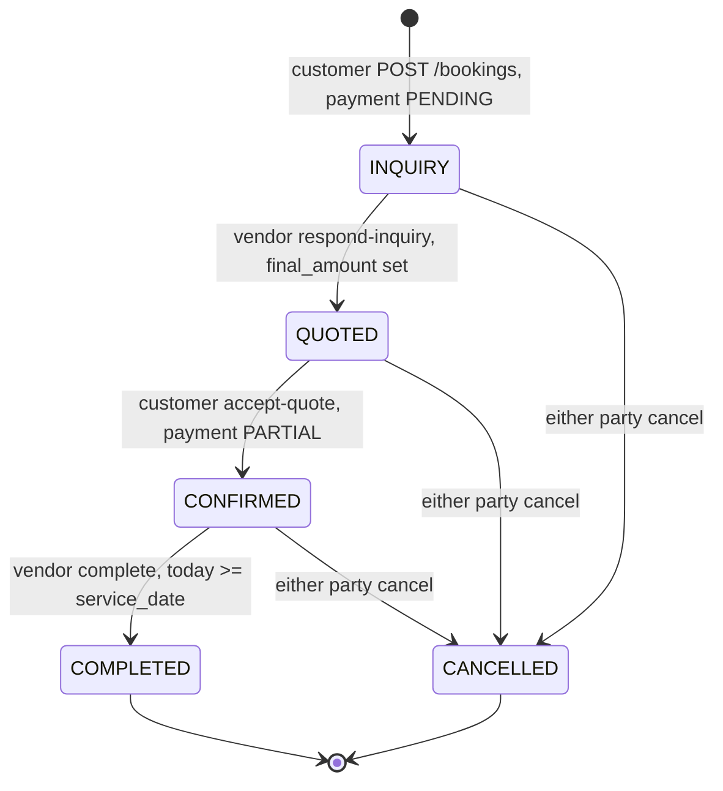
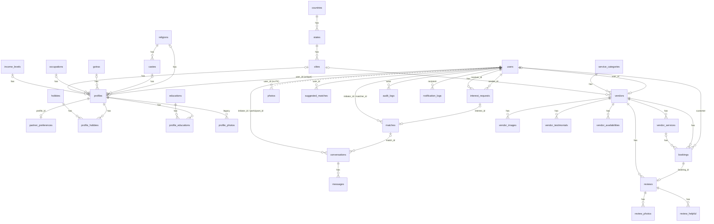

# Software Requirements Specification (SRS)

## HPHIDB — Matrimony & Wedding Services Platform (Backend API + Database)

| Item | Value |
|---|---|
| Document | Software Requirements Specification |
| System | HPHIDB Matrimony platform (`APP_NAME=Matrimony`, database `mphidb_dev`) |
| Version | 1.0 |
| Date | 2026-09-26 |
| Derived from | `backend-code (2).zip` (Laravel 12 REST API, 452 files) and `mphidb_dev_db_file.zip` (phpMyAdmin dump of `mphidb_dev`, generated 2026-07-18) |
| Companion documents | [User Manual](USER_MANUAL.md), [Data Dictionary](appendix/DATA_DICTIONARY.md) |

> **How this document was produced.** Every requirement below was reverse-engineered from the source code, migrations, configuration and the database dump. Where the code's *intent* (validation rules, config keys, comments) and its *behaviour* differ, both are stated: the requirement describes the intent and a **Status** note records the deviation, cross-referenced to the consolidated issue list in §7. Nothing was executed — the snapshot contains no `vendor/` directory and no `tests/` directory — so framework-dependent statements are marked *[unverified]*.
>
> **Not covered.** The frontend single-page application (referenced by `FRONTEND_URL=http://localhost:5173` in the backend `.env`) was **not** included in the uploaded archives. UI screens, navigation and client-side validation are therefore out of scope; user-facing behaviour is specified at the API level.

---

## Table of contents

1. [Introduction](#1-introduction)
2. [Overall description](#2-overall-description)
3. [System features and functional requirements](#3-system-features-and-functional-requirements)
4. [External interface requirements](#4-external-interface-requirements)
5. [Non-functional requirements](#5-non-functional-requirements)
6. [Data requirements](#6-data-requirements)
7. [Known issues, gaps and open questions](#7-known-issues-gaps-and-open-questions)
8. [Appendices](#8-appendices)

---

## 1. Introduction

### 1.1 Purpose

This SRS specifies the functional and non-functional requirements of the HPHIDB backend: a REST API and relational database that power an Indian-community **matrimonial matching service** combined with a **wedding-services vendor marketplace**. It is intended for product owners, developers, testers and operators who need an authoritative description of what the system does, what it is supposed to do, and where the two diverge.

### 1.2 Scope

The system provides:

* **Member (matrimony) services** — OTP-verified registration, a detailed biodata profile with photos, education, hobbies and partner preferences; profile search with filters; daily AI-style compatibility suggestions; an interest → match → private chat funnel; blocking.
* **Wedding vendor marketplace** — vendor registration and self-service listing management (profile, services/pricing, gallery, testimonials); public vendor browsing; an inquiry → quotation → confirmation → completion booking workflow; verified-purchase reviews with vendor responses and helpful votes.
* **Administration** — dashboard KPIs, user/profile/photo/vendor/testimonial moderation, master-data (reference list) management, audit trail and 30-day reports.
* **Platform services** — token authentication, OTP delivery (SMS/e-mail, currently stubbed), encrypted photo storage with signed URLs, encrypted chat storage, real-time broadcasting (Reverb), queued jobs, in-app notification log, audit log.

Out of scope: payments (no gateway is integrated), the web/mobile frontend, SMS gateway integration, push notifications.

### 1.3 Definitions, acronyms and abbreviations

| Term | Meaning |
|---|---|
| Member / User | A person seeking a match (`users.role = 2`). Owns one *Profile*. |
| Vendor | A wedding-service business account (`users.role = 3`) with a `vendors` row. |
| Admin | Platform administrator (`users.role = 1`). |
| Profile | The matrimony biodata record (`profiles`) — one per member. |
| Interest | A request from one member to another expressing interest (`interest_requests`). |
| Match | Created when an interest is accepted (`matches`); unlocks chat. |
| Conversation / Message | Private chat between two matched members. |
| Suggestion | A daily system-generated recommended profile with a compatibility score (`suggested_matches`). |
| Master data | Reference lists: religions, castes, gotras, educations, occupations, hobbies, countries, states, cities, income levels, service categories. |
| Service (vendor) | A bookable offering with a price (`vendor_services`). |
| Booking | A customer's request for a vendor service (`bookings`), lifecycle INQUIRY → QUOTED → CONFIRMED → COMPLETED / CANCELLED. |
| OTP | One-time password (6 digits) sent to the mobile number. |
| Sanctum | Laravel bearer-token authentication package. |
| Reverb | Laravel WebSocket server used for broadcasting chat events. |
| Envelope | The JSON wrapper around every API response (see §4.1). |
| KI-nn | Known Issue number, see §7. |

### 1.4 References

* Laravel 12 framework documentation (routing, validation, Sanctum, broadcasting, queues).
* Source files under `backend-code/` — `routes/api/v1/*.php`, `app/Http/Controllers`, `app/Services`, `app/Models`, `app/Policies`, `config/*.php`, `database/migrations`, `database/seeders`.
* Database dump `mphidb_dev.sql` (MySQL 9.1.0).
* [Data Dictionary](appendix/DATA_DICTIONARY.md) — column-level schema, keys, foreign keys, ER diagram, seeded data.

### 1.5 Document overview

§2 gives the product context, actors and constraints. §3 lists functional requirements per feature with business rules and implementation status. §4 specifies the API contract, broadcasting and storage interfaces. §5 states non-functional requirements. §6 summarises the data model. §7 consolidates every defect and gap found during analysis. §8 holds reference appendices.

---

## 2. Overall description

### 2.1 Product perspective

HPHIDB is a **headless backend**: a stateless JSON REST API under `/api/v1/…` consumed by a separate SPA (Vite dev server on port 5173) and potentially mobile clients. Authentication is by bearer token. Real-time chat events are pushed over WebSockets through Laravel Reverb; long-running work goes through a database-backed queue.

```mermaid
flowchart LR
    subgraph Clients
        SPA["Web SPA<br/>localhost:5173<br/>(not in scope)"]
        Mobile["Mobile app<br/>(hypothetical)"]
    end
    subgraph Backend["Laravel 12 backend (PHP ≥ 8.2)"]
        API["REST API<br/>/api/v1/*"]
        MW["Middleware<br/>auth:sanctum · admin · vendor<br/>throttle · TrackUserPresence"]
        SVC["Services<br/>Otp · Profile · SecurePhoto · Search<br/>Matching · Suggestion · Interest · Match<br/>Message · Vendor · Booking · Review · Admin"]
        Q["Queue worker<br/>(database driver)"]
        SCH["Scheduler<br/>(Kernel.php – see KI-08)"]
        RV["Reverb WebSocket server<br/>:8080"]
    end
    subgraph Storage
        DB[("MySQL 9.1<br/>mphidb_dev")]
        FS[("Filesystem<br/>storage/app/private – encrypted photos<br/>storage/app/public – vendor media")]
        CACHE[("Cache and queue tables<br/>cache · jobs")]
    end
    subgraph External
        MAIL["Mail (MAIL_MAILER=log)"]
        SMS["SMS gateway<br/>(not integrated – log stub)"]
    end
    SPA -- HTTPS JSON --> API
    Mobile -- HTTPS JSON --> API
    API --> MW --> SVC
    SVC --> DB
    SVC --> FS
    SVC --> CACHE
    SVC -- events --> Q
    Q --> RV
    RV -. private-conversation.{id} .-> SPA
    SVC --> MAIL
    SVC --> SMS
    SCH --> Q
```

### 2.2 Technology stack

| Layer | Technology / version | Notes |
|---|---|---|
| Language / framework | PHP ^8.2, Laravel ^12.0 | `composer.json` |
| Auth | laravel/sanctum ^4.3 | Listed under `require-dev` (KI-15h) |
| Real-time | laravel/reverb ^1.10 | Listed under `require-dev` |
| Images | intervention/image ^3.11 (GD) | Thumbnails |
| Database | MySQL 9.1 (dev dump); SQLite in `.env.example` | 69 migrations |
| Cache / queue / session | Database driver for all three (`CACHE_STORE=database`, `QUEUE_CONNECTION=database`, `SESSION_DRIVER=database`) | |
| Mail | `MAIL_MAILER=log` in dev | |
| SMS | `SMS_DRIVER=log`; MSG91 keys present in `.env` but **no gateway code exists** | |
| Build tooling | Vite 7, Tailwind 4 (backend assets only) | |
| Static analysis / tests | larastan, PHPUnit 11 (tests directory absent from snapshot) | |

### 2.3 Product functions (summary)

| Area | Functions |
|---|---|
| Authentication & account | Register (member/vendor), OTP verify/resend, login by e-mail or mobile, logout, forgot/reset password, change password/e-mail/mobile |
| Master data | Public read of 11 reference lists + coded enumerations; admin CRUD |
| Member profile | Create/read/update biodata; education history; up to 6 encrypted photos with primary selection; partner preferences; hobbies; completeness score |
| Discovery | Filtered search (17 filters, 4 sorts), popular profiles, daily suggestions with 15-factor compatibility breakdown, 3 refreshes/day |
| Interests | Send (20/day, 30-day expiry), list sent/received/pending, accept (creates match), reject, block, withdraw |
| Matches | List, view, view partner profile, block/unblock, start conversation |
| Chat | Conversations list/detail/messages, send text/media, edit (60 min), delete, read receipts, typing indicators, presence |
| Vendor marketplace | Public vendor search/detail/services/availability; vendor self-service profile, logo, services, gallery (10 images), testimonials |
| Bookings | Inquiry → quote → accept → complete / cancel; lists scoped to customer or vendor |
| Reviews | One verified review per completed booking (overall + 4 sub-ratings, up to 10 photo URLs), vendor response, helpful toggle, public listing, aggregate rating |
| Admin | Dashboard stats & activity; user activate/suspend/delete; profile approve/reject; photo approve/reject; vendor verify/suspend; testimonial approve/reject; master data CRUD with reference protection; audit log browsing; 30-day user/booking/engagement reports |
| Platform | Audit log, in-app notification log, scheduled jobs (daily suggestions, interest expiry), broadcasting |

### 2.4 User classes and characteristics

| Class | `users.role` | Access | Typical goals |
|---|---|---|---|
| **Guest** (unauthenticated) | — | Master data, discovery filters, public vendor listing/detail/services/availability/reviews, signed photo URLs | Browse vendors before signing up |
| **Member** | 2 | All member endpoints; may also book vendors and write reviews | Find a life partner; hire wedding vendors |
| **Vendor** | 3 | `/vendor/*` self-service; bookings/reviews scoped to own business; account endpoints | Get listed, receive and quote inquiries, build reputation |
| **Admin** | 1 | `/admin/*`; account endpoints; may also book (policy allows non-vendors) | Moderate content, manage reference data, monitor |

Role and account status are stored on `users` (`role` 1/2/3; `status` 1 Pending, 2 Active, 3 Suspended). Vendors additionally carry a listing status on `vendors.status` (1 Pending, 2 Approved, 3 Rejected, 4 Suspended) and `is_verified`.

### 2.5 Operating environment

* Linux/macOS/Windows host with PHP 8.2+, Composer, a MySQL 8/9 (or SQLite) database, Node for asset build.
* Long-running processes required for full functionality: HTTP server (`php artisan serve` or nginx/php-fpm), **queue worker** (`php artisan queue:work`) for broadcasts and queued listeners, **Reverb** server (`php artisan reverb:start`) for WebSockets, **scheduler** (`php artisan schedule:run` via cron) for daily jobs.
* Development defaults: `APP_URL=http://localhost:8000`, `FRONTEND_URL=http://localhost:5173`, `REVERB_HOST=127.0.0.1:8080`.

### 2.6 Design and implementation constraints

* All API routes are versioned under `/api/v1` and return JSON only.
* Bearer-token-only authentication (`statefulApi()` is not enabled; no SPA cookie auth).
* Passwords bcrypt-hashed (`BCRYPT_ROUNDS=12`); OTPs bcrypt-hashed; profile photos encrypted at rest with `APP_KEY` (Laravel `Crypt`); chat message bodies encrypted at rest (Eloquent `encrypted` cast). Loss of `APP_KEY` renders photos and messages unrecoverable.
* Master-data tables carry `status` flags but public reads do not filter on them (KI-21e).
* No payment provider; booking `payment_status` is informational only.

### 2.7 Assumptions and dependencies

* A1. The deployed database schema equals the one produced by the 69 migrations (confirmed for the dump: all 69 recorded in `migrations`).
* A2. The frontend sends `role` as a JSON number, `otp` as a JSON string, and handles two response-envelope shapes (§4.1).
* A3. An SMS gateway will be integrated behind `OtpService::sendSms()`; until then OTPs are echoed in API responses (dev) or written to `laravel.log`.
* A4. Reverb, queue worker and scheduler are run as separate processes in production.
* A5. Only one profile exists per user (DB unique key), one partner-preference row per profile, one review per booking (code-enforced only).

---

## 3. System features and functional requirements

Notation: **FR-AREA-nn** requirement id · **Actor** · **Pre** preconditions · rules quoted from code. **Status**: ✅ implemented as specified · ⚠️ implemented with deviations (see note) · ❌ not functional as written (see KI reference).

### 3.1 Authentication and account (FR-AUTH)

Endpoints: `POST /auth/register`, `POST /auth/verify-otp`, `POST /auth/resend-otp`, `POST /auth/login`, `POST /auth/logout`, `POST /auth/forgot-password`, `POST /auth/reset-password`, `PUT /account/password`, `PUT /account/email`, `PUT /account/mobile`.

| ID | Requirement | Status |
|---|---|---|
| FR-AUTH-01 | The system shall allow a guest to register as **Member (role 2)** or **Vendor (role 3)** with `name` (≤255), unique `email` (≤255), unique `mobile` (≤20 chars), `password` (≥8, confirmed) and optional `category_id` (vendor service category). Admin accounts cannot self-register. | ✅ |
| FR-AUTH-02 | On registration the account shall be created with status **Pending**, a 6-digit OTP shall be generated (bcrypt-hashed, valid **10 minutes**, previous OTPs for the mobile invalidated), delivered per FR-AUTH-10, and an access token issued (HTTP 201). | ✅ |
| FR-AUTH-03 | For vendor registration a `vendors` row shall also be created: `business_name = owner_name = name`, `email`, `phone`, `service_category_id = category_id ?? 1`, `business_address = ''`, `status = Pending (1)`, `is_verified = false`. | ⚠️ Non-transactional; `role` sent as a string skips vendor-row creation; duplicate business name → 500 (KI-16g) |
| FR-AUTH-04 | `POST /auth/verify-otp` (`mobile` must exist, `otp` exactly 6 digits as a string) shall verify the latest OTP for the mobile: not found → 404; expired → 410 (OTP deleted); after **3 wrong attempts** the 4th request → 429 (OTP deleted); wrong → 400 (attempt counted). On success `phone_verified_at` is set, status becomes **Active**, and a new token is issued. | ⚠️ Sets Active unconditionally — re-activates suspended users (KI-16b) |
| FR-AUTH-05 | `POST /auth/resend-otp` shall issue a fresh OTP for an unverified mobile (409 if already verified); rate 3 per 10 min per IP. | ⚠️ 500 for soft-deleted users (KI-16h) |
| FR-AUTH-06 | `POST /auth/login` shall accept `login` = e-mail **or** mobile plus `password`; invalid credentials → 401; suspended account → 403 "Your account has been suspended. Please contact support."; Pending (unverified) accounts may log in. Rate 5/min per IP. | ✅ |
| FR-AUTH-07 | `POST /auth/logout` shall revoke the presented token only. | ✅ |
| FR-AUTH-08 | `POST /auth/forgot-password` shall e-mail a reset link (token valid 60 min, one issue per 60 s); `POST /auth/reset-password` (`token`, `email`, `password` ≥8 confirmed) shall set the new password. | ❌ No `password.reset` route/URL callback exists, so link generation is expected to throw → 500 (KI-07) |
| FR-AUTH-09 | Authenticated users of any role shall change password (`current_password` + new ≥8 confirmed), e-mail (unique) and mobile (`^\d{10}$`, unique) with current-password confirmation; a mobile change resets `phone_verified_at` and triggers a new OTP while the account stays usable. Rate 5/min. | ⚠️ Tokens not revoked on password change; vendor row e-mail/phone not synchronised |
| FR-AUTH-10 | OTP delivery shall be controlled by `OTP_SMS_ENABLED` / `OTP_EMAIL_ENABLED`: SMS via gateway, e-mail via `OtpNotification` ("Your verification code"). When **both are false** the plaintext OTP shall be returned in the response `data.otp` (development mode). | ⚠️ SMS path is a logging stub; plaintext OTP written to `laravel.log` when a channel is disabled (KI-15c) |
| FR-AUTH-11 | Access tokens shall be Sanctum personal access tokens named `auth_token` with all abilities; `expiration = null` (never expire). | ⚠️ Tokens accumulate; only admin suspension revokes all (KI-15a) |
| FR-AUTH-12 | Every authenticated API request shall update `users.last_seen_at` at most once per minute (presence). | ⚠️ Middleware ordering *[unverified]* (KI-22) |

**Business rules.** Roles: 1 Admin, 2 User, 3 Vendor. Statuses: 1 Pending, 2 Active, 3 Suspended. OTP length 6, expiry 10 min, max attempts 3. Registration throttle 10/min; verify 8/10 min; login/forgot/reset 5/min.

### 3.2 Master data (FR-MST)

Endpoints (public): `GET /masters`, `GET /masters/{type}`, `GET /masters/coded-lists`, `GET /masters/coded-lists/all`. Admin CRUD: see §3.11.6.

| ID | Requirement | Status |
|---|---|---|
| FR-MST-01 | The system shall expose the reference lists `religions`, `castes` (with `religion_id`), `gotras`, `educations` (`level` exposed as `name`, `field_of_study`), `occupations`, `hobbies`, `countries`, `states` (filter `?country_id=`), `cities` (filter `?state_id=`), `income-levels`, `service-categories`, ordered by name, without authentication. Unknown type → 400 "Invalid master type". | ⚠️ Inactive (`status=0`) rows are not filtered out (KI-21e) |
| FR-MST-02 | `GET /masters` shall return all eleven lists in one payload; results cached 24 h (`masters.{type}`, `masters.all`); filtered state/city lookups bypass the cache. | ✅ |
| FR-MST-03 | `GET /masters/coded-lists` shall return enumerations used by the profile API: `gender` (male/female/other), `complexion` (fair, very_fair, wheatish, wheatish_brown, brown, dark_brown), `food_type` (veg, non_veg, both, jain), `created_for` (self, son, daughter, brother, sister, friend), `marital_status` (1 Never Married, 2 Divorced, 3 Widowed), `user_status`, `interest_status`, `booking_status`, `income` (active income levels); cached 7 days. | ✅ (note the integer `Gender/Complexion/FoodType/CreatedFor` constant classes are **not** the API vocabulary) |

Seeded values are listed in Appendix 8.3.

### 3.3 Member profile (FR-PRF)

Endpoints: `POST /profile`, `GET /profile`, `PUT /profile`.

| ID | Requirement | Status |
|---|---|---|
| FR-PRF-01 | A member shall create exactly one profile (DB unique `profiles.user_id`) with: `full_name`* (≤255), `gender`* (male/female/other), `dob`* (age > 18 and < 70 years), `created_for`* (self/son/daughter/brother/sister/friend), `religion_id`*, `caste_id`, `gotra_id`, `occupation_id`, `state_id`, `city_id`, `income_level_id`, `marital_status`* (1/2/3), `height_cm` (100–250), `complexion`, `food_type`, `about` (≤1000). (* required on create). | ⚠️ `income_level_id` validated but never saved (KI-21c); on non-MySQL engines the initial insert lacks `gender` (KI-01) |
| FR-PRF-02 | `POST /profile` on an existing profile shall act as an upsert (201). `PUT /profile` shall update the profile with all fields optional (`sometimes`). | ⚠️ PUT is **destructive**: omitted optional fields are written NULL (only `created_for`, `marital_status`, `about` are preserved) — clients must resend the full profile (KI-21d) |
| FR-PRF-03 | `GET /profile` shall return the profile with religion/caste/gotra/occupation/state/city names, labels, computed `age`, educations, photos (signed URLs), hobbies, preferences, plus a **completeness** object `{overall, breakdown{basic 40, education 15, photos 15, preferences 20, hobbies_about 10}, next_steps[]}`. 404 if no profile. | ⚠️ Photo component can never exceed 0 because uploaded photos are never marked verified (KI-04) |
| FR-PRF-04 | Every profile write shall be audit-logged (`profile.updated`). | ✅ |
| FR-PRF-05 | Editing a key identity field (`full_name`, `gender`, `date_of_birth`, `religion_id`, `caste_id`, `marital_status`) shall flag the account for re-verification when `matrimony.reverify_on_key_edit` is true; admin approval (`moderation_status`) shall **not** be reset (`reapprove_on_key_edit=false`). | ❌ Dead code — `config('matrimony.*')` is read nowhere, `isDirty()` runs after save, and `users.verification_status` does not exist (KI-18) |
| FR-PRF-06 | New profiles shall start with `moderation_status = Pending (1)` and become visible in search only when `is_active` and `is_verified` are true and the owner's phone is verified (`scopeSearchable`). | ⚠️ Admin approval sets `moderation_status` only; `is_verified` has no writer in the API (KI-16a) |

**Completeness algorithm.** `basic = (#non-empty of full_name, gender, dob, religion_id, caste_id, marital_status)/6 × 40`; `education = 15` if any education row; `photos = min(15, verified_photos/3 × 15)`; `preferences = 20` if a preference row exists; `hobbies_about = 5 (about) + 5 (≥1 hobby)`; `overall = min(100, round(sum))`. `next_steps` messages: "Complete basic profile information", "Add education details", "Add verified photos (minimum 3)", "Set partner preferences", "Add hobbies and about information".

#### 3.3.1 Education history (FR-EDU)

Endpoints: `GET/POST /profile/educations`, `PUT/DELETE /profile/educations/{education}`, `PUT /profile/educations/{education}/highest`.

| ID | Requirement | Status |
|---|---|---|
| FR-EDU-01 | A member shall add education entries with `education_id`* (from `educations`), `specialization` (≤255), `institute` (≤255), `is_highest` (bool); the first entry becomes highest automatically; setting a new highest clears the flag on others; deleting the highest promotes the most recent remaining entry. Each change is audit-logged (`education.created/updated/deleted/set_as_highest`). | ❌ Feature is non-functional on three layers: policy not discoverable (403 on writes), model `$fillable` uses different attribute names, and `profile_educations` lacks `user_id`/`is_highest`/`institute` (GET → 500). See KI-02 |

#### 3.3.2 Photos (FR-PHO)

Endpoints: `POST /profile/photos` (multipart), `PUT /profile/photos/{photo}/primary`, `DELETE /profile/photos/{photo}`, public signed `GET /photos/view/{id}/{token}?expires=` and `GET /photos/thumb/{id}/{token}?expires=`.

| ID | Requirement | Status |
|---|---|---|
| FR-PHO-01 | A member shall upload JPG/PNG photos ≤ **2 MB**, ≥ **200×200 px**, max **6 per profile**, max **10 uploads per rolling 24 h**; validation shall check MIME type and magic bytes (JPEG `ffd8ffe0/e1/e2`, PNG `89504e47`). | ✅ (JPEGs with other APP markers are rejected) |
| FR-PHO-02 | Files shall be stored under `profiles/photos/{user_id}/{32-random}.{ext}` on the private disk, **encrypted with APP_KEY** when `PHOTO_ENCRYPTION_ENABLED` (default true); the first photo is primary; a new photo may be flagged primary. | ✅ |
| FR-PHO-03 | Photos shall be served only through **HMAC-SHA256 signed URLs** (`id|expires`, keyed by `APP_KEY`) valid **15 minutes**, rate-limited 100/h per IP; thumbnails 300×300 (cover, JPEG q80 / PNG) generated on the fly. Responses carry `Cache-Control: private, max-age=900`. | ⚠️ URL is not bound to the viewer and serves pending/rejected photos (KI-15e) |
| FR-PHO-04 | Uploaded photos shall start `status = pending`, `is_verified = false` and be approved/rejected by an admin before counting as verified. | ❌ Admin moderation operates on the legacy `profile_photos` table, not `photos`; no code path ever approves an uploaded photo (KI-04) |
| FR-PHO-05 | Deleting a photo shall remove the file and promote the oldest remaining photo to primary; setting primary shall clear the flag on others. Combined upload/primary/delete calls limited to 10/day per user. | ✅ (no audit log) |

#### 3.3.3 Partner preferences (FR-PPF)

Endpoints: `GET /profile/preferences`, `PUT /profile/preferences`.

| ID | Requirement | Status |
|---|---|---|
| FR-PPF-01 | A member with a profile shall maintain one preference set: `age_min/age_max` (18–100), `height_min_cm/height_max_cm` (100–250), `religion_id`, and multi-select lists `caste_ids`, `complexions`, `food_types`, `hobby_ids`, `city_ids`, `state_ids`, `education_ids`, `occupation_ids` (ids validated against masters; list fields accept JSON strings). Defaults on first save: age 18–50, height 150–200. No profile → 409 "Please create your profile first." Audit `preferences.updated`. | ⚠️ Only `age_*`, `height_*`, `religion_id` persist; all list fields are silently dropped because they are not mass-assignable (KI-03) |
| FR-PPF-02 | `GET` shall return ids **and** resolved names (castes, hobbies, cities, educations, occupations). 404 if no profile or no preference row. | ✅ (lists come back empty because of KI-03) |

#### 3.3.4 Hobbies (FR-HOB)

| ID | Requirement | Status |
|---|---|---|
| FR-HOB-01 | `PUT /profile/hobbies` with `hobby_ids[]` shall **replace** the member's hobby set (empty/omitted clears all); audit `hobbies.updated`; 409 if no profile. | ✅ |

### 3.4 Discovery, search and suggestions (FR-DSC / FR-SUG)

Endpoints: `POST /discover/search`, `GET /discover/filters` (public), `GET /discover/popular`, `GET /suggestions`, `GET /suggestions/{profileId}/breakdown`, `POST /suggestions/refresh`. All except `filters` require role **User (2)**.

| ID | Requirement | Status |
|---|---|---|
| FR-DSC-01 | Members shall search profiles with filters `age_min/age_max` (18–70), `height_min/height_max` (100–250), `religion_id`, `caste_ids[]`, `gotra_ids[]`, `complexions[]`, `food_types[]`, `education_ids[]`, `occupation_ids[]`, `state_id`, `city_id`, `hobby_ids[]` (profile must have **all** selected), `profile_completeness_min` (0–100), `photos_min` (verified photos), `sort_by` (compatibility default / recent / completeness / photos), `page`. Page size 20. Results carry a per-viewer `compatibility_score` and `compatibility_breakdown`. | ⚠️ `compatibility` sort falls back to newest-first; blocked users not excluded (TODO stub); no gender filter; `pagination.total` is the page count; height filter uses legacy `height` column (KI-21a/b) |
| FR-DSC-02 | Only searchable profiles shall be returned: `is_active`, `is_verified`, not deleted, owner phone-verified; the searcher's own profile excluded. | ✅ |
| FR-DSC-03 | Search shall be limited to **100 requests per hour** per user (route throttle 100/60 min plus an hourly counter returning "Search rate limit exceeded. Maximum 100 searches per hour."). | ✅ |
| FR-DSC-04 | `GET /discover/filters` shall return the option lists for the search form (religions, castes, education levels, occupations, states, cities, hobbies, complexions, food types, sort options) cached 7 days. | ✅ |
| FR-DSC-05 | `GET /discover/popular` shall return 20 most recently created searchable profiles with viewer-specific scores; cached 1 h globally. | ⚠️ Not exclusion-aware (own profile may appear) |
| FR-SUG-01 | The system shall compute a **compatibility score (0–100)** between the viewer's profile/preferences and a candidate from 15 weighted factors (Appendix 8.2): age 12, location 12, religion 10, caste 10, gotra 5 (same gotra **−30**), height 8, complexion 5, food 5, education 6, occupation 5, hobbies 8, completeness 5, photos 6, recency 5, profile status 3. | ⚠️ Weights hard-coded; `config/discovery.php` scoring and `matrimony.suggestion_threshold` unused (KI-18) |
| FR-SUG-02 | Daily suggestions: for each active, phone-verified member with a profile **and** a preference row, candidates shall be filtered by hard preference limits (age, height, religion, caste, education, occupation, state, city, marital status, body type), scored, and the top **10** stored in `suggested_matches` with the breakdown; cached 24 h per user (`suggestions_user_{id}_{date}`); previously suggested profiles are excluded. | ⚠️ Bulk insert passes the breakdown array uncast (likely runtime error); `compatibility_score` is 0 in list responses; profiles once suggested are excluded forever (KI-10) |
| FR-SUG-03 | `GET /suggestions` shall return today's suggestions (generating them on demand when absent). `POST /suggestions/refresh` shall regenerate, limited to **3 per day** (429 "You have reached the maximum number of refreshes for today (3 per day)"). | ⚠️ Counter consumed even when generation fails |
| FR-SUG-04 | `GET /suggestions/{profileId}/breakdown` shall return the stored (or live) factor breakdown and `total_score` for any profile id, recording `viewed_at`. | ✅ |
| FR-SUG-05 | `GenerateDailySuggestionsJob` shall run daily at 02:00 for all eligible members. | ❌ Schedule defined in a `Console\Kernel` that Laravel 12's bootstrap does not load (KI-08) |

### 3.5 Interests (FR-INT)

Endpoints: `POST /interests`, `GET /interests/received`, `GET /interests/sent`, `GET /interests/pending`, `PUT /interests/{interest}/accept|reject|block`, `DELETE /interests/{interest}`.

Lifecycle: `PENDING → ACCEPTED | REJECTED | BLOCKED | EXPIRED`; sender may withdraw (soft-delete) at any time. Statuses are **strings** on `interest_requests.status` (the integer `InterestStatus` constants are not used).

| ID | Requirement | Status |
|---|---|---|
| FR-INT-01 | A member shall send an interest to a profile (`receiver_profile_id`*, `message` ≤500, `channel` app/sms/email) subject to: not self; not blocked in either direction; no existing interest between the pair; sender has a profile. Expiry = **30 days** (`interests.interest_ttl_days`). Limit **20 per day** per user. Creates an in-app notification `interest_received` for the receiver. | ⚠️ Failed attempts consume the daily allowance; "existing interest" check blocks any re-send after rejection/expiry, and the DB unique `(sender_id, receiver_id)` blocks re-send even after withdrawal (KI-13a); `matrimony.rerequest_after_reject_days=90` unused |
| FR-INT-02 | The receiver shall accept a pending, unexpired interest, which shall create a **match** (`initiator = sender`, `matcher = receiver`, `connected_at = now`) and notify the sender (`interest_accepted`). Response 201 with the match. No conversation is created yet. | ⚠️ Policy denials surface as HTTP 500 instead of 403 (KI-13b) |
| FR-INT-03 | The receiver shall reject (optional `reason` ≤200) or block a pending interest; blocking is permanent, applies in both directions, and notifies the sender (`user_blocked`). | ⚠️ `reason` is discarded; block only prevents future interests, not search/suggestions/chat (KI-13c, KI-14) |
| FR-INT-04 | Lists shall be paginated (20/page), filterable by `status`, newest first; by default pending-but-expired rows are hidden. `pending` returns up to 5 sent + 5 received pending interests. | ✅ |
| FR-INT-05 | `ExpireInterestsJob` shall daily (03:00) mark pending interests past `expires_at` as EXPIRED and notify senders (`interest_expired`). | ❌ Scheduler not loaded (KI-08); lists/policies still treat them as expired via `expires_at` |

### 3.6 Matches (FR-MAT)

Endpoints: `GET /matches`, `GET /matches/{match}`, `GET /matches/{match}/profile`, `PUT /matches/{match}/block|unblock`, `POST /matches/{match}/message`.

| ID | Requirement | Status |
|---|---|---|
| FR-MAT-01 | A participant shall list matches (active only by default; `active_only=false` includes blocked), 20/page, newest connection first, with the other party's profile, `message_count`, `latest_message`, `is_active`, `blocked_by`, `can_block`. | ✅ |
| FR-MAT-02 | A participant shall view a match and the **other party's full profile** (with preferences and hobbies). | ⚠️ `photos` and `educations` omitted due to relation-name mismatch (KI-14b) |
| FR-MAT-03 | A participant shall block an active match (`is_active=false`, `blocked_by_id`), audit `match_blocked`; only the blocker may unblock. Non-participants → 403. | ⚠️ Blocked matches can still exchange messages (KI-14a) |
| FR-MAT-04 | `POST /matches/{match}/message` (`body` 1–1000 chars) shall create or reuse the conversation for the pair (initiator = lower user id) and post the first message, updating `last_interaction_at`. | ⚠️ Not broadcast (`MessageSent` not fired); conflicts with the per-pair unique key if a conversation exists for another match (KI-14c) |

### 3.7 Messaging / chat (FR-MSG)

Endpoints: `GET /conversations`, `GET /conversations/{c}`, `GET /conversations/{c}/messages`, `PUT /conversations/{c}/read`, `DELETE /conversations/{c}`, `POST /messages`, `POST /messages/upload`, `PUT /messages/{m}`, `DELETE /messages/{m}`, `POST /messages/{m}/read`, `POST /conversations/{c}/typing`, `POST /conversations/{c}/typing/stop`.

| ID | Requirement | Status |
|---|---|---|
| FR-MSG-01 | A participant shall list conversations (20/page, latest activity first) with the other user (name, avatar, `is_online`, `last_seen`), last message and `unread_count`. | ✅ |
| FR-MSG-02 | A participant shall read a conversation's messages: page of 50 ascending, or cursor style (`before_id`, `limit` default 50). Non-participants → 403. | ⚠️ Detail endpoint returns raw models including the sender's e-mail/phone; cursor returns oldest-first (KI-15f) |
| FR-MSG-03 | Sending a message (`conversation_id`*, `type` text/image/file/system, `body` 1–5000 required for text, optional `media` ≤10 MB of jpg/jpeg/png/gif/pdf/doc/docx/xls/xlsx/zip) shall store the body **encrypted**, update `last_message_at`, broadcast `message-sent` on `private-conversation.{id}` and audit `message_sent`. Rate 60/min. | ❌ for media: the `chat` filesystem disk is not configured → 500 (KI-06); text messages ✅ |
| FR-MSG-04 | The sender shall edit a message within **60 minutes** (`chat.edit_window_minutes`); broadcast `message-edited`. The sender shall delete (soft) a message within **24 h** (`chat.delete_window_minutes`); broadcast `message-deleted`, audit `message_deleted`. | ⚠️ Edit-window violation → 500 instead of 4xx; delete window not enforced (KI-15g) |
| FR-MSG-05 | Read receipts: `PUT /conversations/{c}/read` marks all incoming messages read and broadcasts `message-read {user_id, read_at}`; `POST /messages/{m}/read` marks one message read. | ⚠️ Per-message endpoint lacks a participant check (KI-15d) |
| FR-MSG-06 | Typing indicators shall broadcast `user-typing` / `user-stopped-typing` with the user's id, name and avatar. | ✅ (no server-side timeout) |
| FR-MSG-07 | Deleting a conversation shall soft-delete it for **both** participants. | ⚠️ `conversation-deleted` never broadcast |
| FR-MSG-08 | Presence: a user is **online** when `last_seen_at` is within 5 minutes. | ⚠️ See KI-22; `PresenceUpdated` never broadcast |

### 3.8 Vendor marketplace — public (FR-VND)

Endpoints (no auth): `GET /vendors`, `GET /vendors/{vendor}`, `GET /vendors/{vendor}/services`, `GET /vendors/{vendor}/availability/{date}`, `GET /vendors/{vendor}/reviews`.

| ID | Requirement | Status |
|---|---|---|
| FR-VND-01 | Anyone shall list vendors (20/page, rating desc) filtered by `category_id`, `city_id`, `rating_min`, `price_min`+`price_max` (any service in range), `search` (business name/description), `availability_date`. Each item includes contact, location, active services, gallery, latest 5 reviews, 5 approved testimonials, star breakdown, average service price and logo. | ⚠️ **No approved/verified filter** — pending, rejected and suspended vendors are listed (KI-12); `availability_date` non-functional (KI-11); filters unvalidated |
| FR-VND-02 | Anyone shall view a vendor's detail, its **active** services, and its published reviews (20/page, optional `rating` filter). | ⚠️ Reviewer e-mail exposed publicly (KI-15b) |
| FR-VND-03 | `GET /vendors/{id}/availability/{date}` (date ≥ today) shall return hourly slots between the vendor's opening hours for that weekday, each flagged available unless a CONFIRMED/IN_PROGRESS booking overlaps. | ❌ Weekday lookup compares a name to a 0–6 integer column; no endpoint manages availability (KI-11) |

### 3.9 Vendor self-service (FR-VSS)

Endpoints (auth + role Vendor + vendor row): `GET/PUT /vendor/profile`, `POST /vendor/profile/logo`, `GET/POST /vendor/services`, `PUT/DELETE /vendor/services/{s}`, `GET/POST /vendor/images`, `DELETE /vendor/images/{i}`, `GET/POST /vendor/testimonials`, `POST /vendor/testimonials/{t}` (update), `DELETE /vendor/testimonials/{t}`.

| ID | Requirement | Status |
|---|---|---|
| FR-VSS-01 | A vendor shall view and partially update its listing: `business_name` (≤255), `owner_name`, `bio` (≤1000), `description` (≤2000), `phone` (≤20), `alt_phone`, `business_address` (≤500), `city_id`, `postal_code` (≤10), `service_category_id`, `website` (url), `years_of_experience` (0–100). Not editable: e-mail, status, verification, rating. Edits do not trigger re-approval. | ⚠️ Nulls for NOT NULL columns / duplicate name → 500 |
| FR-VSS-02 | Logo upload: jpg/jpeg/png/webp ≤ 2 MB, 10/h, stored on the public disk, previous file deleted. | ✅ |
| FR-VSS-03 | Services CRUD: `service_category_id`*, `name`*, `description` (≤2000), `base_price`* (≥0), `price_label` (free text ≤100, e.g. "100 plates"), `price_unit` (per_event/per_hour/per_package/custom; default custom), `duration_hours`, `max_guests_count`, `includes_travel/decoration/makeup/videography/album`, `is_active`. Ownership enforced (403). Delete is hard; linked bookings keep a null service. | ✅ |
| FR-VSS-04 | Gallery: jpg/jpeg/png/webp ≤ 4 MB, `caption` ≤255, `is_primary`; **max 10 images** (first is primary; primary re-assigned on delete; soft delete). Rate 20/h. | ⚠️ Cap hard-coded 10 vs `matrimony.max_vendor_images=15` |
| FR-VSS-05 | Testimonials: `reviewer_name`*, `reviewer_title`, `client_location`, `body`* (≤2000), `rating` 1–5 (default 5), optional `image` ≤4 MB; update via POST multipart; hard delete. Testimonials shall require admin approval before public display. | ⚠️ Vendor-authored testimonials are **auto-approved** at creation, making admin moderation moot (KI-16d) |
| FR-VSS-06 | Vendor status/verification shall gate self-service and public visibility. | ❌ Neither is checked anywhere in the marketplace (KI-12) |

### 3.10 Bookings (FR-BKG)

Endpoints (auth): `POST /bookings`, `GET /bookings`, `GET /bookings/{b}`, `PUT /bookings/{b}/respond-inquiry`, `PUT /bookings/{b}/accept-quote`, `PUT /bookings/{b}/complete`, `PUT /bookings/{b}/cancel`.



| ID | Requirement | Status |
|---|---|---|
| FR-BKG-01 | A non-vendor user shall create an inquiry: `vendor_service_id`*, `service_date`* (≥ today), `service_time_from/to` (H:i, to > from), `location_address`* (≤500), `location_city_id`*, `guests_count` (≥1), `special_requirements` (≤1000). `vendor_id` derives from the service; `estimated_amount = base_price`; `status = INQUIRY`; `payment_status = PENDING`. Limits 50/day and 50/min. | ⚠️ Inactive services and unapproved vendors are bookable (KI-12) |
| FR-BKG-02 | The owning vendor shall answer an INQUIRY with `final_amount`* (≥1) and `response_notes` (≤500) → `QUOTED`, recording `inquiry_responded_at` and response time in minutes. | ⚠️ `response_notes` silently discarded (KI-19a); status violations → 500 (KI-05) |
| FR-BKG-03 | The customer shall accept a QUOTED booking → `CONFIRMED`, `confirmed_at`, `payment_status = PARTIAL` (no payment is taken). | ⚠️ KI-05 |
| FR-BKG-04 | The vendor shall complete a CONFIRMED booking on or after the service date → `COMPLETED`. | ⚠️ KI-05 |
| FR-BKG-05 | Either party shall cancel any booking not COMPLETED/CANCELLED with optional `cancellation_reason` (≤500). Refund processing for PAID bookings. | ⚠️ Refund branch empty; KI-05 |
| FR-BKG-06 | Lists shall be scoped: vendors see their business's bookings, others see their own; optional `status` filter; 20/page by service date desc. Detail visible to customer or vendor. Response flags `can_confirm`, `can_cancel`, `can_review`. | ✅ |
| FR-BKG-07 | Booking events (`BookingInquiryCreated`, `QuotationProvided`, `BookingConfirmed`, `BookingCompleted`, `BookingCancelled`) shall notify the counter-party and be audit-logged. | ❌ Listeners not registered / bodies empty; events not broadcast (KI-19b) |
| FR-BKG-08 | A human-readable `booking_code` shall identify each booking. | ❌ Never generated (KI-19c) |

### 3.11 Reviews (FR-REV)

Endpoints: `POST /reviews`, `PUT /reviews/{r}/respond`, `PUT /reviews/{r}/helpful` (auth); `GET /vendors/{v}/reviews` (public).

| ID | Requirement | Status |
|---|---|---|
| FR-REV-01 | The customer of a **COMPLETED** booking shall post exactly one review: `rating`* 1–5, `title`* (≤255), `body`* (≤2000), `punctuality_rating`*, `communication_rating`*, `quality_rating`*, `value_rating`* (1–5), `photos[]` ≤10 URLs. Reviews are published immediately and flagged verified purchase. Errors: not booker 403, not completed 422, already reviewed 422. | ✅ (one-per-booking enforced in code only) |
| FR-REV-02 | Posting a review shall synchronously recompute `vendors.rating` (average of published reviews), `total_reviews`, `rating_updated_at`. | ✅ |
| FR-REV-03 | The owning vendor shall respond to a review (`response` ≤1000), overwritable. | ✅ |
| FR-REV-04 | Any authenticated user shall toggle a "helpful" vote (one per user per review; 204). | ✅ |

### 3.12 Administration (FR-ADM)

All endpoints under `/admin/*` require `auth:sanctum` + role Admin (403 "Forbidden. Admin access required."). Responses use the `{success, message, data[, pagination]}` envelope; page size fixed at 25 (audit logs 50).

#### 3.12.1 Dashboard

| ID | Requirement | Status |
|---|---|---|
| FR-ADM-01 | `GET /admin/dashboard/stats` shall return totals and breakdowns: users by status, profiles by moderation status, vendors by status, bookings by status, interests, matches, `messages_today`, `revenue_this_month` (sum of `final_amount` of completed bookings), `generated_at`; cached 15 min and invalidated by moderation writes. | ⚠️ Bookings breakdown compares the string `status` column to integer constants → always 0 (KI-16i) |
| FR-ADM-02 | `GET /admin/dashboard/activity` shall return the 20 latest audit-log entries with actor. | ⚠️ Includes high-volume member actions (`message_sent`) |

#### 3.12.2 User moderation

| ID | Requirement | Status |
|---|---|---|
| FR-ADM-03 | List users (filters `role`, `status`, `search` on name/e-mail/phone) with profile summary and counts (interests sent/received, bookings, reviews); view one user (including soft-deleted) with photos, interest summary and 20-entry audit trail. | ✅ |
| FR-ADM-04 | Activate a user (any status → Active, clears suspension). Suspend a user with `reason`* (≤500): status Suspended, `suspended_at`, `suspension_reason`, **all tokens revoked**; login thereafter → 403. Delete a user: audit, tokens revoked, profiles and user soft-deleted. | ⚠️ No guard against suspending/deleting an admin or oneself; OTP verification re-activates suspended users; no notification to the user (KI-16b/c) |

#### 3.12.3 Profile and photo moderation

| ID | Requirement | Status |
|---|---|---|
| FR-ADM-05 | List pending profiles (FIFO) with user, moderator, photo count; approve (sets `moderation_status=Approved`, `moderated_at/by`, clears reason); reject with `reason`* (≤500) — stores reason, creates in-app notification `profile_rejected`. Audit `profile.approve/reject`. | ⚠️ Approve does not set `is_verified` needed for search visibility (KI-16a) |
| FR-ADM-06 | List pending photos; approve (`is_verified=true`); reject with reason (`is_active=false`, notification `photo_rejected`). Audit `photo.approve/reject`. | ❌ Targets legacy `profile_photos` and writes columns (`is_active`, `verification_date`) that do not exist → SQL error; uploaded photos (`photos`) have no moderation endpoint (KI-04) |

#### 3.12.4 Vendor and testimonial moderation

| ID | Requirement | Status |
|---|---|---|
| FR-ADM-07 | List vendors (filters `status`, `category`, `verified`, `search`) with category and counts; **verify** (`is_verified=true`, `verified_at`, status Approved); **suspend** with reason (status Suspended; reason kept in audit only). Audit `vendor.verify/suspend`. | ⚠️ No reject endpoint; no effect on the vendor's login or visibility (KI-12) |
| FR-ADM-08 | List pending testimonials; approve (`is_approved`, `approved_at`); reject with reason. Audit `testimonial.approve/reject`. | ⚠️ Rejected testimonials remain in the pending list; vendor testimonials are auto-approved (KI-16d) |

#### 3.12.5 Master data management

| ID | Requirement | Status |
|---|---|---|
| FR-ADM-09 | For each type (`religions, castes, gotras, educations, occupations, hobbies, countries, states, cities, income-levels, service-categories`) an admin shall list (search, 25/page), create, update and delete entries. Validation: name/label required, ≤191, unique per table; `description` ≤500; `status` bool; `code` ≤10; `country_id`; `min_amount`/`max_amount` ≥0; `sort_order` ≥0. Writes invalidate the public master caches and are audited (`master.create/update/delete`). | ⚠️ `educations` type unusable (`name` vs `level`); castes/cities cannot be created (parent FK never validated/passed); several validated fields silently dropped per type (KI-16e/f) |
| FR-ADM-10 | Deletion shall be refused (409, with `references` count) when the entry is referenced by profiles, preferences, castes, states, cities, vendors or profile relations. | ✅ |

#### 3.12.6 Audit log and reports

| ID | Requirement | Status |
|---|---|---|
| FR-ADM-11 | List audit entries (filters `user_id`, `action`, `date_from`, `date_to`; 50/page) and view one; each shows actor, action, target type/id, old/new values, IP, description, timestamp. | ✅ |
| FR-ADM-12 | 30-day daily series: user registrations; bookings count and revenue (all statuses); engagement (interests sent/accepted, matches, messages). | ✅ |

### 3.13 Notifications and audit trail (FR-NTF / FR-AUD)

| ID | Requirement | Status |
|---|---|---|
| FR-NTF-01 | The system shall record in-app notifications (`notification_logs`) for: `interest_received`, `interest_accepted`, `interest_rejected`, `user_blocked`, `interest_expired`, `profile_rejected`, `photo_rejected`. Push/SMS/e-mail delivery are future work. | ⚠️ No endpoint exists for users to read notifications; rows may be duplicated by double listener registration (KI-20d) |
| FR-AUD-01 | The system shall write audit entries for admin actions (14 actions with old/new values, IP, user agent, reason), member profile actions (`profile.updated`, `preferences.updated/cleared`, `education.*`, `hobbies.updated`) and chat/match events (`message_sent`, `message_deleted`, `match_blocked`, `user_blocked`). | ⚠️ Member-side entries lack IP/user-agent/old values; login/logout/register are not audited; booking/review listeners not wired |

### 3.14 Background processing (FR-JOB)

| ID | Requirement | Status |
|---|---|---|
| FR-JOB-01 | Broadcast events and queued listeners shall be processed by a queue worker on the `default` queue (database driver). | ✅ (dump shows 84 unprocessed jobs — no worker was running in dev) |
| FR-JOB-02 | `GenerateDailySuggestionsJob` (02:00, timeout 3600 s, 3 tries) and `ExpireInterestsJob` (03:00, timeout 1800 s, 3 tries) shall run daily, single-server, without overlap. | ❌ Not registered with the Laravel 12 scheduler (KI-08); can be dispatched manually |

---

## 4. External interface requirements

### 4.1 REST API conventions

* **Base URL:** `{APP_URL}/api/v1`. Health check: `GET /up`.
* **Content type:** JSON request/response; multipart/form-data for file uploads (`photo`, `logo`, `image`, `media`).
* **Authentication:** `Authorization: Bearer <token>`; tokens obtained from register / verify-otp / login. No token expiry.
* **Success envelope A** (auth, account, profile family, discovery, interests, matches, admin):
  `{"success": true, "message": "...", "data": ..., ["pagination": {...}]}` — auth endpoints use `status` instead of `success` (`{"status": true, "message", "data", "errors": null}`).
* **Framework error envelope** (validation, auth, not-found, throttling, `abort()`): `{"status": false, "message": "...", "data": null, "errors": {field: [messages]} | null}` with HTTP 422 `Validation failed.`, 401 `Unauthenticated.`, 404 `Endpoint not found.`, 403 (message from `abort`), 429 `Too Many Attempts.`.
* **Chat / vendor / booking / review endpoints** return Laravel resource shapes: bare objects, `{"data": …}`, bare arrays, or paginated `{"data": [...], "links": {...}, "meta": {...}}`; some return `{"success": true, "message": ...}` or **204 No Content**. See KI-17 — clients must special-case per endpoint.
* **Pagination:** query `page`; page sizes are fixed server-side (20 for most lists, 25 admin, 50 audit logs / messages).
* **Rate limiting:** per-route `throttle:N,M` (N requests per M minutes keyed by user id, else IP); see Appendix 8.4.
* **Dates:** ISO-8601 (`2026-09-26T18:00:00+00:00`) or `Y-m-d` / `Y-m-d H:i:s` depending on resource.
* **HTTP status usage:** 200 OK, 201 Created, 204 No Content, 400 business-rule failure (profile/interest modules), 401, 403, 404, 409 conflict, 410 expired OTP, 422 validation, 429 rate limit, 500 unexpected.

### 4.2 Endpoint catalogue

Auth column: `—` public · `S` Sanctum token · `U` role User · `V` role Vendor (+vendor row) · `A` role Admin.

| # | Method | Path | Auth | Throttle | Purpose |
|---|---|---|---|---|---|
| 1 | POST | `/auth/register` | — | 10/1m | Register member/vendor, issue OTP + token |
| 2 | POST | `/auth/verify-otp` | — | 8/10m | Verify mobile OTP, activate |
| 3 | POST | `/auth/resend-otp` | — | 3/10m | New OTP |
| 4 | POST | `/auth/login` | — | 5/1m | Login (e-mail or mobile) |
| 5 | POST | `/auth/logout` | S | — | Revoke current token |
| 6 | POST | `/auth/forgot-password` | — | 5/1m | Send reset link |
| 7 | POST | `/auth/reset-password` | — | 5/1m | Reset with token |
| 8 | PUT | `/account/password` | S | 5/1m | Change password |
| 9 | PUT | `/account/email` | S | 5/1m | Change e-mail |
| 10 | PUT | `/account/mobile` | S | 5/1m | Change mobile (re-OTP) |
| 11 | GET | `/masters` | — | — | All master lists |
| 12 | GET | `/masters/{type}` | — | — | One master list (`?country_id`, `?state_id`) |
| 13 | GET | `/masters/coded-lists[/all]` | — | — | Enumerations |
| 14 | GET | `/photos/view/{id}/{token}?expires=` | signed | 100/1h | Full photo |
| 15 | GET | `/photos/thumb/{id}/{token}?expires=` | signed | 100/1h | 300×300 thumbnail |
| 16 | POST | `/profile` | S | — | Create/upsert profile |
| 17 | GET | `/profile` | S | — | Own profile + completeness |
| 18 | PUT | `/profile` | S | — | Update profile (full resend) |
| 19 | GET | `/profile/educations` | S | — | List educations |
| 20 | POST | `/profile/educations` | S | — | Add education |
| 21 | PUT | `/profile/educations/{id}` | S | — | Update education |
| 22 | DELETE | `/profile/educations/{id}` | S | — | Delete education |
| 23 | PUT | `/profile/educations/{id}/highest` | S | — | Mark highest |
| 24 | POST | `/profile/photos` | S | 10/day ×2 | Upload photo |
| 25 | PUT | `/profile/photos/{id}/primary` | S | 10/day | Set primary |
| 26 | DELETE | `/profile/photos/{id}` | S | 10/day | Delete photo |
| 27 | GET | `/profile/preferences` | S | — | Partner preferences |
| 28 | PUT | `/profile/preferences` | S | — | Update preferences |
| 29 | PUT | `/profile/hobbies` | S | — | Replace hobbies |
| 30 | POST | `/discover/search` | U | 100/1h | Search profiles |
| 31 | GET | `/discover/filters` | — | — | Filter options |
| 32 | GET | `/discover/popular` | U | — | Popular profiles |
| 33 | GET | `/suggestions` | U | — | Today's suggestions |
| 34 | GET | `/suggestions/{profileId}/breakdown` | U | — | Score breakdown |
| 35 | POST | `/suggestions/refresh` | U | 3/day | Regenerate |
| 36 | POST | `/interests` | S | 20/day | Send interest |
| 37 | GET | `/interests/received` | S | — | Received (paged) |
| 38 | GET | `/interests/sent` | S | — | Sent (paged) |
| 39 | GET | `/interests/pending` | S | — | Pending summary |
| 40 | PUT | `/interests/{id}/accept` | S receiver | — | Accept → match |
| 41 | PUT | `/interests/{id}/reject` | S receiver | — | Reject |
| 42 | PUT | `/interests/{id}/block` | S receiver | — | Block sender |
| 43 | DELETE | `/interests/{id}` | S sender | — | Withdraw |
| 44 | GET | `/matches` | S | — | My matches |
| 45 | GET | `/matches/{id}` | S party | — | Match detail |
| 46 | GET | `/matches/{id}/profile` | S party | — | Partner's profile |
| 47 | PUT | `/matches/{id}/block` | S party | — | Block match |
| 48 | PUT | `/matches/{id}/unblock` | S blocker | — | Unblock |
| 49 | POST | `/matches/{id}/message` | S party | — | Start conversation |
| 50 | GET | `/conversations` | S | — | My conversations |
| 51 | GET | `/conversations/{id}` | S party | — | Conversation + messages |
| 52 | GET | `/conversations/{id}/messages` | S party | — | Messages (cursor) |
| 53 | PUT | `/conversations/{id}/read` | S party | — | Mark all read |
| 54 | DELETE | `/conversations/{id}` | S party | — | Delete conversation |
| 55 | POST | `/messages/upload` | S | 30/1h | Upload media |
| 56 | POST | `/messages` | S party | 60/1m | Send message |
| 57 | PUT | `/messages/{id}` | S sender | — | Edit (60 min) |
| 58 | DELETE | `/messages/{id}` | S sender | — | Delete |
| 59 | POST | `/messages/{id}/read` | S | — | Mark one read |
| 60 | POST | `/conversations/{id}/typing` | S party | — | Typing start |
| 61 | POST | `/conversations/{id}/typing/stop` | S party | — | Typing stop |
| 62 | GET | `/vendors` | — | — | Vendor search |
| 63 | GET | `/vendors/{id}` | — | — | Vendor detail |
| 64 | GET | `/vendors/{id}/services` | — | — | Active services |
| 65 | GET | `/vendors/{id}/availability/{date}` | — | — | Hourly slots |
| 66 | GET | `/vendors/{id}/reviews` | — | — | Published reviews |
| 67 | GET | `/vendor/profile` | V | — | Own listing |
| 68 | PUT | `/vendor/profile` | V | — | Update listing |
| 69 | POST | `/vendor/profile/logo` | V | 10/1h | Upload logo |
| 70 | GET | `/vendor/services` | V | — | Own services |
| 71 | POST | `/vendor/services` | V | — | Create service |
| 72 | PUT | `/vendor/services/{id}` | V | — | Update service |
| 73 | DELETE | `/vendor/services/{id}` | V | — | Delete service |
| 74 | GET | `/vendor/images` | V | — | Gallery |
| 75 | POST | `/vendor/images` | V | 20/1h | Add image (max 10) |
| 76 | DELETE | `/vendor/images/{id}` | V | — | Remove image |
| 77 | GET | `/vendor/testimonials` | V | — | Testimonials |
| 78 | POST | `/vendor/testimonials` | V | 20/1h | Add testimonial |
| 79 | POST | `/vendor/testimonials/{id}` | V | 20/1h | Update testimonial |
| 80 | DELETE | `/vendor/testimonials/{id}` | V | — | Delete testimonial |
| 81 | POST | `/bookings` | S non-vendor | 50/day, 50/1m | Create inquiry |
| 82 | GET | `/bookings` | S | — | My / my business bookings |
| 83 | GET | `/bookings/{id}` | S party | — | Booking detail |
| 84 | PUT | `/bookings/{id}/respond-inquiry` | V owner | — | Quote |
| 85 | PUT | `/bookings/{id}/accept-quote` | S customer | — | Confirm |
| 86 | PUT | `/bookings/{id}/complete` | V owner | — | Complete |
| 87 | PUT | `/bookings/{id}/cancel` | S party | — | Cancel |
| 88 | POST | `/reviews` | S customer | 50/day, 50/1m | Create review |
| 89 | PUT | `/reviews/{id}/respond` | V owner | — | Vendor response |
| 90 | PUT | `/reviews/{id}/helpful` | S | — | Toggle helpful |
| 91 | GET | `/admin/dashboard/stats` | A | — | KPIs |
| 92 | GET | `/admin/dashboard/activity` | A | — | Recent audit |
| 93 | GET | `/admin/users` | A | — | Users list |
| 94 | GET | `/admin/users/{id}` | A | — | User detail |
| 95 | PUT | `/admin/users/{id}/activate` | A | — | Activate |
| 96 | PUT | `/admin/users/{id}/suspend` | A | — | Suspend (reason) |
| 97 | DELETE | `/admin/users/{id}` | A | — | Soft-delete |
| 98 | GET | `/admin/profiles/pending` | A | — | Pending profiles |
| 99 | PUT | `/admin/profiles/{id}/approve` | A | — | Approve |
| 100 | PUT | `/admin/profiles/{id}/reject` | A | — | Reject (reason) |
| 101 | GET | `/admin/photos/pending` | A | — | Pending photos |
| 102 | PUT | `/admin/photos/{id}/approve` | A | — | Approve photo |
| 103 | PUT | `/admin/photos/{id}/reject` | A | — | Reject photo |
| 104 | GET | `/admin/vendors` | A | — | Vendors list |
| 105 | PUT | `/admin/vendors/{id}/verify` | A | — | Verify/approve |
| 106 | PUT | `/admin/vendors/{id}/suspend` | A | — | Suspend (reason) |
| 107 | GET | `/admin/testimonials/pending` | A | — | Pending testimonials |
| 108 | PUT | `/admin/testimonials/{id}/approve` | A | — | Approve |
| 109 | PUT | `/admin/testimonials/{id}/reject` | A | — | Reject (reason) |
| 110 | GET | `/admin/masters/{type}` | A | — | List master (search) |
| 111 | POST | `/admin/masters/{type}` | A | — | Create |
| 112 | PUT | `/admin/masters/{type}/{id}` | A | — | Update |
| 113 | DELETE | `/admin/masters/{type}/{id}` | A | — | Delete (409 if referenced) |
| 114 | GET | `/admin/audit-logs` | A | — | Audit list |
| 115 | GET | `/admin/audit-logs/{id}` | A | — | Audit entry |
| 116 | GET | `/admin/reports/users` | A | — | 30-day registrations |
| 117 | GET | `/admin/reports/bookings` | A | — | 30-day bookings/revenue |
| 118 | GET | `/admin/reports/engagement` | A | — | 30-day engagement |

### 4.3 Real-time interface (WebSockets / Reverb)

| Channel | Event | Payload | Trigger |
|---|---|---|---|
| `private-conversation.{conversationId}` | `message-sent` | id, body, type, media_url, file_name, file_size, sender_id, sender_name, sender_avatar, is_edited, edited_at, read_at, created_at, updated_at | `POST /messages` |
| same | `message-edited` | id, body, is_edited, edited_at | `PUT /messages/{id}` |
| same | `message-deleted` | id | `DELETE /messages/{id}` |
| same | `message-read` | user_id, read_at | `PUT /conversations/{id}/read` |
| same | `user-typing` | user_id, user_name, user_avatar | typing start |
| same | `user-stopped-typing` | user_id | typing stop |
| same | `conversation-deleted` | conversation_id | *(defined, never dispatched)* |
| `presence-users.{userId}` | `presence-updated` | user_id, status, last_seen | *(defined, never dispatched)* |

Events are queued (`ShouldBroadcast`) — a queue worker and the Reverb server must be running. **No channel-authorization route (`/broadcasting/auth`) is registered**, so clients cannot currently subscribe to private channels (KI-09). Booking/review events declare `private-vendor.{id}` / `private-user.{id}` channels but are not broadcast.

### 4.4 File storage interface

| Content | Disk | Path | Access |
|---|---|---|---|
| Profile photos | `local` (`storage/app/private`), encrypted | `profiles/photos/{user_id}/{random}.{ext}` | Signed URLs only (15 min) |
| Vendor logo | `public` (`storage/app/public`) | `vendors/{vendor_id}/{random}.{ext}` | Public URL `APP_URL/storage/...` |
| Vendor gallery | `public` | `vendors/{vendor_id}/...` | Public |
| Testimonial images | `public` | `vendors/{vendor_id}/testimonials/...` | Public |
| Chat media | `chat` (**not configured**) | `chat-media/{user_id}/{uniqid}/{original name}` | n/a (KI-06) |

### 4.5 E-mail and SMS

* E-mail via Laravel mail (`MAIL_MAILER`): OTP notification (subject "Your verification code", body "Your OTP is: {otp} / This code expires in 10 minutes.") when `OTP_EMAIL_ENABLED=true`; password-reset notification (Laravel default).
* SMS: `OtpService::sendSms()` is a stub that logs; `SMS_DRIVER`/`MSG91_*` variables are present in `.env` but unused by code.

### 4.6 Configuration parameters

See Appendix 8.5 for every config key, its default and whether the code reads it.

---

## 5. Non-functional requirements

### 5.1 Security

| ID | Requirement | Status |
|---|---|---|
| NFR-SEC-01 | Passwords stored bcrypt (12 rounds); OTPs stored hashed; never returned except in explicit dev mode. | ✅ (dev-mode echo and log lines are by design but must be disabled in production — KI-15c) |
| NFR-SEC-02 | Profile photos encrypted at rest; served only via time-limited signed URLs; chat message bodies encrypted at rest. | ✅ / ⚠️ URLs not viewer-bound (KI-15e) |
| NFR-SEC-03 | Authorization: role middleware (`admin`, `vendor`), ownership policies (Profile, Photo, Interest, Match, Booking view) and inline participant checks; admins have no blanket bypass. | ⚠️ Gaps: per-message read (KI-15d), blocked-match chat (KI-14a), education policy (KI-02) |
| NFR-SEC-04 | Rate limiting on all sensitive endpoints (Appendix 8.4); no global API limiter. | ✅ |
| NFR-SEC-05 | Access tokens should expire and be revoked on password change/reset and account suspension. | ⚠️ Only suspension revokes (KI-15a) |
| NFR-SEC-06 | Personal data minimisation in public responses. | ⚠️ Reviewer e-mail and full vendor contact exposed anonymously; chat detail leaks sender phone/e-mail (KI-15b/f) |
| NFR-SEC-07 | Input validation on every write via FormRequests; query filters on lists. | ⚠️ Vendor list, admin list and audit filters are unvalidated |
| NFR-SEC-08 | Production dependencies must include Sanctum and Reverb. | ⚠️ Both are in `require-dev` (KI-15h) |

### 5.2 Performance and capacity

* Fixed page sizes (20/25/50) bound response size; master data cached 24 h / 7 d; dashboard 15 min; popular profiles 1 h; suggestions 24 h per user.
* Search executes compatibility scoring in PHP per page (20 profiles × 15 factors) — acceptable for page-level loads; sorting by score across the whole result set is not implemented.
* `VendorResource` is heavy (services, gallery, 5 reviews, 5 testimonials, rating breakdown per vendor) — list responses issue several queries per row.
* Thumbnails are generated per request (no cache).

### 5.3 Reliability and availability

* Long-running dependencies: queue worker (broadcasts, queued listeners), Reverb, scheduler. Without a worker, WebSocket events accumulate in `jobs` (84 in the dump).
* Daily jobs are `onOneServer` + `withoutOverlapping` with retries (3) — once scheduling is fixed (KI-08).
* No transaction around multi-row writes (registration, suggestion regeneration) — partial failures leave orphans.

### 5.4 Data integrity

* Referential integrity via 75 foreign keys (InnoDB) with explicit cascade/set-null behaviour; `photos`, `sessions`, `personal_access_tokens` lack FKs (MyISAM).
* Uniqueness: one profile per user, one preference per profile, one interest per ordered user pair, one match per ordered pair, one conversation per ordered pair, one helpful vote per user/review, unique vendor business name and e-mail, unique master names.
* Soft deletes on users, profiles, vendors, bookings, conversations, messages, interests, vendor images/packages.

### 5.5 Maintainability

* Layered structure: routes → FormRequests → controllers → services → models; resources for output; policies for ownership; constants classes for enumerations.
* Two `ApiResponse` helpers with different envelopes and mixed resource shapes reduce client maintainability (KI-17).
* Substantial dead code and unused configuration (Appendix 8.5, KI-18) should be removed or wired.

### 5.6 Portability and deployment

* Default `.env.example` targets SQLite; the dev dump is MySQL 9.1 with `utf8mb4_unicode_ci`. Several defects only manifest on one engine (KI-01, KI-11).
* Re-importing the dump requires removing the two orphan views (`access_list_views`, `assign_user_access_views`) whose base tables do not exist (KI-20c).

### 5.7 Logging and auditability

* Application log `storage/logs/laravel.log` (level debug in dev). Audit trail in `audit_logs` (§3.13). Failed jobs in `failed_jobs`.

### 5.8 Localisation

* Single locale `en`; currency implicit INR (income bands), though `vendor_packages.currency` defaults to `USD` (legacy table).

---

## 6. Data requirements

The full column-level dictionary (47 tables, 2 views, 75 FKs, indexes, seeded data) is in the [Data Dictionary](appendix/DATA_DICTIONARY.md). This section summarises the model.

### 6.1 Table groups

| Group | Tables |
|---|---|
| Identity & auth | `users`, `otps`, `personal_access_tokens`, `password_reset_tokens`, `sessions` |
| Master data | `religions`, `castes`, `gotras`, `educations`, `occupations`, `hobbies`, `countries`, `states`, `cities`, `income_levels`, `service_categories` |
| Matrimony profile | `profiles`, `profile_educations`, `profile_hobbies`, `profile_photos` (legacy), `photos` (upload pipeline), `partner_preferences` |
| Discovery & engagement | `suggested_matches`, `interest_requests`, `matches`, `conversations`, `messages` |
| Vendor marketplace | `vendors`, `vendor_services`, `vendor_packages` (legacy), `vendor_images`, `vendor_testimonials`, `vendor_availabilities`, `bookings`, `booking_messages`, `booking_photos`, `reviews`, `review_photos`, `review_helpful` |
| Platform | `audit_logs`, `notification_logs`, `cache`, `cache_locks`, `jobs`, `job_batches`, `failed_jobs`, `migrations` |
| Orphan views | `access_list_views`, `assign_user_access_views` (reference non-existent `tbl_acl_*`/`tbl_admins` tables; unused by code) |

### 6.2 Core entity-relationship overview



### 6.3 Key entities and status vocabularies

| Entity | Status field | Values actually used |
|---|---|---|
| `users.role` | int | 1 Admin, 2 User, 3 Vendor |
| `users.status` | int | 1 Pending, 2 Active, 3 Suspended |
| `profiles.moderation_status` | int | 1 Pending, 2 Approved, 3 Rejected (+ `is_active`, `is_verified` booleans used for search) |
| `photos.status` | enum | pending, approved, rejected, private (only `pending` ever written) |
| `interest_requests.status` | varchar | PENDING, ACCEPTED, REJECTED, BLOCKED, EXPIRED |
| `matches.is_active` | bool | true / false (blocked) |
| `vendors.status` | int | 1 Pending, 2 Approved, 3 Rejected, 4 Suspended (per `VendorStatus`; column comment differs) |
| `bookings.status` | enum | INQUIRY, QUOTED, CONFIRMED, IN_PROGRESS (unused), COMPLETED, CANCELLED |
| `bookings.payment_status` | enum | PENDING, PARTIAL, PAID (unused), REFUNDED (unused) |
| `vendor_services.price_unit` | enum | per_event, per_hour, per_package, custom |
| `reviews.is_published` | bool | always true |
| `vendor_testimonials.is_approved` | bool | true at creation |
| master `status` | int | 1 Active, 0 Inactive |

### 6.4 Data volume in the development dump

8 users (1 admin, 6 members, 1 vendor), 3 profiles, 3 uploaded photos, 1 interest → 1 match → 1 conversation → 9 messages, 1 vendor with 1 service and 2 bookings, 0 reviews; master data fully seeded (5 religions, 10 castes, 10 gotras, 10 educations, 15 occupations, 15 hobbies, 5 countries, 10 states, 46 cities, 5 income levels, 8 service categories); 61 tokens (44 orphaned); 84 unprocessed queue jobs.

---

## 7. Known issues, gaps and open questions

Severity: **H** feature broken or security-relevant · **M** incorrect behaviour / data loss · **L** cosmetic / maintainability. All findings are from static reading; items marked *[unverified]* need a runtime check.

| ID | Sev | Area | Finding | Effect / recommendation |
|---|---|---|---|---|
| KI-01 | L | Profile | `profiles.gender` is NOT NULL without default and `getOrCreateProfile()` inserts without it. MySQL substitutes the first ENUM value (`male`), so it works there (the dump proves profiles exist); SQLite/strict engines would fail. | Pass `gender` on create; add a DB default. |
| KI-02 | H | Education | `EducationPolicy` is not registered for `ProfileEducation` (403 on writes); `ProfileEducation::$fillable` (`education_level_id, field_of_study, completion_year, is_pursuing`) ≠ service attributes (`user_id, education_id, specialization, institute, is_highest`); table has no `user_id`/`is_highest`/`institute` and requires `institution_name` (GET → 500); resource reads `education->name` (column is `level`). | Whole education feature unusable. Align migration, model, service, policy. |
| KI-03 | H | Preferences | `PartnerPreference::$fillable` omits `preferred_castes/educations/occupations/locations/qualities`, `additional_preferences` — all multi-select preferences are silently dropped (confirmed by dump: audit shows them submitted, row has NULL). | Add to `$fillable`; enable `Model::preventSilentlyDiscardingAttributes()`. |
| KI-04 | H | Photos | Two photo tables: uploads → `photos`; admin moderation, search `photos_min`, matching photo score, suggestion payloads → `profile_photos`. No code approves `photos`; admin approve/reject writes non-existent `profile_photos.is_active/verification_date` → SQL error *[unverified]*. | Migrate moderation/search/matching to `photos`; drop legacy table. |
| KI-05 | H | Bookings | `BookingException` is not an HTTP exception and has no `render()`; every business-rule failure (wrong status, wrong party, service date) returns HTTP 500. | Extend `HttpException` or add a render callback (403/422). |
| KI-06 | H | Chat | Filesystem disk `chat` is not defined in `config/filesystems.php`; `POST /messages/upload` and `POST /messages` with `media` → 500. | Define the disk; return a servable URL. |
| KI-07 | H | Auth | `forgot-password` uses Laravel's default reset mail which calls `route('password.reset')` — not defined, no `createUrlUsing` → expected 500 *[unverified]*; the reset token is stored first, so a retry is throttled for 60 s. | Register `ResetPassword::createUrlUsing()` pointing at `FRONTEND_URL`. |
| KI-08 | M | Jobs | Schedule lives in `app/Console/Kernel.php`, which Laravel 12's `bootstrap/app.php` never loads; daily suggestions and interest expiry never run automatically. | Move to `routes/console.php` `Schedule::job(...)` or `withSchedule()`. |
| KI-09 | M | Real-time | No `routes/channels.php` / `withBroadcasting()`; private channels cannot be authorised, so clients cannot subscribe. | Register channel auth for `conversation.{id}`. |
| KI-10 | M | Suggestions | `SuggestedMatch::insert()` bypasses casts — `breakdown` array likely fails *[unverified]*; `compatibility_score` never attached to profiles (always 0 in `/suggestions`); previously suggested profiles excluded forever (`is_rejected` never set); requires a preference row. | Use `create()`/JSON-encode; surface stored score; scope exclusion to a window. |
| KI-11 | M | Vendors | `vendor_availabilities.day_of_week` is 0–6 but code compares to `'monday'`; model fillable names non-existent columns; no endpoint to manage availability. | Availability filter and slot endpoint are non-functional. |
| KI-12 | M | Vendors | Listing, detail, booking and self-service ignore `vendors.status`/`is_verified`; admin verify/suspend has no visible effect. `VendorStatus` constants contradict the column comment. | Filter public endpoints to Approved; gate self-service on non-suspended. |
| KI-13 | M | Interests | (a) Existing-interest query precedence + DB unique `(sender_id, receiver_id)` block any re-send after reject/expiry/withdraw (`rerequest_after_reject_days=90` unused). (b) `AuthorizationException` caught as generic → 500 instead of 403. (c) Reject `reason` validated but discarded; `AcceptInterestRequest` unused. (d) Daily allowance consumed before validation. | Fix query grouping; drop/adjust unique key; catch `AuthorizationException`. |
| KI-14 | M | Matches/Chat | (a) Blocking a match does not stop `POST /matches/{id}/message` or `POST /messages`. (b) `/matches/{id}/profile` omits photos/educations (resource keys `photos`/`educations` vs loaded `profilePhotos`/`profileEducations`). (c) Conversations unique per user pair conflict with per-match `firstOrCreate` (500 when a second match exists). | Check `is_active` in chat; align relation names. |
| KI-15 | H | Security | (a) Tokens never expire, never revoked on password change/reset. (b) `reviewer.email` and vendor contact exposed anonymously. (c) Plaintext OTP logged when a channel is disabled; dev-mode echo must be off in production. (d) `POST /messages/{id}/read` has no participant check. (e) Signed photo URLs not viewer-bound, serve pending/rejected photos. (f) `GET /conversations/{id}` returns raw models with sender e-mail/phone/role. (g) Chat `abort(403)` renders "Request failed.". (h) Sanctum and Reverb in `require-dev` — `composer install --no-dev` breaks auth. | Address individually; move packages to `require`. |
| KI-16 | M | Admin | (a) Profile approve sets `moderation_status` only, not `is_verified` → approved profiles still not searchable. (b) OTP verification re-activates suspended users. (c) No guard against suspending/deleting admins or oneself. (d) Vendor testimonials auto-approved; rejected ones stay in the pending list. (e) `educations` master type unusable (`name` vs `level`). (f) `castes`/`cities` cannot be created (parent FK never validated); `countries.code`/`states.code` NOT NULL but nullable in validation; several validated fields dropped by `filterFillable()`. (g) Vendor registration non-transactional; duplicate business name / string `role` issues. (h) `resend-otp` 500 for soft-deleted users. (i) Dashboard bookings breakdown compares string `status` to integer constants → zeros. | |
| KI-17 | L | API | Two envelope helpers (`status` vs `success`) plus bare/`data`/paginated resource shapes across modules; 404 message "Endpoint not found." also used for missing models and `abort(404, …)` *[unverified]*. | Standardise on one envelope. |
| KI-18 | L | Config | `config/matrimony.php` (all keys), `discovery.scoring`, `interests.interest_send_limit/notification_channels/block_duration`, `chat.*` except edit/delete windows, `photo-storage.encryption.cipher/rate_limit.downloads_per_hour` are never read; values are hard-coded elsewhere. | Wire or delete. |
| KI-19 | M | Bookings | (a) `response_notes` discarded (service signature). (b) Booking/review listeners not registered (`shouldDiscoverEvents=false`, `$listen` incomplete) and `SendBookingNotifications` bodies are empty; events not broadcast. (c) `booking_code` never generated; `bookings.review_id` never set; `payment_status` never PAID/REFUNDED; no refund logic. (d) `BookingStatus`/`PricingModel`/`AvailabilityStatus` constants unused. | |
| KI-20 | M | Database | (a) `suggested_matches.suggested_profile_id` FK still references `users(id)` though it stores profile ids. (b) Ten tables are MyISAM (no FKs; `photos.user_id` unconstrained). (c) Orphan views reference missing `tbl_*` tables; dump does not import as-is. (d) Duplicate audit/notification rows (dump shows every `message_sent`/`interest_*` twice) — listeners registered explicitly **and** auto-discovered *[unverified]*. (e) Legacy duplicate columns (`profile_status/status`, `messages.message_type/attachment_path`, `reviews.user_id/review_text`, etc.); 44 orphaned tokens. | Fix FK; convert to InnoDB; drop views; disable discovery or explicit map. |
| KI-21 | M | Search/Profile | (a) No gender/opposite-gender rule in search, suggestions or interests. (b) Blocked users not excluded from search; `compatibility` sort no-op; `pagination.total` = page count; height filter on legacy `height`. (c) `income_level_id` never saved. (d) `PUT /profile` nulls omitted fields. (e) Masters return inactive rows. | |
| KI-22 | L | Presence | `TrackUserPresence` is in the global `api` group and runs before route-level `auth:sanctum`; whether `$request->user()` resolves there is *[unverified]*. If not, nobody is ever "online". | Verify; move after auth. |
| KI-23 | L | Tests | `.phpunit.result.cache` lists Discovery/Interest/Match/Message/Suggestion tests all in failure state; `tests/` absent from snapshot. | Restore test suite. |

**Open questions for the product owner**

1. Which photo table is canonical going forward (`photos` vs `profile_photos`)?
2. Should search/suggestions/interests enforce opposite-gender (or preference-based gender) matching?
3. Should re-sending an interest after rejection be allowed after a cooling-off period (config says 90 days)?
4. Are vendor listings meant to be hidden until admin approval?
5. Is a payment gateway planned (booking `payment_status` PAID/REFUNDED, refunds)?
6. Should testimonials require admin approval before display?
7. Is the frontend expected to normalise the mixed response envelopes, or should the API be unified?

---

## 8. Appendices

### 8.1 Roles, statuses and constants

| Class | Values | Where used |
|---|---|---|
| `UserRole` | 1 Admin, 2 User, 3 Vendor | `users.role` |
| `UserStatus` | 1 Pending, 2 Active, 3 Suspended | `users.status` |
| `VendorStatus` | 1 Pending, 2 Approved, 3 Rejected, 4 Suspended | `vendors.status` |
| `ModerationStatus` | 1 Pending, 2 Approved, 3 Rejected | `profiles.moderation_status` |
| `MaritalStatus` | 1 Never Married, 2 Divorced, 3 Widowed | `profiles.marital_status`, coded list |
| `InterestStatus` | 1–5 integers | **not used** (strings PENDING/ACCEPTED/REJECTED/BLOCKED/EXPIRED on the model) |
| `MatchStatus` | 1 Confirmed, 2 Unmatched | not used (`matches.is_active`) |
| `BookingStatus` | 1 Inquiry, 2 Confirmed, 3 Cancelled, 4 Completed | coded list, seeder, dashboard only (workflow uses string enum) |
| `PricingModel` | 1 Hourly, 2 Daily, 3 Package | not used (`price_unit` enum) |
| `AvailabilityStatus` | 1 Available, 2 Booked, 3 Blocked | not used |
| `Gender`, `Complexion`, `FoodType`, `CreatedFor`, `EducationLevel` | integers | not used — API uses string vocabularies from `/masters/coded-lists` |
| `NotificationChannel`, `NotificationStatus`, `InterestChannel` | integers | not used |

### 8.2 Compatibility scoring factors (MatchingService)

| Factor | Max | Scoring rule (score → message) |
|---|---|---|
| age | 12 | \|Δage\| ≤2 → 12 "Perfect age match"; ≤5 → 10; ≤10 → 6; ≤15 → 2; else 0. Missing DOB → 0 |
| location | 12 | same city 12; same state 10; different state 5; unknown 2; missing 0 |
| religion | 10 | pref set & equal 10; pref set & different 0; same as viewer 8; no pref 4; candidate none 5 |
| caste | 10 | pref equal 10; pref different 2; same as viewer 8; no pref 4; candidate none 5 |
| gotra | 5 | different 5; not specified 5; **same gotra −30** ("avoided in Hindu traditions") |
| height | 8 | within preferred range 8; within 5 cm of lower bound 6; within 10 cm 3; else 0; no pref 5; missing 0 |
| complexion | 5 | matches preference (`body_type`) 5; differs 2; no pref 3; missing 0 |
| food_type | 5 | equal 5; either "both" 3; mismatch 0; no pref 3; missing 0 |
| education | 6 | equal id 6; ids within 1 → 4; else 1; no pref 3; missing 0 |
| occupation | 5 | equal 5; different 2; no pref 3; missing 0 |
| hobbies | 8 | min(8, common × 2); either side none 2 |
| completeness | 5 | ≥80 % 5; ≥60 % 3; else 1 |
| photos | 6 | ≥3 verified 6; 2 → 4; 1 → 2; 0 → 0 |
| recency | 5 | created this month 3; ≤3 months 2; ≤6 months 1; else 0 |
| profile_status | 3 | active & verified 3; active 2; else 0 |

Total = Σ scores, clamped to 0–100 (theoretical max 103).

### 8.3 Seeded master data

* **Religions:** Hindu, Muslim, Sikh, Christian, Jain.
* **Castes:** Hindu → Brahmin, Rajput, Agarwal, Kayastha, Jat, Yadav, Kurmi, Maratha; Muslim → Ansari, Syed.
* **Gotras:** Bharadwaj, Kashyap, Vashishtha, Gautam, Atri, Vatsa, Shandilya, Kaushik, Garg, Parashar.
* **Educations:** 12th Pass, Diploma, Bachelor's, Master's, PhD, B.Tech, M.Tech, MBA, BCA, MCA.
* **Occupations:** Software Engineer, Doctor, Teacher, Accountant, Lawyer, Engineer, Businessman, Bank Manager, Sales Executive, Government Official, Architect, Fashion Designer, Journalist, Chef, Pilot.
* **Hobbies:** Reading, Traveling, Cooking, Photography, Painting, Music, Dancing, Sports, Yoga, Gardening, Gaming, Movies, Hiking, Writing, Volunteering.
* **Countries:** India (IN), United States (USA), United Kingdom (UK), Canada (CA), Australia (AU).
* **States (India):** Madhya Pradesh, Maharashtra, Uttar Pradesh, Delhi, Rajasthan, Gujarat, Karnataka, Tamil Nadu, West Bengal, Punjab. **Cities** seeded for the first six states (46 total).
* **Income levels (INR/yr):** Lower (≤3 L), Middle (3–10 L), Upper Middle (10–25 L), High (25 L–1 Cr), Affluent (≥1 Cr).
* **Service categories:** Shaadi Halls, Caterers, Makeup Artists, Decorators, Wedding Planners, Photographers, Transportation, Pooja/Pandit Booking.
* **Seeded admin:** `admin@matrimony.test` — password `Admin@12345` (`AdminUserSeeder`) or `Admin@123` (`DatabaseSeeder` factory); phone 9999999999.

### 8.4 Limits and quotas

| Limit | Value | Source |
|---|---|---|
| OTP length / validity / attempts | 6 digits / 10 min / 3 wrong | `OtpService` |
| Register · verify-otp · resend-otp · login/forgot/reset | 10/min · 8/10 min · 3/10 min · 5/min | routes |
| Account changes | 5/min | routes |
| Profile photos | ≤6 per profile, ≤2 MB, ≥200×200, 10 uploads/day; signed URL 15 min; downloads 100/h | `photo-storage.php`, limiters |
| Search | 100/hour; 20 per page | `discovery.php` |
| Suggestions | 10 per day; refresh 3/day; cache 24 h | `discovery.php`, controller |
| Interests | 20/day; expire after 30 days; lists 20/page | routes, `interests.php` |
| Messages | 60/min; body ≤5000; media ≤10 MB; upload 30/h; edit 60 min; delete 24 h | routes, `chat.php` |
| Vendor logo / gallery / testimonials | 2 MB, 10/h · 4 MB, 20/h, max 10 images · 4 MB, 20/h | routes, controllers |
| Bookings / reviews | 50/day and 50/min each | routes, controllers |
| Admin pagination | 25 (50 audit logs) | controllers |

### 8.5 Configuration reference

| Key | Default | Read by code? |
|---|---|---|
| `services.otp.sms_enabled` / `email_enabled` (`OTP_SMS_ENABLED`, `OTP_EMAIL_ENABLED`) | false / false | ✅ OtpService |
| `sanctum.expiration` | null | ✅ (never expire) |
| `photo-storage.disk` (`PHOTO_STORAGE_DISK`) | local | ✅ |
| `photo-storage.encryption.enabled` (`PHOTO_ENCRYPTION_ENABLED`) | true | ✅ |
| `photo-storage.upload.*` (2 MB, 200 px, jpg/jpeg/png, 6) | | ✅ |
| `photo-storage.rate_limit.uploads_per_day` | 10 | ✅ (downloads_per_hour ❌ hard-coded) |
| `photo-storage.signed_url.expiry_minutes` | 15 | ✅ |
| `photo-storage.thumbnails.*` | 300×300 q80 | ✅ |
| `discovery.suggestions_cache_ttl` / `filters_cache_ttl` / `popular_cache_ttl` | 86400 / 604800 / 3600 s | ✅ |
| `discovery.search_page_size` / `suggestions_per_user` | 20 / 10 | ✅ |
| `discovery.scoring.*` | weights | ❌ hard-coded in MatchingService |
| `interests.interest_ttl_days` / `interest_search_page_size` | 30 / 20 | ✅ |
| `interests.interest_send_limit` / `notification_channels` / `block_duration` | 20 / [app,sms,email] / null | ❌ |
| `chat.edit_window_minutes` / `delete_window_minutes` | 60 / 1440 | ✅ / ⚠️ informational only |
| `chat.message_max_length` / `typing_timeout` / `media_max_size` / `messages_per_page` / `conversations_per_page` | 5000 / 3000 ms / 10 MB / 50 / 20 | ❌ hard-coded equivalents |
| `matrimony.*` (`max_photos` 6, `max_vendor_images` 15, `interest_expiry_days` 30, `rerequest_after_reject_days` 90, `max_interests_per_day` 10, `exclude_same_gotra`, `reverify_on_key_edit` true, `reapprove_on_key_edit` false, `suggestion_threshold` 40, `suggestion_cache_hours` 24) | | ❌ none read |
| `auth.passwords.users.expire` / `throttle` | 60 min / 60 s | ✅ (framework) |
| `broadcasting.default` (`BROADCAST_DRIVER`) | reverb | ✅ |
| `REVERB_*`, `QUEUE_CONNECTION=database`, `CACHE_STORE=database` | | ✅ |
| `MAT_EXCLUDE_SAME_GOTRA`, `SMS_DRIVER`, `MSG91_*` | | ❌ |

### 8.6 Audit-log action catalogue

Admin: `user.activate`, `user.suspend`, `user.delete`, `profile.approve`, `profile.reject`, `photo.approve`, `photo.reject`, `vendor.verify`, `vendor.suspend`, `testimonial.approve`, `testimonial.reject`, `master.create`, `master.update`, `master.delete`.
Member: `profile.updated`, `preferences.updated`, `preferences.cleared`, `education.created`, `education.updated`, `education.deleted`, `education.set_as_highest`, `hobbies.updated`.
Listeners: `message_sent`, `message_deleted`, `match_blocked`, `user_blocked`; (defined, not wired) `booking_inquiry_created`, `quotation_provided`, `booking_confirmed`, `booking_completed`, `booking_cancelled`, `review_created`.
