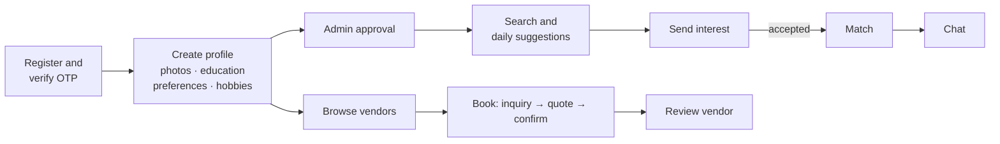
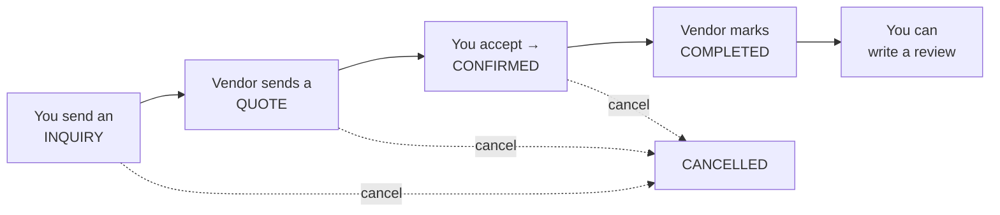

# HPHIDB Matrimony & Wedding Services Platform — User Manual

| Item | Value |
|---|---|
| Version | 1.0 (2026-09-26) |
| Applies to | Backend API v1 (`/api/v1`) and database `mphidb_dev` |
| Audience | Members (people looking for a match), Vendors (wedding-service businesses), Administrators, and the operators who install the system |
| Companion documents | [Software Requirements Specification](SRS.md) · [Data Dictionary](appendix/DATA_DICTIONARY.md) |

> **About the screens.** The web/mobile front-end was not part of the material this manual was generated from, so it describes *what you can do* and *the rules that apply*, naming the underlying API operation in `code` so the behaviour can be located precisely. Your app's screens will present the same operations with their own labels. Where the current build does not behave the way the feature was designed, a **⚠ Current build** note says so.

---

## Contents

1. [Getting started](#1-getting-started)
2. [Member guide](#2-member-guide)
3. [Vendor guide](#3-vendor-guide)
4. [Administrator guide](#4-administrator-guide)
5. [Installation & operations guide](#5-installation--operations-guide)
6. [Error messages and troubleshooting](#6-error-messages-and-troubleshooting)
7. [Quick reference: limits and statuses](#7-quick-reference-limits-and-statuses)
8. [Known limitations of the current build](#8-known-limitations-of-the-current-build)

---

## 1. Getting started

### 1.1 Who uses the platform

| Role | What you can do |
|---|---|
| **Visitor** (not signed in) | Browse wedding vendors, their services, reviews and availability; read the reference lists (religions, cities, …). |
| **Member** | Build a matrimony profile, search and receive daily suggestions, express interest, match and chat, book wedding vendors and review them. |
| **Vendor** | Manage your business listing, services and prices, gallery and testimonials; receive booking inquiries, send quotations, complete bookings and reply to reviews. |
| **Administrator** | Moderate members, profiles, photos, vendors and testimonials; maintain reference data; view dashboards, reports and the audit trail. |

Each account has a **status**: *Pending* (registered, mobile not yet verified), *Active*, or *Suspended* (blocked by an administrator).

### 1.2 Create an account

1. Choose **Member** or **Vendor** registration.
2. Provide your **name**, **e-mail** (must be unused), **mobile number** (must be unused), a **password** of at least 8 characters, and confirm the password. Vendors may also pick their **service category** (Shaadi Halls, Caterers, Makeup Artists, Decorators, Wedding Planners, Photographers, Transportation, Pooja/Pandit Booking); if you skip it the first category is assigned and you can change it later.
3. Submit (`POST /auth/register`). Your account is created in **Pending** status and you are signed in immediately, but you should verify your mobile next.

> **⚠ Current build:** while SMS/e-mail delivery is switched off (the default), the OTP is shown in the registration response so it can be entered directly — this is a development convenience and must be disabled in production.

### 1.3 Verify your mobile number (OTP)

1. A **6-digit one-time password** is sent to your mobile (and/or e-mail when enabled). It is valid for **10 minutes**.
2. Enter your mobile number and the code (`POST /auth/verify-otp`). On success your account becomes **Active**.
3. You may enter a wrong code **3 times**; on the 4th attempt the code is cancelled and you must request a new one.
4. Did not receive it? Use **Resend OTP** (`POST /auth/resend-otp`) — at most 3 resends per 10 minutes. A resend cancels the previous code.

Registration limits: 10 registrations per minute and 8 verification attempts per 10 minutes from the same network address.

### 1.4 Sign in and out

* **Sign in** (`POST /auth/login`) with your **e-mail or mobile number** and password. Five attempts per minute are allowed.
  * "Invalid credentials provided." — wrong e-mail/mobile or password.
  * "Your account has been suspended. Please contact support." — an administrator suspended the account.
* Unverified (*Pending*) accounts can still sign in; verify your mobile to unlock the full experience.
* **Sign out** (`POST /auth/logout`) ends the current session on this device only. Other devices stay signed in.

### 1.5 Forgot your password

1. Enter your registered e-mail (`POST /auth/forgot-password`). A reset link is e-mailed; it is valid for **60 minutes** and a new one can be requested once per minute.
2. Open the link and set a new password (at least 8 characters, confirmed) (`POST /auth/reset-password`).

> **⚠ Current build:** the reset e-mail cannot be generated because the reset page route is not configured (SRS KI-07). Ask an administrator to reset your password until this is fixed.

### 1.6 Account settings (all roles)

All three changes require your **current password** and are limited to 5 per minute.

| Setting | How | Notes |
|---|---|---|
| Change password | `PUT /account/password` — current password, new password (≥8) + confirmation | Other signed-in devices are **not** signed out. |
| Change e-mail | `PUT /account/email` — new unique e-mail + current password | No confirmation e-mail is sent. |
| Change mobile | `PUT /account/mobile` — new 10-digit mobile + current password | Your number is changed immediately and marked unverified; a new OTP is sent. Verify it with **Verify OTP** (§1.3). Your account stays usable meanwhile. |

---

## 2. Member guide

### 2.1 Overview of the member journey



### 2.2 Create and edit your profile

Your profile (biodata) is what other members see and what suggestions are calculated from. You have **one** profile.

**Create** (`POST /profile`) — required fields marked *:

| Field | Rules |
|---|---|
| Full name* | up to 255 characters |
| Gender* | male / female / other |
| Date of birth* | you must be **over 18 and under 70** |
| Profile created for* | self / son / daughter / brother / sister / friend |
| Religion* | from the religion list |
| Marital status* | Never Married / Divorced / Widowed |
| Caste, Gotra, Occupation, State, City, Income level | from the reference lists (optional) |
| Height | 100–250 cm |
| Complexion | fair / very fair / wheatish / wheatish brown / brown / dark brown |
| Food preference | vegetarian / non-vegetarian / both / jain |
| About me | up to 1000 characters |

**View** (`GET /profile`) shows everything above with names resolved, your age, photos, education, hobbies, preferences and a **completeness score** (see §2.7).

**Edit** (`PUT /profile`). All fields are optional on edit.

> **⚠ Current build:** an edit **replaces** the whole profile — any optional field you leave out is cleared. Always submit the complete profile when editing. The *income level* field is accepted but not saved (SRS KI-21c/d).

Every save is recorded in the audit trail.

### 2.3 Education history

Add one entry per qualification (`POST /profile/educations`): **education level*** (from the list, e.g. B.Tech, MBA), specialization, institute, and whether it is your **highest** qualification. The first entry is automatically your highest; marking another as highest (`PUT /profile/educations/{id}/highest`) moves the flag. Deleting the highest entry promotes your most recent one.

> **⚠ Current build:** the education section does not work — listing fails and adding/editing is refused (SRS KI-02). Use the *About me* text to mention your education until it is fixed.

### 2.4 Photos

* Up to **6 photos** per profile; **JPG or PNG**, at most **2 MB**, at least **200 × 200 pixels**.
* You may upload at most **10 photos per day** (upload, set-primary and delete together count toward a 10-per-day allowance).
* Your **first photo becomes your primary (display) photo**; you can mark any photo as primary (`PUT /profile/photos/{id}/primary`) or delete one (`DELETE /profile/photos/{id}`) — deleting the primary promotes your oldest remaining photo.
* Photos are stored **encrypted** and are only ever shown through short-lived links (15 minutes) — they cannot be hot-linked permanently.
* New photos are marked **Pending Review** until an administrator approves them; only approved photos count toward your completeness score and "verified photo" search filters.

> **⚠ Current build:** administrator photo approval does not reach uploaded photos, so they remain *Pending Review* and never count as verified (SRS KI-04). They are still visible to you and to your matches.

### 2.5 Partner preferences

Tell the system who you are looking for (`PUT /profile/preferences`; view with `GET /profile/preferences`). You need a profile first.

| Preference | Rules |
|---|---|
| Age range | 18–100 (defaults 18–50) |
| Height range | 100–250 cm (defaults 150–200) |
| Religion | one religion |
| Castes, Hobbies, Cities, States, Educations, Occupations | multi-select from the lists |
| Complexions, Food preferences | multi-select |

Preferences drive **daily suggestions** (candidates outside your age/height/religion/caste/education/occupation/location limits are excluded) and the **compatibility score**.

> **⚠ Current build:** only the age range, height range and religion are saved; every multi-select list is discarded (SRS KI-03).

### 2.6 Hobbies

Pick hobbies from the list (`PUT /profile/hobbies`). Each save **replaces** your whole hobby list — sending an empty list removes all hobbies. Shared hobbies add up to 8 points to compatibility (2 per common hobby).

### 2.7 Profile completeness and approval

Your completeness score (0–100) is made of: basic details **40** (name, gender, DOB, religion, caste, marital status), education **15**, verified photos **15** (5 per photo, up to 3), partner preferences **20**, about + hobbies **10** (5 each). The profile page lists the **next steps** to raise it.

Every new profile is reviewed by an administrator (**Pending → Approved / Rejected**). If rejected you receive an in-app notification with the reason; update your profile accordingly. Your profile appears in other members' search results only when it is active, verified and your mobile is verified.

### 2.8 Search for profiles

`POST /discover/search` — members only, up to **100 searches per hour**, 20 results per page.

**Filters:** age range (18–70), height range (100–250 cm), religion, castes, gotras, complexions, food preferences, education levels, occupations, state, city, hobbies (profiles must have **all** selected hobbies), minimum profile completeness (%), minimum number of verified photos.

**Sort:** Best Match (compatibility), Most Recent, Most Complete, Most Photos. The option lists for the filters come from `GET /discover/filters`.

Each result shows the member's key details and a **compatibility score with breakdown** (see §2.9). Your own profile is never shown.

> **⚠ Current build:** results are not filtered by gender, members you have blocked can still appear, and "Best Match" ordering currently returns newest-first (SRS KI-21).

**Popular profiles** (`GET /discover/popular`) lists the 20 most recently added approved profiles.

### 2.9 Daily suggestions and the compatibility score

Every day the system prepares up to **10 suggested profiles** for you (`GET /suggestions`), chosen from members who fit your partner preferences and ranked by compatibility. You can regenerate them up to **3 times per day** (`POST /suggestions/refresh`). Tap a suggestion to see **why** it was suggested (`GET /suggestions/{profileId}/breakdown`).

The **compatibility score (0–100)** adds up 15 factors:

| Factor | Max points | What earns points |
|---|---|---|
| Age difference | 12 | ≤2 years: 12 · ≤5: 10 · ≤10: 6 · ≤15: 2 |
| Location | 12 | same city 12 · same state 10 · different state 5 |
| Religion | 10 | matches your preference 10 · same as yours 8 |
| Caste | 10 | matches preference 10 · same as yours 8 · differs from preference 2 |
| Gotra | 5 | different gotra 5 · **same gotra −30** (traditionally avoided) |
| Height | 8 | inside your preferred range 8 · near it 6 / 3 |
| Complexion | 5 | matches preference 5 |
| Food preference | 5 | same 5 · one of you is flexible 3 |
| Education | 6 | same level 6 · adjacent 4 |
| Occupation | 5 | same 5 |
| Hobbies | 8 | 2 per shared hobby |
| Profile completeness | 5 | ≥80 %: 5 · ≥60 %: 3 |
| Verified photos | 6 | 3+: 6 · 2: 4 · 1: 2 |
| Recently joined | 5 | this month 3 · ≤3 months 2 · ≤6 months 1 |
| Active & verified | 3 | both 3 · active only 2 |

You need a profile **and** saved partner preferences to receive suggestions.

> **⚠ Current build:** suggestion generation may fail on the server, and the list shows a score of 0 while the breakdown shows the real per-factor values (SRS KI-10). Daily automatic generation is not scheduled; suggestions are generated when you open the page.

### 2.10 Interests — expressing and responding

An **interest** is how you tell another member you would like to connect.

**Send** (`POST /interests`): choose the profile, optionally add a message (≤500 characters). Rules:

* Up to **20 interests per day**.
* You cannot send an interest to yourself, to someone who has blocked you (or whom you blocked), or to someone you already have an interest with.
* An interest **expires after 30 days** if not answered.
* The receiver gets an in-app notification.

**Track** your interests: received (`GET /interests/received`), sent (`GET /interests/sent`), and a short pending summary (`GET /interests/pending`) — filter by status *PENDING / ACCEPTED / REJECTED / BLOCKED / EXPIRED*.

**Respond** to a received, still-pending interest:

| Action | Effect |
|---|---|
| **Accept** (`PUT /interests/{id}/accept`) | Creates a **match** between you; the sender is notified. Chat can start (§2.12). |
| **Reject** (`PUT /interests/{id}/reject`, optional reason ≤200) | The sender is notified that you declined. |
| **Block** (`PUT /interests/{id}/block`) | Permanently prevents interests between you in either direction; the sender is notified. There is no unblock. |

**Withdraw** an interest you sent (`DELETE /interests/{id}`) at any time; an existing match is not affected.

> **⚠ Current build:** after a rejection, expiry or withdrawal you cannot send a new interest to the same person; the rejection reason is not stored; blocking only stops interests — it does not hide the person from search or chat (SRS KI-13, KI-14).

### 2.11 Matches

When your interest is accepted (or you accept one) a **match** is created.

* **My matches** (`GET /matches`) — newest first, with the other member's profile summary, the number of messages exchanged and the latest message. Blocked matches are hidden unless you ask to include them.
* **Match details / partner profile** (`GET /matches/{id}`, `GET /matches/{id}/profile`) — the other member's full profile including their preferences and hobbies.
* **Block a match** (`PUT /matches/{id}/block`) hides it; only the person who blocked can **unblock** (`PUT /matches/{id}/unblock`).
* **Start chatting** (`POST /matches/{id}/message`, 1–1000 characters) opens the conversation with your first message.

> **⚠ Current build:** the partner-profile view omits photos and education; blocking a match does not stop messages (SRS KI-14).

### 2.12 Chat

Chat is private, one-to-one between matched members; message text is stored encrypted.

| Task | How | Rules |
|---|---|---|
| See conversations | `GET /conversations` | Latest activity first; shows unread count, whether the other person is online (active in the last 5 minutes) and when last seen. |
| Read messages | `GET /conversations/{id}`, `GET /conversations/{id}/messages` | 50 per page; load older messages with `before_id`. |
| Send a message | `POST /messages` | Text up to **5000 characters**; up to **60 messages per minute**. Attachments (JPG/PNG/GIF/PDF/DOC/DOCX/XLS/XLSX/ZIP, ≤10 MB) — see note. |
| Edit | `PUT /messages/{id}` | Only your own messages, within **60 minutes** of sending; marked "edited". |
| Delete | `DELETE /messages/{id}` | Only your own messages (designed window: 24 hours). |
| Mark read | `PUT /conversations/{id}/read` or `POST /messages/{id}/read` | The other person sees read receipts. |
| Typing indicator | `POST /conversations/{id}/typing`, `…/typing/stop` | Shown live to the other person. |
| Delete conversation | `DELETE /conversations/{id}` | Removes it for **both** participants. |

Live updates (new messages, edits, deletions, read receipts, typing) are delivered over a WebSocket connection while the app is open.

> **⚠ Current build:** file attachments fail (storage location not configured); editing after the 60-minute window produces a server error instead of a friendly message; live updates require the WebSocket channel authorisation that is not yet configured (SRS KI-06, KI-09, KI-15g).

### 2.13 Find wedding vendors

No sign-in is needed to browse.

* **Search vendors** (`GET /vendors`) — filter by **category**, **city**, **minimum rating**, **price range** (any service in range), free-text **search** (business name/description) and **availability date**; sorted by rating, 20 per page.
* **Vendor page** (`GET /vendors/{id}`) — description, contact details, address, years of experience, active **services with prices**, photo gallery, latest reviews with star breakdown, testimonials, average service price.
* **Services** (`GET /vendors/{id}/services`) and **reviews** (`GET /vendors/{id}/reviews`, filter by star rating).
* **Availability** (`GET /vendors/{id}/availability/{date}`) — hourly slots for a date, showing which are already booked.

> **⚠ Current build:** the availability lookup and date filter do not return correct data (SRS KI-11); vendors that are not yet approved can also appear in the list (SRS KI-12).

### 2.14 Book a vendor



1. **Send an inquiry** (`POST /bookings`) for a specific vendor **service**: event **date** (today or later), optional time from/to, **event address** and **city**, expected guest count, special requirements. The service's base price is shown as the *estimated amount*. Limits: 50 inquiries per day.
2. **Wait for the quote.** The vendor replies with a **final amount** (status becomes *QUOTED*).
3. **Accept the quote** (`PUT /bookings/{id}/accept-quote`) — the booking becomes **CONFIRMED**. No online payment is taken; the payment status shows *PARTIAL* as a placeholder — settle payment directly with the vendor.
4. After the event the vendor marks it **COMPLETED**.
5. **Cancel** (`PUT /bookings/{id}/cancel`, optional reason ≤500) at any time before completion — either you or the vendor can cancel.

Track your bookings with `GET /bookings` (filter by status) and `GET /bookings/{id}`; each shows whether you can confirm, cancel or review it.

> **⚠ Current build:** if you try an action that is not allowed in the booking's current status (for example accepting a quote that has not been sent), the server returns a generic error instead of an explanation (SRS KI-05). Vendors are not notified automatically of new inquiries — they see them in their booking list (SRS KI-19).

### 2.15 Review a vendor

After a booking is **COMPLETED** you can write **one review** for it (`POST /reviews`):

* **Overall rating** 1–5 stars, **title** (≤255), **review text** (≤2000).
* Four detailed ratings 1–5: **punctuality**, **communication**, **quality**, **value for money**.
* Up to 10 photo links.

Reviews are published immediately, marked *verified purchase*, and update the vendor's average rating. You cannot edit or delete a review. Other signed-in users can mark a review **helpful** (`PUT /reviews/{id}/helpful` — toggles). Vendors may post a public response.

### 2.16 Notifications

The platform records in-app notifications when someone shows interest in you, accepts or declines your interest, blocks you, when an interest expires, and when an administrator rejects your profile or a photo. (Push, SMS and e-mail delivery are planned; the current build stores notifications only.)

---

## 3. Vendor guide

### 3.1 Register and get approved

1. Register as a **Vendor** (§1.2), choosing your service category, and verify your mobile (§1.3).
2. Your business listing is created with your name as the business name and starts in **Pending** status, *unverified*.
3. An administrator **verifies** your business, which marks it *Approved* and shows a verified badge. Administrators can also **suspend** a listing.

> **⚠ Current build:** the listing is publicly visible and bookable regardless of approval status (SRS KI-12). Complete your profile before you expect customers.

### 3.2 Your business profile

**View** `GET /vendor/profile` · **Edit** `PUT /vendor/profile` (only the fields you send are changed):

| Field | Rules |
|---|---|
| Business name | ≤255, must be unique across the platform |
| Owner name | ≤255 |
| Short bio / Description | ≤1000 / ≤2000 |
| Phone / Alternate phone | ≤20 |
| Business address | ≤500 |
| City, Postal code (≤10) | |
| Service category | from the category list |
| Website | valid URL |
| Years of experience | 0–100 |

Your **e-mail**, rating, review count and verification flags are not editable here (use Account settings, §1.6, for the login e-mail).

**Logo** (`POST /vendor/profile/logo`): JPG/PNG/WEBP up to 2 MB; replaces the previous logo; 10 uploads per hour.

### 3.3 Services and pricing

Customers book a **service**. Manage them with `GET/POST /vendor/services`, `PUT/DELETE /vendor/services/{id}`.

| Field | Rules |
|---|---|
| Category* | from the category list (may differ from your main category) |
| Name* | ≤255 |
| Description | ≤2000 |
| Base price* | number ≥ 0 — shown to customers as the estimated amount |
| Price label | free text ≤100, e.g. "100 plates", "per couple" |
| Price unit | per event / per hour / per package / custom (default custom) |
| Duration (hours), Max guests | ≥1 |
| Includes: travel · decoration · makeup · videography · album | yes/no |
| Active | inactive services are hidden from customers but kept in your list |

Deleting a service is permanent; past bookings keep their details but no longer link to the service.

### 3.4 Photo gallery

`GET /vendor/images`, `POST /vendor/images`, `DELETE /vendor/images/{id}`.

* JPG/PNG/WEBP up to **4 MB**, optional caption (≤255); up to **20 uploads per hour**.
* Maximum **10 photos** in the gallery. The first photo is the primary image; you can flag another as primary when uploading. Removing the primary makes the next one primary.

### 3.5 Testimonials

Showcase client feedback you have collected outside the platform: `GET/POST /vendor/testimonials`, update with `POST /vendor/testimonials/{id}`, remove with `DELETE /vendor/testimonials/{id}`.

Fields: **client name***, client title, client location, **testimonial text*** (≤2000), rating 1–5 (default 5), optional photo (JPG/PNG/WEBP ≤4 MB). Up to five approved testimonials appear on your public page.

> **⚠ Current build:** testimonials are published immediately (the admin approval step is bypassed). Note that customers' verified *reviews* (§3.7) are separate and cannot be written by you.

### 3.6 Handle bookings

Your booking list (`GET /bookings`, filter by status) shows every inquiry for your business with the customer's details, event date, location and guest count.

| Step | Action | Rules |
|---|---|---|
| New **INQUIRY** arrives | Review it (`GET /bookings/{id}`) | Includes the customer's requirements and the estimated amount (your base price). |
| **Send a quotation** | `PUT /bookings/{id}/respond-inquiry` with **final amount** (≥1) and optional notes (≤500) | Status → *QUOTED*; your response time is recorded. |
| Customer **accepts** | — | Status → *CONFIRMED*. Arrange payment directly with the customer (no online payment). |
| After the event | `PUT /bookings/{id}/complete` | Allowed only on or after the event date; status → *COMPLETED*; the customer may now review you. |
| **Cancel** | `PUT /bookings/{id}/cancel` with optional reason | Possible from any status except completed/cancelled. |

> **⚠ Current build:** quotation notes are not saved; there are no automatic notifications — check your booking list regularly (SRS KI-19).

### 3.7 Reviews, responses and your rating

* Customers can review a booking only after you mark it **completed**, once per booking.
* Your public **rating** is the average of all published reviews and updates immediately when a review is posted; the review count and a star breakdown appear on your page.
* **Respond** to a review (`PUT /reviews/{id}/respond`, ≤1000 characters). You can update your response later. Reviews cannot be removed by vendors.

---

## 4. Administrator guide

Administrators sign in like any user (§1.4) with an account whose role is *Admin*. A seeded administrator exists in development: `admin@matrimony.test` (password `Admin@12345` when created by `AdminUserSeeder`, or `Admin@123` when created by the demo `DatabaseSeeder`). **Change it before going live.** All admin operations live under `/api/v1/admin/…`; non-admins receive "Forbidden. Admin access required."

Every moderation action is written to the audit trail with your identity, IP address, the previous and new values, and the reason you gave.

### 4.1 Dashboard

* **Statistics** (`GET /admin/dashboard/stats`): users by status, profiles by moderation status, vendors by status, bookings by status, total interests and matches, messages today, revenue this month (completed bookings). Refreshed every 15 minutes and after moderation actions.
* **Recent activity** (`GET /admin/dashboard/activity`): the 20 latest audit entries.

> **⚠ Current build:** the bookings-by-status counters always show 0 (SRS KI-16i).

### 4.2 Users

* **List** (`GET /admin/users`) — filter by role, status, or search name/e-mail/phone; shows profile summary and counts of interests, bookings and reviews. **Detail** (`GET /admin/users/{id}`) adds photos, interest summary and a 20-entry audit trail; deleted users can still be viewed.
* **Activate** (`PUT /admin/users/{id}/activate`) — sets *Active* and clears any suspension.
* **Suspend** (`PUT /admin/users/{id}/suspend`, **reason required**, ≤500) — the user is signed out everywhere and cannot sign in ("Your account has been suspended…"). Suspension is indefinite until you activate the user again.
* **Delete** (`DELETE /admin/users/{id}`) — soft-deletes the user and their profile and signs them out; bookings, messages and vendor records remain.

> Take care: nothing prevents suspending or deleting another administrator or yourself (SRS KI-16c). A suspended user who completes an OTP verification is re-activated (KI-16b).

### 4.3 Profile moderation

* **Pending queue** (`GET /admin/profiles/pending`) — oldest first, with the member's name/e-mail, photo count and any previous moderator.
* **Approve** (`PUT /admin/profiles/{id}/approve`) — marks the profile *Approved*.
* **Reject** (`PUT /admin/profiles/{id}/reject`, reason required) — marks *Rejected*, stores the reason and sends the member an in-app notification "Your profile was rejected by moderation. Reason: …".

> **⚠ Current build:** approval alone does not make a profile visible in search (the *verified* flag is not set) — SRS KI-16a.

### 4.4 Photo moderation

`GET /admin/photos/pending`, `PUT /admin/photos/{id}/approve`, `PUT /admin/photos/{id}/reject` (reason required; the member is notified).

> **⚠ Current build:** this queue reads a legacy photo table, so members' uploaded photos never appear here and approve/reject fails (SRS KI-04).

### 4.5 Vendor moderation

* **List** (`GET /admin/vendors`) — filter by status, category, verified flag or search (business, owner, e-mail); shows booking and review counts.
* **Verify** (`PUT /admin/vendors/{id}/verify`) — sets *Approved* and the verified badge (also re-activates a suspended vendor).
* **Suspend** (`PUT /admin/vendors/{id}/suspend`, reason required) — sets *Suspended*; the reason is kept in the audit log. The vendor's login is not affected.

There is no separate "reject" action; leave a listing pending or suspend it.

### 4.6 Testimonial moderation

`GET /admin/testimonials/pending`, `PUT /admin/testimonials/{id}/approve`, `PUT /admin/testimonials/{id}/reject` (reason required).

> **⚠ Current build:** vendor-entered testimonials are already approved when created, and rejected ones return to the pending list (SRS KI-16d).

### 4.7 Reference data (masters)

Maintain the lists members and vendors pick from: `religions`, `castes`, `gotras`, `educations`, `occupations`, `hobbies`, `countries`, `states`, `cities`, `income-levels`, `service-categories`.

* **List/search** `GET /admin/masters/{type}?search=` (25 per page).
* **Create** `POST /admin/masters/{type}` — name (or *label* for income levels; required, unique, ≤191), description (≤500), status, code (≤10), country (for states), min/max amount and sort order (income levels).
* **Update** `PUT /admin/masters/{type}/{id}`.
* **Delete** `DELETE /admin/masters/{type}/{id}` — refused with "Cannot delete: record is referenced by other data" (and the number of references) when profiles, preferences, vendors or child lists use the entry.

Changes clear the public caches immediately and are audited (`master.create/update/delete`).

> **⚠ Current build:** the *educations* list cannot be managed here, and *castes* and *cities* cannot be created because their parent (religion / state) cannot be supplied — add them through the database or seeder for now (SRS KI-16e/f). Some fields (e.g. status on religions) are accepted but not saved.

### 4.8 Audit log

`GET /admin/audit-logs` (50 per page; filter by actor `user_id`, `action`, `date_from`, `date_to`) and `GET /admin/audit-logs/{id}`. Each entry shows the actor, action name (e.g. `user.suspend`, `profile.reject`, `master.update`, `message_sent`), the target record, old and new values, IP address, description/reason and time. Member and chat actions appear alongside admin actions — filter by action to isolate moderation.

### 4.9 Reports (last 30 days, daily)

* **Users** (`GET /admin/reports/users`) — registrations per day.
* **Bookings** (`GET /admin/reports/bookings`) — bookings created and quoted revenue per day.
* **Engagement** (`GET /admin/reports/engagement`) — interests sent and accepted, matches created, messages per day.

---

## 5. Installation & operations guide

### 5.1 Requirements

* PHP **8.2+** with the usual Laravel extensions plus **GD** (thumbnails) and OpenSSL; Composer.
* MySQL 8/9 (development dump uses MySQL 9.1, `utf8mb4_unicode_ci`); SQLite is possible for local development.
* Node.js/npm (only for building the backend's own assets).
* A process supervisor (systemd/Supervisor) for the queue worker and Reverb in production.

### 5.2 First-time setup

```bash
cd backend-code
composer install                     # add --no-dev only after moving sanctum/reverb to "require"
cp .env.example .env                 # then edit (see §5.3)
php artisan key:generate             # APP_KEY encrypts photos and chat messages — back it up!
php artisan migrate                  # 69 migrations
php artisan db:seed --class=AdminUserSeeder   # admin@matrimony.test / Admin@12345
# optional demo data (40 profiles, 18 vendors, sample bookings):
php artisan db:seed
php artisan storage:link             # exposes vendor logos/gallery under /storage
npm install && npm run build         # optional
```

**Importing the supplied development database** (`mphidb_dev.sql`) instead of migrating: first delete the two orphan view definitions (`access_list_views`, `assign_user_access_views` — both the empty stand-in `CREATE TABLE` blocks near the top and the `CREATE VIEW` statements near the end); their source tables do not exist and MySQL rejects the file otherwise. Then `mysql mphidb_dev < mphidb_dev.sql`.

### 5.3 Configuration (`.env`)

| Setting | Purpose | Development default |
|---|---|---|
| `APP_NAME`, `APP_URL`, `FRONTEND_URL` | Branding; API base; SPA origin | Matrimony · http://localhost:8000 · http://localhost:5173 |
| `APP_KEY` | Encryption key for photos, messages, tokens | generated |
| `APP_DEBUG` | Show stack traces (set **false** in production) | true |
| `DB_*` | Database connection | mysql / mphidb_dev |
| `CACHE_STORE`, `QUEUE_CONNECTION`, `SESSION_DRIVER` | All use the database | database |
| `BROADCAST_CONNECTION`, `REVERB_APP_ID/KEY/SECRET`, `REVERB_HOST/PORT/SCHEME` | WebSocket server | reverb · 127.0.0.1:8080 http |
| `MAIL_MAILER`, `MAIL_*` | Outgoing e-mail (OTP e-mail, password reset) | log |
| `OTP_SMS_ENABLED`, `OTP_EMAIL_ENABLED` | OTP delivery channels. **When both are false the OTP is returned in API responses** — never in production. | false / false |
| `SMS_DRIVER`, `MSG91_AUTH_KEY`, `MSG91_ROUTE` | Reserved for an SMS gateway (not yet implemented) | log |
| `PHOTO_STORAGE_DISK`, `PHOTO_ENCRYPTION_ENABLED` | Where/how profile photos are stored | local / true |
| `MAT_EXCLUDE_SAME_GOTRA` | Reserved (not read by code) | false |

### 5.4 Running the platform

| Process | Command | Needed for |
|---|---|---|
| HTTP API | `php artisan serve` (dev) or nginx + php-fpm | everything |
| Queue worker | `php artisan queue:work --tries=3` | chat broadcasts, queued listeners |
| WebSocket server | `php artisan reverb:start` | live chat updates |
| Scheduler | cron: `* * * * * php artisan schedule:run` | daily suggestions (02:00) and interest expiry (03:00) — see note |
| All-in-one dev | `composer run dev` | serve + queue + logs + vite |

> **⚠ Current build:** the daily jobs are defined in a console kernel that Laravel 12 does not load, so the scheduler runs nothing until they are re-registered (SRS KI-08). They can be run manually with `php artisan tinker` → `dispatch(new App\Jobs\GenerateDailySuggestionsJob)` / `dispatch(new App\Jobs\ExpireInterestsJob)`.

Health check: `GET /up`.

### 5.5 Backups and data protection

* Back up the database **and** `storage/app` (private encrypted photos, public vendor media) **and** the `APP_KEY`. Photos and chat history cannot be decrypted without the key.
* Logs: `storage/logs/laravel.log`. While OTP channels are disabled the log contains plaintext OTPs — restrict access and disable in production.
* Failed queue jobs are recorded in `failed_jobs`; retry with `php artisan queue:retry all`.

---

## 6. Error messages and troubleshooting

| Message (HTTP) | Meaning | What to do |
|---|---|---|
| `Validation failed.` (422) + field errors | A field is missing or invalid | Fix the listed fields (each has a specific message, e.g. "You must be at least 18 years old", "Photo must not exceed 2MB"). |
| `Unauthenticated.` (401) | No or invalid access token | Sign in again. |
| `Forbidden. Admin access required.` / `Forbidden. Vendor access required.` (403) | Wrong role | Use an account with the right role. |
| `This action is unauthorized.` / `Unauthorized` / `Request failed.` (403) | You do not own this record or are not a participant | Check you are acting on your own data. |
| `Endpoint not found.` / `Resource not found.` (404) | Wrong URL or the record no longer exists | Refresh the list. |
| `Too Many Attempts.` (429) | Rate limit hit | Wait (the `Retry-After` header says how long). |
| `OTP not found. Please register again.` (404) | No code on file for that mobile | Request a new OTP. |
| `OTP has expired. Please request a new one.` (410) | Older than 10 minutes | Resend OTP. |
| `Maximum OTP verification attempts exceeded…` (429) | 3 wrong codes | Resend OTP. |
| `Invalid OTP provided.` (400) | Wrong code | Re-enter (attempts remaining decrease). |
| `Mobile number is already verified.` (409) | Resend not needed | Sign in. |
| `Invalid credentials provided.` (401) | Wrong login/password | Retry or reset password. |
| `Your account has been suspended. Please contact support.` (403) | Admin suspension | Contact the administrator. |
| `Current password is incorrect.` (422) | Account change refused | Re-enter your current password. |
| `Please create your profile first.` (409) | Preferences/hobbies need a profile | Create the profile. |
| `Profile not found` / `Preferences not found` (404) | Not created yet | Create them. |
| `Daily photo upload limit reached` / `Maximum photos per profile reached` (400) | Photo quotas | Wait a day / delete a photo. |
| `Search rate limit exceeded. Maximum 100 searches per hour.` (429) | Search quota | Wait. |
| `You have reached the maximum number of refreshes for today (3 per day)` (429) | Suggestion refreshes | Try tomorrow. |
| `You have exceeded the daily interest limit. Try again tomorrow.` (429) | 20 interests/day | Wait. |
| `Cannot send interest to yourself` / `You are blocked by this user` / `Interest already exists between these users` (400) | Interest rules | — |
| `Interest is no longer pending` / `Interest has expired` (400) | Cannot respond | — |
| `Match is already blocked` / `You did not block this match` (400) | Block state | — |
| `Maximum of 10 gallery photos per business.` (422) | Vendor gallery full | Remove a photo. |
| `This service/photo/testimonial does not belong to your business.` (403) | Vendor ownership | — |
| `Cannot delete: record is referenced by other data` (409) | Master entry in use | Reassign references first. |
| `User did not book this service` (403) · `Booking is not completed` · `This booking has already been reviewed` (422) | Review rules | — |
| `Server Error` (500) | Unexpected failure — includes several known cases listed in §8 | Report to the administrator with the time and action. |

---

## 7. Quick reference: limits and statuses

| Item | Value |
|---|---|
| OTP | 6 digits, 10 min, 3 wrong attempts, resend 3 per 10 min |
| Password | ≥ 8 characters |
| Profile age | > 18 and < 70 |
| Photos | 6 per profile, 2 MB, ≥200×200, JPG/PNG, 10 changes/day, links valid 15 min |
| Search | 100/hour, 20 per page |
| Suggestions | 10/day, refresh 3/day |
| Interests | 20/day, expire in 30 days, 20 per page |
| Chat | 5000 chars, 60 msgs/min, edit within 60 min, attachments 10 MB (30/h) |
| Vendor media | logo 2 MB (10/h); gallery 4 MB, max 10 (20/h); testimonial photo 4 MB (20/h) |
| Bookings / reviews | 50 per day each |

**Account status:** Pending · Active · Suspended. **Profile moderation:** Pending · Approved · Rejected. **Photo:** Pending Review · Approved · Rejected · Private. **Interest:** PENDING · ACCEPTED · REJECTED · BLOCKED · EXPIRED. **Vendor listing:** Pending · Approved · Rejected · Suspended. **Booking:** INQUIRY · QUOTED · CONFIRMED · COMPLETED · CANCELLED. **Payment:** PENDING · PARTIAL (no online payments).

---

## 8. Known limitations of the current build

The following features are specified but do not work correctly in the analysed build. Full technical detail and IDs are in SRS §7.

| Feature | Symptom | SRS ref |
|---|---|---|
| Forgot password | Reset e-mail cannot be generated | KI-07 |
| Education history | Cannot list, add or edit | KI-02 |
| Partner preferences | Multi-select lists (castes, hobbies, cities, …) are not saved | KI-03 |
| Photo approval | Uploaded photos never become verified; admin photo queue fails | KI-04 |
| Profile approval | Approved profiles are still not searchable | KI-16a |
| Profile edit | Omitted fields are cleared; income level not saved | KI-21c/d |
| Search | No gender filter; blocked users shown; "Best match" sort inactive | KI-21 |
| Suggestions | May fail to generate; list score shows 0; not run automatically | KI-08, KI-10 |
| Interests | No re-sending after rejection/expiry; reason not stored; some denials show as server errors | KI-13 |
| Matches | Blocking does not stop chat; partner profile lacks photos/education | KI-14 |
| Chat attachments / live updates | Attachments fail; WebSocket channel authorisation missing | KI-06, KI-09 |
| Vendor availability | Slots/date filter incorrect; no way to set opening hours | KI-11 |
| Vendor approval | Unapproved/suspended vendors remain visible and bookable | KI-12 |
| Bookings | Rule violations return "Server Error"; quote notes not saved; no notifications; no booking code | KI-05, KI-19 |
| Testimonials | Auto-approved; rejected ones stay pending | KI-16d |
| Master data admin | Educations unmanageable; castes/cities cannot be created | KI-16e/f |
| Dashboard | Booking counters show 0 | KI-16i |
| Security hygiene | Tokens never expire; OTPs in logs in dev mode; reviewer e-mails public | KI-15 |
