# Data Dictionary — `mphidb_dev`

> Appendix to the [Software Requirements Specification](../SRS.md) and [User Manual](../USER_MANUAL.md) of the HPHIDB Matrimony & Wedding Services Platform. Generated 2026-09-26 from the phpMyAdmin dump `mphidb_dev.sql` (MySQL 9.1.0, dump dated 2026-07-18), cross-checked against the 69 migrations, 37 Eloquent models, 18 constants classes and 2 seeders in `backend-code/`. Sample data described in §9 is reported in aggregate only — no credentials, e-mail addresses, phone numbers or tokens are reproduced.


## 0. Sources, scope and conventions

| Item | Value |
|---|---|
| Primary source | `mphidb_dev.sql` — phpMyAdmin 5.2.1 dump, generated 2026-07-18 08:55, MySQL 9.1.0, PHP 8.2.26, 2 245 lines |
| Secondary sources | `backend-code/database/migrations/` (69 files), `backend-code/app/Models/` (37 models), `backend-code/app/Constants/` (18 enum classes), `backend-code/database/seeders/` (2 seeders), route files under `backend-code/routes/` |
| Database | `mphidb_dev`, default charset `utf8mb4`, collation `utf8mb4_unicode_ci` on every table and string column |
| Objects in dump | **47 tables + 2 views** (`access_list_views`, `assign_user_access_views`) = 49 objects |
| Engines | InnoDB for all domain tables. **MyISAM** (no FK support) for: `cache`, `cache_locks`, `failed_jobs`, `jobs`, `job_batches`, `migrations`, `password_reset_tokens`, `personal_access_tokens`, `photos`, `sessions` |
| Migrations applied | All 69 migration files are recorded in `migrations` (batch 1: 65 files; batches 2–5: `000066`–`000069`, one per batch) |

Conventions used in the column tables below:

* **Type** is copied from the dump (`bigint UNSIGNED` written as `bigint unsigned`; `tinyint(1)` is Laravel's `boolean()`).
* **Null** = `Y` if the column allows NULL, `N` if `NOT NULL`.
* **Default** = the dump's `DEFAULT`; `—` means no default (must be supplied on INSERT); `auto` = `AUTO_INCREMENT`.
* **Meaning** comes, in order of preference, from the column `COMMENT` in the dump (quoted), the migration that added it (cited as `m:NNNNNN`, i.e. `0001_01_01_00NNNNNN_*`), the model's `$casts`/constants, or the column name.
* "Keys" lists PRIMARY KEY, UNIQUE KEYs and plain KEYs exactly as named in the dump. "Foreign keys" lists the `ALTER TABLE … ADD CONSTRAINT` statements at the end of the dump, with `ON DELETE` behaviour (no FK in the dump specifies `ON UPDATE`, so all are `ON UPDATE RESTRICT/NO ACTION` by MySQL default).
* "Rows in dump" is the number of tuples in the table's `INSERT` statement(s); "AI" is the `AUTO_INCREMENT` value in `CREATE TABLE`, which reveals how many rows once existed.
* Every table has `created_at`/`updated_at` as `timestamp NULL DEFAULT NULL` unless stated otherwise.

---

## 1. Identity & auth

### 1.1 `users` — InnoDB, rows in dump: 8, AI = 90 — model `App\Models\User` (Sanctum `HasApiTokens`, `SoftDeletes`)

| Column | Type | Null | Default | Meaning |
|---|---|---|---|---|
| id | bigint unsigned | N | auto | PK |
| name | varchar(255) | N | — | Display name |
| email | varchar(191) | N | — | Login e-mail, unique |
| phone | varchar(20) | Y | NULL | Mobile number; target of OTP login (m:000032). Not unique at DB level |
| email_verified_at | timestamp | Y | NULL | E-mail verification time. Only set on the seeded admin; the app verifies phone, not e-mail (comment in `Profile::scopeSearchable`) |
| phone_verified_at | timestamp | Y | NULL | Set when the OTP is verified (m:000032) |
| password | varchar(255) | N | — | bcrypt hash (`$casts['password'] = 'hashed'`) |
| role | tinyint unsigned | N | 2 | "1=Admin, 2=User, 3=Vendor" (`App\Constants\UserRole`) |
| status | tinyint unsigned | N | 1 | "1=Pending, 2=Active, 3=Suspended" (`App\Constants\UserStatus`) |
| remember_token | varchar(100) | Y | NULL | Laravel "remember me" token |
| created_at | timestamp | Y | NULL | |
| updated_at | timestamp | Y | NULL | |
| last_seen_at | timestamp | Y | NULL | Presence heartbeat (m:000038); `User::isOnline()` = seen within the last 5 minutes |
| suspended_at | timestamp | Y | NULL | Admin suspension time (m:000053) |
| suspension_reason | text | Y | NULL | Admin suspension reason (m:000053) |
| deleted_at | timestamp | Y | NULL | Soft delete (m:000053) |

Keys: `PRIMARY KEY (id)`; `UNIQUE KEY users_email_unique (email)`. No other indexes (no index on `phone`, `role` or `status`).
Foreign keys: none (parent table only).

### 1.2 `otps` — InnoDB, rows in dump: 12, AI = 31 — model `App\Models\Otp`

| Column | Type | Null | Default | Meaning |
|---|---|---|---|---|
| id | bigint unsigned | N | auto | PK |
| mobile | varchar(20) | N | — | Mobile number the OTP was sent to (not an FK to `users.phone`) |
| otp | varchar(255) | N | — | The one-time code, stored as a bcrypt hash (all 12 sample values start with `$2y$12$`) |
| attempts | smallint unsigned | N | 0 | Failed verification attempts; `Otp::isMaxAttemptsExceeded($max = 3)` |
| expires_at | timestamp | N | — | Expiry; `Otp::isExpired()`. In the sample data `expires_at − created_at` is 10 minutes for every row |
| created_at | timestamp | Y | NULL | |
| updated_at | timestamp | Y | NULL | |

Keys: `PRIMARY KEY (id)`; `KEY otps_mobile_index (mobile)`; `KEY otps_expires_at_index (expires_at)`.
Foreign keys: none.

### 1.3 `personal_access_tokens` — **MyISAM**, rows in dump: 61, AI = 76 — Laravel Sanctum (no app model; `2026_07_10_120223`)

| Column | Type | Null | Default | Meaning |
|---|---|---|---|---|
| id | bigint unsigned | N | auto | PK |
| tokenable_type | varchar(191) | N | — | Polymorphic owner class; always `App\Models\User` in the dump |
| tokenable_id | bigint unsigned | N | — | Owner id (`users.id`) |
| name | varchar(255) | N | — | Token name; always `auth_token` in the dump |
| token | varchar(64) | N | — | SHA-256 of the plain-text bearer token, unique |
| abilities | text | Y | NULL | JSON array of abilities; always `["*"]` in the dump |
| last_used_at | timestamp | Y | NULL | |
| expires_at | timestamp | Y | NULL | Always NULL in the dump (non-expiring tokens) |
| created_at | timestamp | Y | NULL | |
| updated_at | timestamp | Y | NULL | |

Keys: `PRIMARY KEY (id)`; `UNIQUE KEY personal_access_tokens_token_unique (token)`; `KEY personal_access_tokens_tokenable_type_tokenable_id_index (tokenable_type, tokenable_id)`.
Foreign keys: none (polymorphic; MyISAM).

### 1.4 `password_reset_tokens` — **MyISAM**, rows in dump: 0 — Laravel framework (m:000000)

| Column | Type | Null | Default | Meaning |
|---|---|---|---|---|
| email | varchar(191) | N | — | PK; e-mail the reset token was issued for |
| token | varchar(255) | N | — | Hashed reset token |
| created_at | timestamp | Y | NULL | |

Keys: `PRIMARY KEY (email)`. Foreign keys: none.

### 1.5 `sessions` — **MyISAM**, rows in dump: 0 — Laravel framework (m:000000)

| Column | Type | Null | Default | Meaning |
|---|---|---|---|---|
| id | varchar(191) | N | — | PK; session id |
| user_id | bigint unsigned | Y | NULL | Logged-in user (no FK) |
| ip_address | varchar(45) | Y | NULL | |
| user_agent | text | Y | NULL | |
| payload | longtext | N | — | Serialized session data |
| last_activity | int | N | — | Unix timestamp |

Keys: `PRIMARY KEY (id)`; `KEY sessions_user_id_index (user_id)`; `KEY sessions_last_activity_index (last_activity)`. Foreign keys: none.

---

## 2. Master data

All master tables share the pattern `status tinyint NOT NULL DEFAULT 1 COMMENT '1=Active, 0=Inactive'` (comment present on all except `countries` and `income_levels`).

### 2.1 `religions` — InnoDB, rows: 5, AI = 6 — model `Religion`

| Column | Type | Null | Default | Meaning |
|---|---|---|---|---|
| id | bigint unsigned | N | auto | PK |
| name | varchar(100) | N | — | Religion name, unique |
| description | text | Y | NULL | |
| status | tinyint | N | 1 | "1=Active, 0=Inactive" |
| created_at / updated_at | timestamp | Y | NULL | |

Keys: `PRIMARY KEY (id)`; `UNIQUE KEY religions_name_unique (name)`; `KEY religions_status_index (status)`. Foreign keys: none.

### 2.2 `castes` — InnoDB, rows: 10, AI = 11 — model `Caste`

| Column | Type | Null | Default | Meaning |
|---|---|---|---|---|
| id | bigint unsigned | N | auto | PK |
| religion_id | bigint unsigned | N | — | Owning religion |
| name | varchar(100) | N | — | Caste name, unique per religion |
| description | text | Y | NULL | |
| status | tinyint | N | 1 | "1=Active, 0=Inactive" |
| created_at / updated_at | timestamp | Y | NULL | |

Keys: `PRIMARY KEY (id)`; `UNIQUE KEY castes_religion_id_name_unique (religion_id, name)`; `KEY castes_religion_id_index (religion_id)`; `KEY castes_status_index (status)`.
Foreign keys: `castes_religion_id_foreign (religion_id) → religions(id) ON DELETE CASCADE`.

### 2.3 `gotras` — InnoDB, rows: 10, AI = 11 — model `Gotra`

| Column | Type | Null | Default | Meaning |
|---|---|---|---|---|
| id | bigint unsigned | N | auto | PK |
| name | varchar(100) | N | — | Gotra name, unique (not scoped to religion/caste) |
| description | text | Y | NULL | |
| status | tinyint | N | 1 | "1=Active, 0=Inactive" |
| created_at / updated_at | timestamp | Y | NULL | |

Keys: `PRIMARY KEY (id)`; `UNIQUE KEY gotras_name_unique (name)`; `KEY gotras_status_index (status)`. Foreign keys: none.

### 2.4 `educations` — InnoDB, rows: 10, AI = 11 — model `Education`

| Column | Type | Null | Default | Meaning |
|---|---|---|---|---|
| id | bigint unsigned | N | auto | PK |
| level | varchar(100) | N | — | Qualification level / degree name, unique (e.g. "Bachelor's", "MBA") |
| field_of_study | varchar(100) | Y | NULL | Discipline (e.g. "Technology") |
| description | text | Y | NULL | |
| status | tinyint | N | 1 | "1=Active, 0=Inactive" (`$casts` integer) |
| created_at / updated_at | timestamp | Y | NULL | |

Keys: `PRIMARY KEY (id)`; `UNIQUE KEY educations_level_unique (level)`; `KEY educations_status_index (status)`. Foreign keys: none.

### 2.5 `occupations` — InnoDB, rows: 15, AI = 16 — model `Occupation`

| Column | Type | Null | Default | Meaning |
|---|---|---|---|---|
| id | bigint unsigned | N | auto | PK |
| name | varchar(100) | N | — | Occupation title, unique. Created as `title` (m:000007) and renamed to `name` (m:000055) |
| category | varchar(100) | Y | NULL | Sector (e.g. "IT", "Healthcare") |
| description | text | Y | NULL | |
| status | tinyint | N | 1 | "1=Active, 0=Inactive" |
| created_at / updated_at | timestamp | Y | NULL | |

Keys: `PRIMARY KEY (id)`; `UNIQUE KEY occupations_title_unique (name)` (index name kept the old column name); `KEY occupations_status_index (status)`; `KEY occupations_category_index (category)`. Foreign keys: none.

### 2.6 `hobbies` — InnoDB, rows: 15, AI = 16 — model `Hobby`

| Column | Type | Null | Default | Meaning |
|---|---|---|---|---|
| id | bigint unsigned | N | auto | PK |
| name | varchar(100) | N | — | Hobby name, unique |
| description | text | Y | NULL | |
| category | varchar(100) | Y | NULL | Grouping; NULL for all seeded rows |
| status | tinyint | N | 1 | "1=Active, 0=Inactive" |
| created_at / updated_at | timestamp | Y | NULL | |

Keys: `PRIMARY KEY (id)`; `UNIQUE KEY hobbies_name_unique (name)`; `KEY hobbies_status_index (status)`; `KEY hobbies_category_index (category)`. Foreign keys: none.

### 2.7 `countries` — InnoDB, rows: 5, AI = 6 — model `Country` (m:000062)

| Column | Type | Null | Default | Meaning |
|---|---|---|---|---|
| id | bigint unsigned | N | auto | PK |
| name | varchar(191) | N | — | Country name, unique |
| code | varchar(3) | N | — | Country code; values are not ISO-consistent ("IN", "USA", "UK", "CA", "AU"). Not unique, not indexed |
| status | tinyint | N | 1 | Active flag (no comment; `$casts` integer) |
| created_at / updated_at | timestamp | Y | NULL | |

Keys: `PRIMARY KEY (id)`; `UNIQUE KEY countries_name_unique (name)`. Foreign keys: none.

### 2.8 `states` — InnoDB, rows: 10, AI = 11 — model `State`

| Column | Type | Null | Default | Meaning |
|---|---|---|---|---|
| id | bigint unsigned | N | auto | PK |
| country_id | bigint unsigned | Y | NULL | Owning country (m:000064); all 10 rows = 1 (India) |
| name | varchar(100) | N | — | State name, globally unique (not scoped to country) |
| code | varchar(10) | N | — | State code, globally unique (e.g. "MP") |
| description | text | Y | NULL | |
| status | tinyint | N | 1 | "1=Active, 0=Inactive" |
| created_at / updated_at | timestamp | Y | NULL | |

Keys: `PRIMARY KEY (id)`; `UNIQUE KEY states_name_unique (name)`; `UNIQUE KEY states_code_unique (code)`; `KEY states_status_index (status)`; `KEY states_country_id_foreign (country_id)`.
Foreign keys: `states_country_id_foreign (country_id) → countries(id) ON DELETE SET NULL`.

### 2.9 `cities` — InnoDB, rows: 46, AI = 47 — model `City`

| Column | Type | Null | Default | Meaning |
|---|---|---|---|---|
| id | bigint unsigned | N | auto | PK |
| state_id | bigint unsigned | N | — | Owning state |
| name | varchar(100) | N | — | City name, unique per state |
| code | varchar(10) | Y | NULL | Seeder sets first three letters upper-cased (e.g. "BHO"); not unique |
| description | text | Y | NULL | |
| status | tinyint | N | 1 | "1=Active, 0=Inactive" |
| created_at / updated_at | timestamp | Y | NULL | |

Keys: `PRIMARY KEY (id)`; `UNIQUE KEY cities_state_id_name_unique (state_id, name)`; `KEY cities_state_id_index (state_id)`; `KEY cities_status_index (status)`.
Foreign keys: `cities_state_id_foreign (state_id) → states(id) ON DELETE CASCADE`.

### 2.10 `income_levels` — InnoDB, rows: 5, AI = 6 — model `IncomeLevel` (m:000063)

| Column | Type | Null | Default | Meaning |
|---|---|---|---|---|
| id | bigint unsigned | N | auto | PK |
| label | varchar(191) | N | — | Band label ("Lower" … "Affluent") |
| min_amount | decimal(12,2) | Y | NULL | Lower bound of annual income (INR per seeder comment); NULL = open |
| max_amount | decimal(12,2) | Y | NULL | Upper bound; NULL = open |
| sort_order | int | N | 0 | Display order |
| status | tinyint | N | 1 | Active flag |
| created_at / updated_at | timestamp | Y | NULL | |

Keys: `PRIMARY KEY (id)` only. Foreign keys: none.

### 2.11 `service_categories` — InnoDB, rows: 8, AI = 9 — model `ServiceCategory`

| Column | Type | Null | Default | Meaning |
|---|---|---|---|---|
| id | bigint unsigned | N | auto | PK |
| name | varchar(100) | N | — | Vendor category name, unique |
| description | text | Y | NULL | |
| icon | varchar(255) | Y | NULL | Icon reference; NULL for all rows |
| status | tinyint | N | 1 | "1=Active, 0=Inactive" |
| created_at / updated_at | timestamp | Y | NULL | |

Keys: `PRIMARY KEY (id)`; `UNIQUE KEY service_categories_name_unique (name)`; `KEY service_categories_status_index (status)`. Foreign keys: none.
Note: the model's `$fillable` lists `slug`, which is not a column.

---

## 3. Matrimony profile

### 3.1 `profiles` — InnoDB, rows: 3, AI = 51 — model `Profile` (`SoftDeletes`)

Columns are listed in dump order (which reflects the migration history: m:000012 base, m:000066 inserted `created_for`, `height_cm`, `food_type`, `about` via `->after()`, then m:000052, m:000057, m:000065 appended).

| Column | Type | Null | Default | Meaning |
|---|---|---|---|---|
| id | bigint unsigned | N | auto | PK |
| user_id | bigint unsigned | N | — | Owning user; **unique** (one profile per user) |
| religion_id | bigint unsigned | Y | NULL | → `religions` |
| caste_id | bigint unsigned | Y | NULL | → `castes` |
| gotra_id | bigint unsigned | Y | NULL | → `gotras` |
| education_id | bigint unsigned | Y | NULL | Highest education → `educations` |
| occupation_id | bigint unsigned | Y | NULL | → `occupations` |
| full_name | varchar(255) | Y | NULL | Full name (made nullable by m:000057) |
| gender | enum('male','female','other') | N | — | No default; must be supplied |
| created_for | varchar(20) | Y | NULL | Who the profile is for (m:000066). Sample value `'self'`. `App\Constants\CreatedFor` defines integer codes (1=Self … 5=Relative) but the column is a string and the data holds strings |
| date_of_birth | date | Y | NULL | |
| height | decimal(3,2) | Y | NULL | "Height in meters" (legacy; NULL in all sample rows) |
| height_cm | smallint unsigned | Y | NULL | Height in cm (m:000066); the field actually used |
| complexion | varchar(50) | Y | NULL | Sample values `'fair'`, `'very_fair'`. `App\Constants\Complexion` defines integer codes; column stores strings |
| food_type | varchar(20) | Y | NULL | Diet (m:000066); sample `'veg'`. `App\Constants\FoodType` defines integer codes; column stores strings |
| bio | text | Y | NULL | Legacy free text (NULL in samples) |
| about | text | Y | NULL | "About me" text (m:000066); the field actually used |
| about_family | text | Y | NULL | |
| expectations | text | Y | NULL | |
| marital_status | tinyint | N | 1 | "1=Single, 2=Divorced, 3=Widowed" (`App\Constants\MaritalStatus` labels 1 as "Never Married") |
| has_children | tinyint | N | 0 | "0=No, 1=Yes" |
| mother_tongue | varchar(100) | Y | NULL | |
| annual_income | decimal(12,2) | Y | NULL | Exact annual income (legacy; see `income_level_id`) |
| profile_status | tinyint | N | 1 | "1=Incomplete, 2=Complete, 3=Verified" (original completeness flag; not in model `$fillable`, stays 1 in all samples) |
| status | tinyint | N | 1 | "1=Active, 0=Inactive" (original; not in model `$fillable`, stays 1) |
| created_at / updated_at | timestamp | Y | NULL | |
| deleted_at | timestamp | Y | NULL | Soft delete |
| moderation_status | tinyint | N | 1 | Admin moderation state (m:000052): `App\Constants\ModerationStatus` 1=Pending, 2=Approved, 3=Rejected |
| moderated_at | timestamp | Y | NULL | When moderated (m:000052) |
| moderated_by | bigint unsigned | Y | NULL | Moderating admin → `users` (m:000052) |
| rejection_reason | text | Y | NULL | Moderation rejection reason (m:000052) |
| first_name | varchar(100) | Y | NULL | (m:000057) |
| last_name | varchar(100) | Y | NULL | (m:000057) |
| weight | smallint unsigned | Y | NULL | "Weight in kg" (m:000057) |
| body_type | varchar(50) | Y | NULL | (m:000057) |
| skin_tone | varchar(50) | Y | NULL | (m:000057) — overlaps `complexion` |
| occupation_detail | varchar(255) | Y | NULL | Free-text job detail (m:000057) |
| city_id | bigint unsigned | Y | NULL | → `cities` (m:000057) |
| state_id | bigint unsigned | Y | NULL | → `states` (m:000057) |
| country | varchar(100) | Y | NULL | Free-text country (m:000057); **not** an FK to `countries` |
| looking_for | text | Y | NULL | Partner expectations text (m:000057) |
| profile_completion_percentage | tinyint unsigned | N | 0 | Computed completeness 0–100 (m:000057; `ProfileService`) |
| is_verified | tinyint(1) | N | 0 | Verified flag (m:000057); set to 1 on moderation approval; required by `Profile::scopeSearchable` |
| verification_date | timestamp | Y | NULL | (m:000057) |
| is_active | tinyint(1) | N | 1 | Active flag (m:000057); required by `scopeSearchable` |
| is_featured | tinyint(1) | N | 0 | (m:000057) |
| income_level_id | bigint unsigned | Y | NULL | → `income_levels` (m:000065) |

Keys: `PRIMARY KEY (id)`; `UNIQUE KEY profiles_user_id_unique (user_id)`; `KEY profiles_caste_id_foreign (caste_id)`; `KEY profiles_gotra_id_foreign (gotra_id)`; `KEY profiles_education_id_foreign (education_id)`; `KEY profiles_occupation_id_foreign (occupation_id)`; `KEY profiles_user_id_index (user_id)`; `KEY profiles_religion_id_index (religion_id)`; `KEY profiles_gender_index (gender)`; `KEY profiles_profile_status_index (profile_status)`; `KEY profiles_status_index (status)`; `KEY profiles_moderated_by_foreign (moderated_by)`; `KEY profiles_moderation_status_index (moderation_status)`; `KEY profiles_city_id_foreign (city_id)`; `KEY profiles_state_id_foreign (state_id)`; `KEY profiles_income_level_id_foreign (income_level_id)`.

Foreign keys:
* `profiles_caste_id_foreign (caste_id) → castes(id) ON DELETE SET NULL`
* `profiles_city_id_foreign (city_id) → cities(id) ON DELETE SET NULL`
* `profiles_education_id_foreign (education_id) → educations(id) ON DELETE SET NULL`
* `profiles_gotra_id_foreign (gotra_id) → gotras(id) ON DELETE SET NULL`
* `profiles_income_level_id_foreign (income_level_id) → income_levels(id) ON DELETE SET NULL`
* `profiles_moderated_by_foreign (moderated_by) → users(id) ON DELETE SET NULL`
* `profiles_occupation_id_foreign (occupation_id) → occupations(id) ON DELETE SET NULL`
* `profiles_religion_id_foreign (religion_id) → religions(id) ON DELETE SET NULL`
* `profiles_state_id_foreign (state_id) → states(id) ON DELETE SET NULL`
* `profiles_user_id_foreign (user_id) → users(id) ON DELETE CASCADE`

Notes: `User::profiles()` is declared `hasMany`, but the unique key makes it 1:1. Four overlapping status-like columns exist (`status`, `profile_status`, `moderation_status`, `is_active`/`is_verified`); the code paths write only `moderation_status`, `is_verified`, `is_active`, `verification_date`, `moderated_*` (see §8).

### 3.2 `profile_educations` — InnoDB, rows: 0, AI = 81 — model `ProfileEducation`

| Column | Type | Null | Default | Meaning |
|---|---|---|---|---|
| id | bigint unsigned | N | auto | PK |
| profile_id | bigint unsigned | N | — | → `profiles` |
| education_id | bigint unsigned | N | — | → `educations` |
| institution_name | varchar(255) | N | — | School/college |
| board_or_university | varchar(255) | Y | NULL | |
| graduation_year | year | Y | NULL | |
| specialization | varchar(255) | Y | NULL | |
| description | text | Y | NULL | |
| status | tinyint | N | 1 | "1=Active, 0=Inactive" |
| created_at / updated_at | timestamp | Y | NULL | |

Keys: `PRIMARY KEY (id)`; `KEY profile_educations_profile_id_index (profile_id)`; `KEY profile_educations_education_id_index (education_id)`; `KEY profile_educations_status_index (status)`.
Foreign keys: `profile_educations_education_id_foreign (education_id) → educations(id) ON DELETE CASCADE`; `profile_educations_profile_id_foreign (profile_id) → profiles(id) ON DELETE CASCADE`.
Note: the model's `$fillable` (`education_level_id`, `field_of_study`, `completion_year`, `is_pursuing`) and its `education()` relation FK (`education_level_id`) do not match these columns (see §8).

### 3.3 `profile_hobbies` — InnoDB, rows: 10, AI = 133 — pivot for `Profile::hobbies()` / `Hobby::profiles()` (no dedicated model)

| Column | Type | Null | Default | Meaning |
|---|---|---|---|---|
| id | bigint unsigned | N | auto | PK |
| profile_id | bigint unsigned | N | — | → `profiles` |
| hobby_id | bigint unsigned | N | — | → `hobbies` |
| description | text | Y | NULL | |
| status | tinyint | N | 1 | "1=Active, 0=Inactive" |
| created_at / updated_at | timestamp | Y | NULL | NULL in all sample rows (pivot written without `withTimestamps()`) |

Keys: `PRIMARY KEY (id)`; `UNIQUE KEY profile_hobbies_profile_id_hobby_id_unique (profile_id, hobby_id)`; `KEY profile_hobbies_profile_id_index (profile_id)`; `KEY profile_hobbies_hobby_id_index (hobby_id)`; `KEY profile_hobbies_status_index (status)`.
Foreign keys: `profile_hobbies_hobby_id_foreign (hobby_id) → hobbies(id) ON DELETE CASCADE`; `profile_hobbies_profile_id_foreign (profile_id) → profiles(id) ON DELETE CASCADE`.

### 3.4 `profile_photos` — InnoDB, rows: 0, AI = 121 — model `ProfilePhoto` (`SoftDeletes`) — **legacy gallery table** (see §8.4)

| Column | Type | Null | Default | Meaning |
|---|---|---|---|---|
| id | bigint unsigned | N | auto | PK |
| profile_id | bigint unsigned | N | — | → `profiles` |
| photo_path | varchar(255) | N | — | Path on the `public` disk (`ProfilePhoto::photoUrl` = `Storage::disk('public')->url()`) |
| thumbnail_path | varchar(255) | Y | NULL | |
| is_primary | tinyint | N | 0 | "0=No, 1=Yes" |
| is_verified | tinyint | N | 0 | "0=No, 1=Yes" — set by admin approval |
| description | text | Y | NULL | |
| status | tinyint | N | 1 | "1=Active, 0=Inactive" |
| created_at / updated_at | timestamp | Y | NULL | |
| deleted_at | timestamp | Y | NULL | Soft delete |

Keys: `PRIMARY KEY (id)`; `KEY profile_photos_profile_id_index (profile_id)`; `KEY profile_photos_is_primary_index (is_primary)`; `KEY profile_photos_is_verified_index (is_verified)`; `KEY profile_photos_status_index (status)`.
Foreign keys: `profile_photos_profile_id_foreign (profile_id) → profiles(id) ON DELETE CASCADE`.

### 3.5 `photos` — **MyISAM**, rows: 3, AI = 6 — model `Photo` — **secure upload pipeline table** (`2024_01_01_000002`; see §8.4)

| Column | Type | Null | Default | Meaning |
|---|---|---|---|---|
| id | bigint unsigned | N | auto | PK |
| user_id | bigint unsigned | N | — | Owning user (keyed by user, not profile). Migration declared `constrained('users')->onDelete('cascade')` but the table is MyISAM, so **no FK exists** |
| filename | varchar(255) | N | — | Random stored filename |
| storage_path | varchar(255) | N | — | Relative path, e.g. `profiles/photos/{user_id}/{filename}` (`config('photo-storage.path')`) |
| original_name | varchar(255) | N | — | Client filename |
| mime_type | varchar(255) | N | — | |
| file_size | int | N | — | Bytes |
| is_primary | tinyint(1) | N | 0 | Primary/avatar photo |
| is_verified | tinyint(1) | N | 0 | |
| status | enum('pending','approved','rejected','private') | N | 'pending' | Moderation/visibility status (`PhotoResource::getStatusLabel`) |
| encrypted | tinyint(1) | N | 1 | File is stored encrypted (`SecurePhotoService`) |
| verified_at | timestamp | Y | NULL | |
| rejected_reason | text | Y | NULL | |
| created_at / updated_at | timestamp | Y | NULL | |

Keys: `PRIMARY KEY (id)`; `KEY photos_user_id_index (user_id)`; `KEY photos_is_primary_index (is_primary)`; `KEY photos_is_verified_index (is_verified)`.
Foreign keys: **none in the dump** (MyISAM).

### 3.6 `partner_preferences` — InnoDB, rows: 1, AI = 44 — model `PartnerPreference`

| Column | Type | Null | Default | Meaning |
|---|---|---|---|---|
| id | bigint unsigned | N | auto | PK |
| profile_id | bigint unsigned | N | — | → `profiles`; **unique** (one preference set per profile) |
| preferred_gender | enum('male','female','both') | N | 'both' | |
| age_from | int | Y | NULL | |
| age_to | int | Y | NULL | |
| height_from | int | Y | NULL | "Height in cm" |
| height_to | int | Y | NULL | "Height in cm" |
| preferred_religions | text | Y | NULL | "JSON array of religion IDs" |
| preferred_castes | text | Y | NULL | "JSON array of caste IDs" |
| preferred_educations | text | Y | NULL | "JSON array of education IDs" |
| preferred_occupations | text | Y | NULL | "JSON array of occupation IDs" |
| preferred_locations | text | Y | NULL | "JSON array of location/city IDs" |
| preferred_qualities | text | Y | NULL | "JSON array of qualities/hobbies" |
| marital_status | enum('single','divorced','widowed','any') | N | 'any' | |
| children_preference | enum('no','yes','any') | N | 'any' | |
| salary_range_from | decimal(12,2) | Y | NULL | Legacy income range |
| salary_range_to | decimal(12,2) | Y | NULL | Legacy income range |
| additional_preferences | text | Y | NULL | Free-form / JSON |
| status | tinyint | N | 1 | "1=Active, 0=Inactive" |
| created_at / updated_at | timestamp | Y | NULL | |
| religion_id | bigint unsigned | Y | NULL | Single preferred religion → `religions` (m:000058) |
| caste_id | bigint unsigned | Y | NULL | → `castes` (m:000058) |
| education_id | bigint unsigned | Y | NULL | → `educations` (m:000058) |
| occupation_id | bigint unsigned | Y | NULL | → `occupations` (m:000058) |
| state_id | bigint unsigned | Y | NULL | → `states` (m:000058) |
| city_id | bigint unsigned | Y | NULL | → `cities` (m:000058) |
| annual_income_from | decimal(12,2) | Y | NULL | (m:000058; `$casts` integer) |
| annual_income_to | decimal(12,2) | Y | NULL | (m:000058; `$casts` integer) |
| body_type | varchar(50) | Y | NULL | (m:000058) |
| skin_tone | varchar(50) | Y | NULL | (m:000058) |
| mother_tongue | varchar(100) | Y | NULL | (m:000058) |
| manglik | tinyint(1) | N | 0 | (m:000058) |
| smoke | tinyint(1) | N | 0 | (m:000058) |
| drink | tinyint(1) | N | 0 | (m:000058) |
| dietary_preference | varchar(50) | Y | NULL | (m:000058) |
| personality_type | varchar(100) | Y | NULL | (m:000058) |
| interests | text | Y | NULL | JSON array (`$casts` array) (m:000058) |

Keys: `PRIMARY KEY (id)`; `UNIQUE KEY partner_preferences_profile_id_unique (profile_id)`; `KEY partner_preferences_profile_id_index (profile_id)`; `KEY partner_preferences_status_index (status)`; `KEY partner_preferences_religion_id_foreign (religion_id)`; `KEY partner_preferences_caste_id_foreign (caste_id)`; `KEY partner_preferences_education_id_foreign (education_id)`; `KEY partner_preferences_occupation_id_foreign (occupation_id)`; `KEY partner_preferences_state_id_foreign (state_id)`; `KEY partner_preferences_city_id_foreign (city_id)`.

Foreign keys:
* `partner_preferences_caste_id_foreign (caste_id) → castes(id) ON DELETE SET NULL`
* `partner_preferences_city_id_foreign (city_id) → cities(id) ON DELETE SET NULL`
* `partner_preferences_education_id_foreign (education_id) → educations(id) ON DELETE SET NULL`
* `partner_preferences_occupation_id_foreign (occupation_id) → occupations(id) ON DELETE SET NULL`
* `partner_preferences_profile_id_foreign (profile_id) → profiles(id) ON DELETE CASCADE`
* `partner_preferences_religion_id_foreign (religion_id) → religions(id) ON DELETE SET NULL`
* `partner_preferences_state_id_foreign (state_id) → states(id) ON DELETE SET NULL`

Note: the model's `$fillable` does **not** include `preferred_gender`, any `preferred_*` JSON column, `children_preference`, `salary_range_*`, `additional_preferences` or `status`. The dump's `audit_logs` row 5 (`preferences.updated`) shows the client submitting `preferred_castes`, `preferred_locations`, `preferred_educations`, `preferred_occupations` and `additional_preferences`, while the stored `partner_preferences` row 43 has all of those NULL — consistent with mass-assignment dropping them.

---

## 4. Discovery & engagement

### 4.1 `suggested_matches` — InnoDB, rows: 0, AI = 6 — model `SuggestedMatch` (no `SoftDeletes` trait although `deleted_at` exists)

| Column | Type | Null | Default | Meaning |
|---|---|---|---|---|
| id | bigint unsigned | N | auto | PK |
| user_id | bigint unsigned | N | — | User receiving the suggestion → `users` |
| suggested_profile_id | bigint unsigned | N | — | Suggested profile. Renamed from `suggested_user_id` (`2026_07_10_000000`); model `belongsTo(Profile)`, seeder writes `profiles.id`, **but the FK still references `users(id)`** (see §8) |
| compatibility_score | decimal(5,2) | N | — | "UserMatch score in percentage" (renamed from `match_score`; `$casts` float) |
| breakdown | json | Y | NULL | Per-factor score breakdown (`$casts` array) — the only native `json` column in the schema |
| is_interested | tinyint(1) | N | 0 | User expressed interest from the suggestion |
| interest_expressed_at | timestamp | Y | NULL | |
| is_rejected | tinyint(1) | N | 0 | User dismissed the suggestion (`scopeActive` = not rejected) |
| rejection_reason | varchar(255) | Y | NULL | |
| rejected_at | timestamp | Y | NULL | |
| match_reasons | text | Y | NULL | "JSON array of reasons for match" (`$casts` array) |
| algorithm_version | varchar(50) | Y | NULL | |
| user_action | tinyint | N | 0 | "0=Not Viewed, 1=Interested, 2=Not Interested, 3=Shortlisted" (original design; not in model `$fillable`) |
| viewed_at | timestamp | Y | NULL | |
| interacted_at | timestamp | Y | NULL | |
| action_taken_at | timestamp | Y | NULL | (original; not in `$fillable`) |
| status | tinyint | N | 1 | "1=Active, 2=Expired" (not in `$fillable`) |
| expired_at | timestamp | Y | NULL | |
| created_at / updated_at | timestamp | Y | NULL | Suggestions are generated per day (`scopeToday`; cache keys `suggestions_user_{id}_{date}`) |
| deleted_at | timestamp | Y | NULL | Present but the model has no `SoftDeletes` |

Keys: `PRIMARY KEY (id)`; `UNIQUE KEY suggested_matches_user_id_suggested_user_id_unique (user_id, suggested_profile_id)`; `KEY suggested_matches_user_id_index (user_id)`; `KEY suggested_matches_suggested_user_id_index (suggested_profile_id)`; `KEY suggested_matches_match_score_index (compatibility_score)`; `KEY suggested_matches_status_index (status)`; `KEY suggested_matches_user_action_index (user_action)`; `KEY suggested_matches_created_at_index (created_at)`; `KEY suggested_matches_user_id_created_at_index (user_id, created_at)`.
Foreign keys: `suggested_matches_suggested_user_id_foreign (suggested_profile_id) → users(id) ON DELETE CASCADE`; `suggested_matches_user_id_foreign (user_id) → users(id) ON DELETE CASCADE`.

### 4.2 `interest_requests` — InnoDB, rows: 1, AI = 11 — model `InterestRequest` (`SoftDeletes`)

| Column | Type | Null | Default | Meaning |
|---|---|---|---|---|
| id | bigint unsigned | N | auto | PK |
| sender_id | bigint unsigned | N | — | Sending user → `users` (renamed from `from_user_id`, m:000034) |
| receiver_id | bigint unsigned | N | — | Receiving user → `users` (renamed from `to_user_id`) |
| status | varchar(255) | Y | 'PENDING' | Originally `tinyint` 1–4 (m:000017); changed to `VARCHAR(255) DEFAULT 'PENDING'` by raw `ALTER` in m:000034. Model constants: `PENDING`, `ACCEPTED`, `REJECTED`, `BLOCKED`, `EXPIRED`; `DatabaseSeeder` also writes `WITHDRAWN`. `App\Constants\InterestStatus` still defines integers 1–5 |
| message | text | Y | NULL | Sender's note |
| responded_at | timestamp | Y | NULL | When accepted/rejected |
| response_message | text | Y | NULL | (not in model `$fillable`) |
| created_at / updated_at | timestamp | Y | NULL | |
| deleted_at | timestamp | Y | NULL | Soft delete |
| sender_profile_id | bigint unsigned | Y | NULL | → `profiles` (m:000034) |
| receiver_profile_id | bigint unsigned | Y | NULL | → `profiles` (m:000034) |
| channel | enum('app','sms','email') | N | 'app' | Delivery channel (m:000034); model constants `CHANNEL_APP/SMS/EMAIL`. (`App\Constants\InterestChannel` defines 1=SMS, 2=Email integers, unused by the column) |
| sent_at | timestamp | N | CURRENT_TIMESTAMP | (m:000034) |
| expires_at | timestamp | Y | NULL | Pending-interest expiry; sample = `sent_at` + 30 days. `scopeActive` requires `expires_at > now()`, `scopeExpired` = pending and past |

Keys: `PRIMARY KEY (id)`; `UNIQUE KEY interest_requests_from_user_id_to_user_id_unique (sender_id, receiver_id)`; `KEY interest_requests_from_user_id_index (sender_id)`; `KEY interest_requests_to_user_id_index (receiver_id)`; `KEY interest_requests_status_index (status)`; `KEY interest_requests_created_at_index (created_at)`; `KEY interest_requests_sender_profile_id_foreign (sender_profile_id)`; `KEY interest_requests_receiver_profile_id_foreign (receiver_profile_id)`.
Foreign keys:
* `interest_requests_from_user_id_foreign (sender_id) → users(id) ON DELETE CASCADE`
* `interest_requests_receiver_profile_id_foreign (receiver_profile_id) → profiles(id) ON DELETE CASCADE`
* `interest_requests_sender_profile_id_foreign (sender_profile_id) → profiles(id) ON DELETE CASCADE`
* `interest_requests_to_user_id_foreign (receiver_id) → users(id) ON DELETE CASCADE`

Note: the unique key is on the ordered pair `(sender_id, receiver_id)` and applies to soft-deleted rows too, so a given sender can only ever have one interest row toward a given receiver.

### 4.3 `matches` — InnoDB, rows: 1, AI = 5 — model `UserMatch` (table name overridden; no `SoftDeletes` although `deleted_at` exists)

| Column | Type | Null | Default | Meaning |
|---|---|---|---|---|
| id | bigint unsigned | N | auto | PK |
| initiator_id | bigint unsigned | N | — | User who sent the interest → `users` (renamed from `user_id`, m:000035) |
| matcher_id | bigint unsigned | N | — | User who accepted → `users` (renamed from `matched_user_id`) |
| match_score | decimal(5,2) | Y | NULL | "UserMatch score in percentage" (model instead uses non-existent `compatibility_score`) |
| match_type | tinyint | N | 1 | "1=Interest, 2=Premium, 3=System Generated" |
| match_criteria | text | Y | NULL | "JSON object of matched criteria" |
| status | tinyint | N | 1 | "1=Active, 2=Declined, 3=Blocked" per column comment; `App\Constants\MatchStatus` says 1=Confirmed, 2=Unmatched |
| last_viewed_at | timestamp | Y | NULL | |
| created_at / updated_at | timestamp | Y | NULL | |
| deleted_at | timestamp | Y | NULL | Present; model lacks `SoftDeletes` |
| interest_id | bigint unsigned | Y | NULL | Accepted interest that created the match → `interest_requests` (m:000035) |
| initiator_profile_id | bigint unsigned | Y | NULL | → `profiles` (m:000035) |
| matcher_profile_id | bigint unsigned | Y | NULL | → `profiles` (m:000035) |
| connected_at | timestamp | Y | NULL | When the match was formed (`scopeRecent` orders by it) |
| last_interaction_at | timestamp | Y | NULL | Last message/activity |
| is_active | tinyint(1) | N | 1 | `scopeActive` |
| blocked_by_id | bigint unsigned | Y | NULL | User who blocked → `users` (m:000035) |

Keys: `PRIMARY KEY (id)`; `UNIQUE KEY matches_user_id_matched_user_id_unique (initiator_id, matcher_id)`; `KEY matches_user_id_index (initiator_id)`; `KEY matches_matched_user_id_index (matcher_id)`; `KEY matches_status_index (status)`; `KEY matches_match_score_index (match_score)`; `KEY matches_created_at_index (created_at)`; `KEY matches_interest_id_foreign (interest_id)`; `KEY matches_initiator_profile_id_foreign (initiator_profile_id)`; `KEY matches_matcher_profile_id_foreign (matcher_profile_id)`; `KEY matches_blocked_by_id_foreign (blocked_by_id)`; `KEY matches_initiator_id_index (initiator_id)` (duplicate of `matches_user_id_index`); `KEY matches_matcher_id_index (matcher_id)` (duplicate of `matches_matched_user_id_index`); `KEY matches_is_active_index (is_active)`; `KEY matches_connected_at_index (connected_at)`.
Foreign keys:
* `matches_blocked_by_id_foreign (blocked_by_id) → users(id) ON DELETE CASCADE`
* `matches_initiator_profile_id_foreign (initiator_profile_id) → profiles(id) ON DELETE CASCADE`
* `matches_interest_id_foreign (interest_id) → interest_requests(id) ON DELETE CASCADE`
* `matches_matched_user_id_foreign (matcher_id) → users(id) ON DELETE CASCADE`
* `matches_matcher_profile_id_foreign (matcher_profile_id) → profiles(id) ON DELETE CASCADE`
* `matches_user_id_foreign (initiator_id) → users(id) ON DELETE CASCADE`

### 4.4 `conversations` — InnoDB, rows: 1, AI = 7 — model `Conversation` (`SoftDeletes`)

| Column | Type | Null | Default | Meaning |
|---|---|---|---|---|
| id | bigint unsigned | N | auto | PK |
| initiator_id | bigint unsigned | N | — | → `users` (renamed from `user_id_1`, m:000056) |
| participant_id | bigint unsigned | N | — | → `users` (renamed from `user_id_2`) |
| subject | text | Y | NULL | |
| status | tinyint | N | 1 | "1=Active, 2=Archived, 3=Blocked" (not in model `$fillable`) |
| last_message_at | timestamp | Y | NULL | For ordering (`scopeOrderByLatest`) |
| initiator_read_at | timestamp | Y | NULL | Read receipt for initiator (m:000037) |
| participant_read_at | timestamp | Y | NULL | Read receipt for participant (m:000037) |
| initiator_is_typing | tinyint(1) | N | 0 | Typing indicator (m:000037) |
| participant_is_typing | tinyint(1) | N | 0 | Typing indicator (m:000037) |
| created_at / updated_at | timestamp | Y | NULL | |
| deleted_at | timestamp | Y | NULL | Soft delete |
| match_id | bigint unsigned | Y | NULL | Match that opened the conversation → `matches` (m:000036) |
| is_active | tinyint(1) | N | 1 | (m:000056) |

Keys: `PRIMARY KEY (id)`; `UNIQUE KEY conversations_user_id_1_user_id_2_unique (initiator_id, participant_id)`; `KEY conversations_user_id_1_index (initiator_id)`; `KEY conversations_user_id_2_index (participant_id)`; `KEY conversations_status_index (status)`; `KEY conversations_last_message_at_index (last_message_at)`; `KEY conversations_match_id_foreign (match_id)`; `KEY conversations_initiator_read_at_index (initiator_read_at)`; `KEY conversations_participant_read_at_index (participant_read_at)`.
Foreign keys: `conversations_match_id_foreign (match_id) → matches(id) ON DELETE CASCADE`; `conversations_user_id_1_foreign (initiator_id) → users(id) ON DELETE CASCADE`; `conversations_user_id_2_foreign (participant_id) → users(id) ON DELETE CASCADE`.
Note: uniqueness is on the ordered pair; `(A,B)` and `(B,A)` can both exist.

### 4.5 `messages` — InnoDB, rows: 9, AI = 28 — model `Message` (`SoftDeletes`)

| Column | Type | Null | Default | Meaning |
|---|---|---|---|---|
| id | bigint unsigned | N | auto | PK |
| conversation_id | bigint unsigned | N | — | → `conversations` |
| sender_id | bigint unsigned | N | — | → `users` |
| receiver_id | bigint unsigned | Y | NULL | → `users`; made nullable by m:000056. NULL in all 9 sample rows |
| body | longtext | N | — | Message text, **encrypted at rest** (`$casts['body'] = 'encrypted'`; stored as Laravel's base64 JSON envelope `{"iv","value","mac","tag"}`). Renamed from `message` (m:000037) |
| type | varchar(255) | N | 'text' | "text, image, file, system" (m:000037) |
| media_url | text | Y | NULL | Attachment URL (m:000037) |
| file_name | varchar(255) | Y | NULL | (m:000037) |
| file_size | bigint | Y | NULL | Bytes (m:000037) |
| is_edited | tinyint(1) | N | 0 | (m:000037) |
| edited_at | timestamp | Y | NULL | (m:000037) |
| message_type | varchar(50) | N | 'text' | "text, image, video, document" — original column, superseded by `type` |
| attachment_path | varchar(255) | Y | NULL | Original column, superseded by `media_url` |
| is_read | tinyint | N | 0 | "0=Unread, 1=Read". In `$fillable` but the code uses `read_at` (`Conversation::markAsRead`, `Message::scopeUnread`); all sample rows have `is_read=0` with `read_at` set |
| read_at | timestamp | Y | NULL | Read time |
| status | tinyint | N | 1 | "1=Active, 2=Deleted" (not in `$fillable`) |
| created_at / updated_at | timestamp | Y | NULL | |
| deleted_at | timestamp | Y | NULL | Soft delete |
| match_id | bigint unsigned | Y | NULL | → `matches` (m:000056); set only on the first sample message |

Keys: `PRIMARY KEY (id)`; `KEY messages_conversation_id_index (conversation_id)`; `KEY messages_sender_id_index (sender_id)`; `KEY messages_receiver_id_index (receiver_id)`; `KEY messages_is_read_index (is_read)`; `KEY messages_created_at_index (created_at)`; `KEY messages_status_index (status)`; `KEY messages_conversation_id_created_at_index (conversation_id, created_at)`; `KEY messages_is_edited_index (is_edited)`; `KEY messages_match_id_foreign (match_id)`.
Foreign keys: `messages_conversation_id_foreign (conversation_id) → conversations(id) ON DELETE CASCADE`; `messages_match_id_foreign (match_id) → matches(id) ON DELETE CASCADE`; `messages_receiver_id_foreign (receiver_id) → users(id) ON DELETE CASCADE`; `messages_sender_id_foreign (sender_id) → users(id) ON DELETE CASCADE`.

---

## 5. Vendor marketplace

### 5.1 `vendors` — InnoDB, rows: 1, AI = 20 — model `Vendor` (`SoftDeletes`)

| Column | Type | Null | Default | Meaning |
|---|---|---|---|---|
| id | bigint unsigned | N | auto | PK |
| user_id | bigint unsigned | Y | NULL | Owning login (role 3) → `users` (m:000033). Not unique although `User::vendor()` is `hasOne` |
| business_name | varchar(255) | N | — | Unique |
| owner_name | varchar(255) | N | — | |
| email | varchar(255) | N | — | Business e-mail, unique (independent of `users.email`) |
| phone | varchar(20) | N | — | |
| alt_phone | varchar(20) | Y | NULL | |
| description | text | Y | NULL | |
| bio | text | Y | NULL | (m:000043) |
| logo_path | varchar(255) | Y | NULL | Sample: `vendors/{id}/{random}.jpg` |
| business_address | text | N | — | |
| city_id | bigint unsigned | Y | NULL | → `cities` |
| postal_code | varchar(10) | Y | NULL | |
| service_category_id | bigint unsigned | N | — | Primary category → `service_categories` |
| website | varchar(255) | Y | NULL | |
| rating | decimal(3,2) | N | 0.00 | "Average rating from 0 to 5" — denormalised; recomputed by `Vendor::calculateAverageRating()` from published reviews |
| total_reviews | int | N | 0 | Denormalised count of published reviews |
| response_time_hours | int | N | 24 | Average inquiry response time (m:000043; `Vendor::updateResponseTime()`) |
| years_of_experience | text | Y | NULL | Free text (sample `'5'`) |
| certifications | text | Y | NULL | |
| social_media | text | Y | NULL | "JSON object of social media links" |
| status | tinyint | N | 1 | "1=Active, 2=Inactive, 3=Suspended" per column comment; `App\Constants\VendorStatus` says 1=Pending, 2=Approved, 3=Rejected, 4=Suspended |
| is_verified | tinyint | N | 0 | "0=No, 1=Yes" (`ModerationService::verifyVendor`) |
| verification_document_url | varchar(255) | Y | NULL | (m:000043) |
| verified_at | timestamp | Y | NULL | |
| rating_updated_at | timestamp | Y | NULL | (m:000043) |
| created_at / updated_at | timestamp | Y | NULL | |
| deleted_at | timestamp | Y | NULL | Soft delete |

Keys: `PRIMARY KEY (id)`; `UNIQUE KEY vendors_business_name_unique (business_name)`; `UNIQUE KEY vendors_email_unique (email)`; `KEY vendors_service_category_id_index (service_category_id)`; `KEY vendors_city_id_index (city_id)`; `KEY vendors_status_index (status)`; `KEY vendors_is_verified_index (is_verified)`; `KEY vendors_rating_index (rating)`; `KEY vendors_user_id_foreign (user_id)`.
Foreign keys: `vendors_city_id_foreign (city_id) → cities(id) ON DELETE SET NULL`; `vendors_service_category_id_foreign (service_category_id) → service_categories(id) ON DELETE CASCADE`; `vendors_user_id_foreign (user_id) → users(id) ON DELETE CASCADE`.

### 5.2 `vendor_services` — InnoDB, rows: 1, AI = 4 — model `VendorService` (m:000042; no soft deletes)

| Column | Type | Null | Default | Meaning |
|---|---|---|---|---|
| id | bigint unsigned | N | auto | PK |
| vendor_id | bigint unsigned | N | — | → `vendors` |
| service_category_id | bigint unsigned | N | — | → `service_categories` (may differ from the vendor's own category — the sample does) |
| name | varchar(255) | N | — | Service title |
| description | text | Y | NULL | |
| base_price | decimal(12,2) | N | — | Numeric price (`$casts` decimal:2) |
| price_label | varchar(100) | Y | NULL | Free-text unit typed by the vendor, e.g. "100 plates", "per couple" (m:000067 comment) |
| price_unit | enum('per_event','per_hour','per_package','custom') | N | 'per_event' | |
| duration_hours | int | Y | NULL | |
| max_guests_count | int | Y | NULL | |
| includes_travel | tinyint(1) | N | 0 | |
| includes_decoration | tinyint(1) | N | 0 | |
| includes_makeup | tinyint(1) | N | 0 | |
| includes_videography | tinyint(1) | N | 0 | |
| includes_album | tinyint(1) | N | 0 | |
| is_active | tinyint(1) | N | 1 | `scopeActive` |
| created_at / updated_at | timestamp | Y | NULL | |

Keys: `PRIMARY KEY (id)`; `KEY vendor_services_vendor_id_index (vendor_id)`; `KEY vendor_services_service_category_id_index (service_category_id)`; `KEY vendor_services_is_active_index (is_active)`.
Foreign keys: `vendor_services_service_category_id_foreign (service_category_id) → service_categories(id) ON DELETE CASCADE`; `vendor_services_vendor_id_foreign (vendor_id) → vendors(id) ON DELETE CASCADE`.

### 5.3 `vendor_packages` — InnoDB, rows: 0, AI = 35 — model `VendorPackage` (`SoftDeletes`)

| Column | Type | Null | Default | Meaning |
|---|---|---|---|---|
| id | bigint unsigned | N | auto | PK |
| vendor_id | bigint unsigned | N | — | → `vendors` |
| name | varchar(255) | N | — | |
| description | text | Y | NULL | |
| price | decimal(12,2) | N | — | (`$casts` decimal:2) |
| currency | varchar(3) | N | 'USD' | ISO currency; default is USD although the platform's income bands are INR |
| duration_days | int | Y | NULL | "Package duration in days" (original; superseded by `duration`/`duration_unit`) |
| features | text | Y | NULL | "JSON array of features" (not in `$fillable`) |
| is_popular | tinyint | N | 0 | "0=No, 1=Yes" (not in `$fillable`) |
| inclusions | text | Y | NULL | JSON array (`$casts` array) |
| exclusions | text | Y | NULL | JSON array (`$casts` array) |
| max_capacity | int | Y | NULL | Original; superseded by `max_guests` |
| current_bookings | int | N | 0 | Original; superseded by `booking_count` |
| status | tinyint | N | 1 | "1=Active, 0=Inactive" (not in `$fillable`) |
| created_at / updated_at | timestamp | Y | NULL | |
| deleted_at | timestamp | Y | NULL | Soft delete |
| service_category_id | bigint unsigned | Y | NULL | → `service_categories` (m:000058) |
| duration | int | Y | NULL | (m:000058) |
| duration_unit | varchar(20) | Y | NULL | (m:000058) |
| max_guests | int | Y | NULL | (m:000058) |
| is_available | tinyint(1) | N | 1 | (m:000058) |
| is_featured | tinyint(1) | N | 0 | (m:000058) |
| booking_count | int | N | 0 | (m:000058) |
| average_rating | decimal(3,2) | N | 0.00 | (m:000058) |
| total_reviews | int | N | 0 | (m:000058) |

Keys: `PRIMARY KEY (id)`; `KEY vendor_packages_vendor_id_index (vendor_id)`; `KEY vendor_packages_status_index (status)`; `KEY vendor_packages_price_index (price)`; `KEY vendor_packages_is_popular_index (is_popular)`; `KEY vendor_packages_service_category_id_foreign (service_category_id)`.
Foreign keys: `vendor_packages_service_category_id_foreign (service_category_id) → service_categories(id) ON DELETE SET NULL`; `vendor_packages_vendor_id_foreign (vendor_id) → vendors(id) ON DELETE CASCADE`.

### 5.4 `vendor_images` — InnoDB, rows: 0, AI = 49 — model `VendorImage` (`SoftDeletes`)

| Column | Type | Null | Default | Meaning |
|---|---|---|---|---|
| id | bigint unsigned | N | auto | PK |
| vendor_id | bigint unsigned | N | — | → `vendors` |
| image_path | varchar(255) | N | — | Path on `public` disk (`VendorImage::imageUrl`) |
| thumbnail_path | varchar(255) | Y | NULL | |
| is_primary | tinyint | N | 0 | "0=No, 1=Yes" |
| caption | text | Y | NULL | |
| alt_text | text | Y | NULL | |
| display_order | int | N | 0 | Gallery ordering |
| status | tinyint | N | 1 | "1=Active, 0=Inactive" |
| created_at / updated_at | timestamp | Y | NULL | |
| deleted_at | timestamp | Y | NULL | Soft delete |

Keys: `PRIMARY KEY (id)`; `KEY vendor_images_vendor_id_index (vendor_id)`; `KEY vendor_images_is_primary_index (is_primary)`; `KEY vendor_images_status_index (status)`; `KEY vendor_images_display_order_index (display_order)`.
Foreign keys: `vendor_images_vendor_id_foreign (vendor_id) → vendors(id) ON DELETE CASCADE`.

### 5.5 `vendor_testimonials` — InnoDB, rows: 0, AI = 36 — model `VendorTestimonial` (no `SoftDeletes` although `deleted_at` exists)

| Column | Type | Null | Default | Meaning |
|---|---|---|---|---|
| id | bigint unsigned | N | auto | PK |
| vendor_id | bigint unsigned | N | — | → `vendors` |
| reviewer_id | bigint unsigned | Y | NULL | Reviewing user → `users` (m:000051) |
| reviewer_name | varchar(255) | Y | NULL | (m:000051) |
| reviewer_title | varchar(255) | Y | NULL | (m:000051) |
| client_location | varchar(255) | Y | NULL | (m:000068) |
| user_id | bigint unsigned | Y | NULL | Original reviewer FK → `users` (superseded by `reviewer_id`; not in `$fillable`) |
| client_name | varchar(255) | N | — | Required |
| client_email | varchar(255) | Y | NULL | |
| rating | decimal(3,2) | N | — | 0–5 (`$casts` integer) |
| testimonial | text | N | — | Required text (original) |
| body | longtext | Y | NULL | Testimonial text (m:000051) — duplicate of `testimonial` |
| photo_path | varchar(255) | Y | NULL | Original (not in `$fillable`) |
| image_url | varchar(255) | Y | NULL | (m:000051) |
| is_featured | tinyint | N | 0 | "0=No, 1=Yes" |
| is_approved | tinyint(1) | N | 0 | (m:000051) |
| approved_at | timestamp | Y | NULL | (m:000051) |
| status | tinyint | N | 1 | "1=Active, 0=Inactive, 2=Pending" (not in `$fillable`) |
| verified_at | timestamp | Y | NULL | |
| created_at / updated_at | timestamp | Y | NULL | |
| deleted_at | timestamp | Y | NULL | Present; model lacks `SoftDeletes` |

Keys: `PRIMARY KEY (id)`; `KEY vendor_testimonials_vendor_id_index (vendor_id)`; `KEY vendor_testimonials_user_id_index (user_id)`; `KEY vendor_testimonials_rating_index (rating)`; `KEY vendor_testimonials_is_featured_index (is_featured)`; `KEY vendor_testimonials_status_index (status)`; `KEY vendor_testimonials_reviewer_id_foreign (reviewer_id)`.
Foreign keys: `vendor_testimonials_reviewer_id_foreign (reviewer_id) → users(id) ON DELETE CASCADE`; `vendor_testimonials_user_id_foreign (user_id) → users(id) ON DELETE SET NULL`; `vendor_testimonials_vendor_id_foreign (vendor_id) → vendors(id) ON DELETE CASCADE`.

### 5.6 `vendor_availabilities` — InnoDB, rows: 0, AI = 113 — model `VendorAvailability`

| Column | Type | Null | Default | Meaning |
|---|---|---|---|---|
| id | bigint unsigned | N | auto | PK |
| vendor_id | bigint unsigned | N | — | → `vendors` |
| day_of_week | tinyint | N | — | "0=Sunday, 1=Monday, ..., 6=Saturday" — weekly recurring schedule |
| start_time | time | N | — | |
| end_time | time | N | — | |
| is_available | tinyint | N | 1 | "0=Not Available, 1=Available" |
| notes | text | Y | NULL | |
| status | tinyint | N | 1 | "1=Active, 0=Inactive" |
| created_at / updated_at | timestamp | Y | NULL | |

Keys: `PRIMARY KEY (id)`; `UNIQUE KEY vendor_availabilities_vendor_id_day_of_week_unique (vendor_id, day_of_week)`; `KEY vendor_availabilities_vendor_id_index (vendor_id)`; `KEY vendor_availabilities_day_of_week_index (day_of_week)`; `KEY vendor_availabilities_status_index (status)`.
Foreign keys: `vendor_availabilities_vendor_id_foreign (vendor_id) → vendors(id) ON DELETE CASCADE`.
Note: the model's `$fillable`/`$casts` (`available_date`, `available_from`, `available_to`) and `Vendor::scopeAvailable()` / `getAvailabilitySlots()` (which compare `day_of_week` with a lower-cased weekday **name**) do not match this schema (see §8). `App\Constants\AvailabilityStatus` (1=Available, 2=Booked, 3=Blocked) has no corresponding column.

### 5.7 `bookings` — InnoDB, rows: 2, AI = 7 — model `Booking` (`SoftDeletes`)

| Column | Type | Null | Default | Meaning |
|---|---|---|---|---|
| id | bigint unsigned | N | auto | PK |
| booking_code | varchar(50) | Y | NULL | Human-readable code, unique; nullable since m:000059; NULL in both sample rows |
| user_id | bigint unsigned | N | — | Customer → `users` |
| vendor_id | bigint unsigned | N | — | → `vendors` |
| vendor_package_id | bigint unsigned | Y | NULL | → `vendor_packages` (nullable since m:000059) |
| vendor_service_id | bigint unsigned | Y | NULL | → `vendor_services` (m:000044); the field used by the current flow |
| booking_date | datetime | Y | NULL | Original booking timestamp (nullable since m:000059) |
| service_date | date | Y | NULL | Event date (m:000044); `scopeUpcoming`/`scopePast` |
| service_time_from | time | Y | NULL | (m:000044) |
| service_time_to | time | Y | NULL | (m:000044) |
| location_address | text | Y | NULL | Event address (m:000044) |
| location_city_id | bigint unsigned | Y | NULL | → `cities` (m:000044) |
| guests_count | int | Y | NULL | (m:000044) |
| special_requirements | text | Y | NULL | (m:000044) |
| start_date | datetime | Y | NULL | Original multi-day range |
| end_date | datetime | Y | NULL | Original multi-day range |
| package_price | decimal(12,2) | Y | NULL | Original (nullable since m:000059) |
| estimated_amount | decimal(12,2) | Y | NULL | Amount at inquiry (m:000044); sample = service `base_price` |
| final_amount | decimal(12,2) | Y | NULL | Vendor's quote (m:000044; `Booking::respondToQuotation`) |
| discount_amount | decimal(12,2) | N | 0.00 | |
| tax_amount | decimal(12,2) | N | 0.00 | |
| total_amount | decimal(12,2) | Y | NULL | Original (nullable since m:000059) |
| payment_method | varchar(50) | Y | NULL | "credit_card, debit_card, upi, wallet, etc." |
| transaction_id | varchar(255) | Y | NULL | |
| inquiry_responded_at | timestamp | Y | NULL | When vendor quoted (m:000044) |
| inquiry_response_time_minutes | int | Y | NULL | `created_at` → `inquiry_responded_at` in minutes (m:000044) |
| booking_status | tinyint | N | 1 | "1=Confirmed, 2=Cancelled, 3=Completed" per comment; `App\Constants\BookingStatus` says 1=Inquiry, 2=Confirmed, 3=Cancelled, 4=Completed. Legacy; both samples = 1 |
| status | enum('INQUIRY','QUOTED','CONFIRMED','IN_PROGRESS','COMPLETED','CANCELLED') | N | 'INQUIRY' | Workflow state actually used by the model (m:000044) |
| payment_status | enum('PENDING','PARTIAL','PAID','REFUNDED') | N | 'PENDING' | Recreated as enum by m:000069 (was `tinyint` 1–4 from m:000026; m:000044's enum was skipped by its `hasColumn` guard) |
| special_requests | text | Y | NULL | Original; duplicates `special_requirements` |
| notes | text | Y | NULL | |
| confirmed_at | timestamp | Y | NULL | |
| cancelled_at | timestamp | Y | NULL | |
| completed_at | timestamp | Y | NULL | (m:000044) |
| cancellation_reason | text | Y | NULL | (m:000044) |
| review_id | bigint unsigned | Y | NULL | → `reviews` (m:000044) — circular with `reviews.booking_id` |
| created_at / updated_at | timestamp | Y | NULL | |
| deleted_at | timestamp | Y | NULL | Soft delete |

Keys: `PRIMARY KEY (id)`; `UNIQUE KEY bookings_booking_code_unique (booking_code)`; `KEY bookings_vendor_package_id_foreign (vendor_package_id)`; `KEY bookings_user_id_index (user_id)`; `KEY bookings_vendor_id_index (vendor_id)`; `KEY bookings_booking_status_index (booking_status)`; `KEY bookings_created_at_index (created_at)`; `KEY bookings_vendor_service_id_foreign (vendor_service_id)`; `KEY bookings_location_city_id_foreign (location_city_id)`; `KEY bookings_review_id_foreign (review_id)`. There is **no index on `status`, `payment_status` or `service_date`** (the original `payment_status` index was dropped with the column in m:000069).
Foreign keys:
* `bookings_location_city_id_foreign (location_city_id) → cities(id) ON DELETE SET NULL`
* `bookings_review_id_foreign (review_id) → reviews(id) ON DELETE SET NULL`
* `bookings_user_id_foreign (user_id) → users(id) ON DELETE CASCADE`
* `bookings_vendor_id_foreign (vendor_id) → vendors(id) ON DELETE CASCADE`
* `bookings_vendor_package_id_foreign (vendor_package_id) → vendor_packages(id) ON DELETE CASCADE`
* `bookings_vendor_service_id_foreign (vendor_service_id) → vendor_services(id) ON DELETE SET NULL`

### 5.8 `booking_messages` — InnoDB, rows: 0 — model `BookingMessage` (m:000047)

| Column | Type | Null | Default | Meaning |
|---|---|---|---|---|
| id | bigint unsigned | N | auto | PK |
| booking_id | bigint unsigned | N | — | → `bookings` |
| sender_id | bigint unsigned | N | — | Customer or vendor user → `users` |
| message | longtext | N | — | Plain text (not encrypted, unlike `messages.body`) |
| created_at / updated_at | timestamp | Y | NULL | |

Keys: `PRIMARY KEY (id)`; `KEY booking_messages_booking_id_index (booking_id)`; `KEY booking_messages_sender_id_index (sender_id)`; `KEY booking_messages_created_at_index (created_at)`.
Foreign keys: `booking_messages_booking_id_foreign (booking_id) → bookings(id) ON DELETE CASCADE`; `booking_messages_sender_id_foreign (sender_id) → users(id) ON DELETE CASCADE`.

### 5.9 `booking_photos` — InnoDB, rows: 0 — model `BookingPhoto` (m:000048)

| Column | Type | Null | Default | Meaning |
|---|---|---|---|---|
| id | bigint unsigned | N | auto | PK |
| booking_id | bigint unsigned | N | — | → `bookings` |
| uploaded_by_user_id | bigint unsigned | N | — | → `users` |
| photo_url | varchar(255) | N | — | |
| photo_type | enum('venue','decoration','setup','final','other') | N | 'other' | |
| created_at / updated_at | timestamp | Y | NULL | |

Keys: `PRIMARY KEY (id)`; `KEY booking_photos_booking_id_index (booking_id)`; `KEY booking_photos_uploaded_by_user_id_index (uploaded_by_user_id)`.
Foreign keys: `booking_photos_booking_id_foreign (booking_id) → bookings(id) ON DELETE CASCADE`; `booking_photos_uploaded_by_user_id_foreign (uploaded_by_user_id) → users(id) ON DELETE CASCADE`.

### 5.10 `reviews` — InnoDB, rows: 0, AI = 2 — model `Review` (no `SoftDeletes` although `deleted_at` exists)

| Column | Type | Null | Default | Meaning |
|---|---|---|---|---|
| id | bigint unsigned | N | auto | PK |
| booking_id | bigint unsigned | N | — | → `bookings`. **Not unique**, so one-review-per-booking is not enforced by the DB (`Booking::review()` is `hasOne`) |
| reviewer_id | bigint unsigned | Y | NULL | → `users` (m:000046); the field used by the current flow |
| user_id | bigint unsigned | Y | NULL | Original reviewer FK → `users` (nullable since m:000060) |
| vendor_id | bigint unsigned | N | — | → `vendors` |
| review_type | enum('service','vendor','both') | N | 'service' | (not in `$fillable`) |
| rating | decimal(3,2) | N | — | Overall 0–5 (`$casts` integer) |
| punctuality_rating | int | Y | NULL | (m:000046) |
| communication_rating | int | Y | NULL | (m:000046) |
| quality_rating | int | Y | NULL | (m:000046) |
| value_rating | int | Y | NULL | (m:000046) |
| photos_count | int | N | 0 | Denormalised count of `review_photos` (m:000046; `ReviewService`) |
| verified_purchase | tinyint(1) | N | 1 | (m:000046) |
| is_published | tinyint(1) | N | 1 | Visibility used by `scopePublished` and `Vendor::calculateAverageRating` (m:000046) |
| response | longtext | Y | NULL | Vendor reply (m:000046) |
| response_at | timestamp | Y | NULL | (m:000046) |
| title | varchar(255) | Y | NULL | (nullable since m:000060) |
| review_text | longtext | Y | NULL | Original text (nullable since m:000060) |
| body | longtext | Y | NULL | Text used by current flow (m:000046) |
| helpful_count | int | N | 0 | Denormalised count of `review_helpful` |
| unhelpful_count | int | N | 0 | (no corresponding vote table) |
| status | tinyint | N | 1 | "1=Published, 2=Pending, 3=Rejected" (original; not in `$fillable`) |
| is_featured | tinyint | N | 0 | "0=No, 1=Yes" |
| tags | text | Y | NULL | "JSON array of review tags" |
| verified_purchase_at | timestamp | Y | NULL | |
| created_at / updated_at | timestamp | Y | NULL | |
| deleted_at | timestamp | Y | NULL | Present; model lacks `SoftDeletes` |

Keys: `PRIMARY KEY (id)`; `KEY reviews_vendor_id_index (vendor_id)`; `KEY reviews_user_id_index (user_id)`; `KEY reviews_booking_id_index (booking_id)`; `KEY reviews_rating_index (rating)`; `KEY reviews_status_index (status)`; `KEY reviews_is_featured_index (is_featured)`; `KEY reviews_reviewer_id_foreign (reviewer_id)`.
Foreign keys: `reviews_booking_id_foreign (booking_id) → bookings(id) ON DELETE CASCADE`; `reviews_reviewer_id_foreign (reviewer_id) → users(id) ON DELETE CASCADE`; `reviews_user_id_foreign (user_id) → users(id) ON DELETE CASCADE`; `reviews_vendor_id_foreign (vendor_id) → vendors(id) ON DELETE CASCADE`.

### 5.11 `review_photos` — InnoDB, rows: 0 — model `ReviewPhoto` (m:000049)

| Column | Type | Null | Default | Meaning |
|---|---|---|---|---|
| id | bigint unsigned | N | auto | PK |
| review_id | bigint unsigned | N | — | → `reviews` |
| photo_url | varchar(255) | N | — | |
| created_at / updated_at | timestamp | Y | NULL | |

Keys: `PRIMARY KEY (id)`; `KEY review_photos_review_id_index (review_id)`.
Foreign keys: `review_photos_review_id_foreign (review_id) → reviews(id) ON DELETE CASCADE`.

### 5.12 `review_helpful` — InnoDB, rows: 0 — model `ReviewHelpful` (`$timestamps = false`; m:000050)

| Column | Type | Null | Default | Meaning |
|---|---|---|---|---|
| id | bigint unsigned | N | auto | PK |
| review_id | bigint unsigned | N | — | → `reviews` |
| user_id | bigint unsigned | N | — | Voting user → `users`; one vote per user per review |

No timestamp columns.
Keys: `PRIMARY KEY (id)`; `UNIQUE KEY review_helpful_review_id_user_id_unique (review_id, user_id)`; `KEY review_helpful_review_id_index (review_id)`; `KEY review_helpful_user_id_index (user_id)`.
Foreign keys: `review_helpful_review_id_foreign (review_id) → reviews(id) ON DELETE CASCADE`; `review_helpful_user_id_foreign (user_id) → users(id) ON DELETE CASCADE`.

---

## 6. Platform / framework

### 6.1 `audit_logs` — InnoDB, rows: 22, AI = 26 — model `AuditLog`

| Column | Type | Null | Default | Meaning |
|---|---|---|---|---|
| id | bigint unsigned | N | auto | PK |
| user_id | bigint unsigned | Y | NULL | Acting user → `users` |
| action | varchar(100) | N | — | "create, update, delete, login, logout, download, etc." Sample values: `profile.updated`, `preferences.updated`, `hobbies.updated`, `message_sent` (and `photo.approve`, `photo.reject` in `ModerationService`) |
| entity_type | varchar(100) | Y | NULL | Original subject type (nullable since m:000060); samples `Profile`, `PartnerPreference`, or NULL |
| entity_id | bigint | Y | NULL | Original subject id |
| old_values | text | Y | NULL | "JSON object of old values" (`$casts` array). m:000054 would have created it as `json`, but the column already existed as `text` |
| new_values | text | Y | NULL | "JSON object of new values" (`$casts` array); same note |
| ip_address | varchar(45) | Y | NULL | |
| user_agent | varchar(255) | Y | NULL | |
| description | text | Y | NULL | Human-readable line |
| status | tinyint | N | 1 | "1=Success, 0=Failed" |
| created_at / updated_at | timestamp | Y | NULL | |
| model_type | varchar(191) | Y | NULL | Polymorphic subject class (m:000054), e.g. `App\Models\Profile` |
| model_id | bigint unsigned | Y | NULL | Polymorphic subject id (m:000054) |

Keys: `PRIMARY KEY (id)`; `KEY audit_logs_user_id_index (user_id)`; `KEY audit_logs_action_index (action)`; `KEY audit_logs_entity_type_index (entity_type)`; `KEY audit_logs_created_at_index (created_at)`; `KEY audit_logs_entity_type_entity_id_index (entity_type, entity_id)`; `KEY audit_logs_model_type_index (model_type)`; `KEY audit_logs_model_id_index (model_id)`.
Foreign keys: `audit_logs_user_id_foreign (user_id) → users(id) ON DELETE SET NULL`.

### 6.2 `notification_logs` — InnoDB, rows: 4, AI = 13 — model `NotificationLog`

| Column | Type | Null | Default | Meaning |
|---|---|---|---|---|
| id | bigint unsigned | N | auto | PK |
| user_id | bigint unsigned | N | — | Recipient → `users` |
| type | varchar(100) | Y | NULL | Original type ("interest_received, match, message, booking_confirmation, review, etc." per m:000028); nullable since m:000061; NULL in samples |
| title | text | Y | NULL | Original; NULL in samples |
| message | longtext | Y | NULL | Body text (used) |
| entity_type | varchar(100) | Y | NULL | "user, booking, vendor, review, etc." (unused in samples) |
| entity_id | bigint | Y | NULL | |
| action_url | varchar(255) | Y | NULL | |
| notification_channel | tinyint | N | 1 | "1=In-App, 2=Email, 3=SMS, 4=Push" (original; `App\Constants\NotificationChannel` says 1=SMS, 2=Email) |
| is_read | tinyint | N | 0 | "0=Unread, 1=Read" (`$casts` boolean) |
| read_at | timestamp | Y | NULL | |
| status | tinyint | N | 1 | "1=Active, 2=Archived" (`App\Constants\NotificationStatus` says 1=Queued, 2=Sent, 3=Failed) |
| created_at / updated_at | timestamp | Y | NULL | |
| notification_type | varchar(100) | Y | NULL | Type used by current code (m:000061); samples `interest_received`, `interest_accepted` (`ModerationService` also emits `profile_rejected`, `photo_rejected`) |
| subject | varchar(255) | Y | NULL | Title used by current code (m:000061) |
| data | text | Y | NULL | JSON payload (`$casts` array), e.g. `{"sender_id","sender_name","receiver_profile_id","interest_id"}` |
| channel | varchar(50) | Y | NULL | Channel used by current code (m:000061); sample `push` |
| sent_at | timestamp | Y | NULL | (m:000061) |

Keys: `PRIMARY KEY (id)`; `KEY notification_logs_user_id_index (user_id)`; `KEY notification_logs_type_index (type)`; `KEY notification_logs_is_read_index (is_read)`; `KEY notification_logs_status_index (status)`; `KEY notification_logs_created_at_index (created_at)`; `KEY notification_logs_entity_type_entity_id_index (entity_type, entity_id)`; `KEY notification_logs_notification_type_index (notification_type)`.
Foreign keys: `notification_logs_user_id_foreign (user_id) → users(id) ON DELETE CASCADE`.

### 6.3 `cache` — **MyISAM**, rows: 32 — Laravel database cache driver (m:000001)

| Column | Type | Null | Default | Meaning |
|---|---|---|---|---|
| key | varchar(191) | N | — | PK; cache key with app prefix `matrimony_` |
| value | mediumtext | N | — | Serialized value |
| expiration | int | N | — | Unix expiry timestamp |

Keys: `PRIMARY KEY (key)`; `KEY cache_expiration_index (expiration)`. Foreign keys: none.

### 6.4 `cache_locks` — **MyISAM**, rows: 0 (m:000001)

| Column | Type | Null | Default | Meaning |
|---|---|---|---|---|
| key | varchar(191) | N | — | PK; lock name |
| owner | varchar(255) | N | — | Lock owner token |
| expiration | int | N | — | Unix expiry |

Keys: `PRIMARY KEY (key)`; `KEY cache_locks_expiration_index (expiration)`. Foreign keys: none.

### 6.5 `jobs` — **MyISAM**, rows: 84, AI = 85 — Laravel database queue (m:000002)

| Column | Type | Null | Default | Meaning |
|---|---|---|---|---|
| id | bigint unsigned | N | auto | PK |
| queue | varchar(191) | N | — | Queue name; all rows `default` |
| payload | longtext | N | — | Serialized job (JSON with `displayName`, `job`, serialized command) |
| attempts | tinyint unsigned | N | — | |
| reserved_at | int unsigned | Y | NULL | Unix time a worker reserved it |
| available_at | int unsigned | N | — | Unix time |
| created_at | int unsigned | N | — | Unix time (integer, not timestamp) |

Keys: `PRIMARY KEY (id)`; `KEY jobs_queue_index (queue)`. Foreign keys: none.

### 6.6 `job_batches` — **MyISAM**, rows: 0 (m:000002)

| Column | Type | Null | Default | Meaning |
|---|---|---|---|---|
| id | varchar(191) | N | — | PK; batch UUID |
| name | varchar(255) | N | — | |
| total_jobs | int | N | — | |
| pending_jobs | int | N | — | |
| failed_jobs | int | N | — | |
| failed_job_ids | longtext | N | — | JSON array |
| options | mediumtext | Y | NULL | Serialized options |
| cancelled_at | int | Y | NULL | Unix time |
| created_at | int | N | — | Unix time |
| finished_at | int | Y | NULL | Unix time |

Keys: `PRIMARY KEY (id)`. Foreign keys: none.

### 6.7 `failed_jobs` — **MyISAM**, rows: 0 (m:000002)

| Column | Type | Null | Default | Meaning |
|---|---|---|---|---|
| id | bigint unsigned | N | auto | PK |
| uuid | varchar(191) | N | — | Unique job UUID |
| connection | text | N | — | Queue connection |
| queue | text | N | — | Queue name |
| payload | longtext | N | — | |
| exception | longtext | N | — | Stack trace |
| failed_at | timestamp | N | CURRENT_TIMESTAMP | |

Keys: `PRIMARY KEY (id)`; `UNIQUE KEY failed_jobs_uuid_unique (uuid)`. Foreign keys: none.

### 6.8 `migrations` — **MyISAM**, rows: 69, AI = 70 — Laravel migration ledger

| Column | Type | Null | Default | Meaning |
|---|---|---|---|---|
| id | int unsigned | N | auto | PK |
| migration | varchar(255) | N | — | Migration file name without `.php` |
| batch | int | N | — | Batch number (1 for the first 65; 2, 3, 4, 5 for `000066`, `000067`, `000068`, `000069`) |

Keys: `PRIMARY KEY (id)`. Foreign keys: none.

---

## 7. Views

Both views appear twice in the dump: an empty "stand-in structure" at lines 30–42 and the real `CREATE VIEW` at lines 2011–2026. Both are `ALGORITHM=UNDEFINED DEFINER=root@localhost SQL SECURITY DEFINER`.

### 7.1 `access_list_views`

```sql
CREATE ... VIEW `access_list_views` AS
SELECT ac.id, ac.title, ac.resides_at, ac.controller_name, ac.status, ac.created_at, ac.updated_at,
       ac.created_by, ac.updated_by,
       concat(cr.first_name,' ',cr.last_name) AS creator_name,
       concat(er.first_name,' ',er.last_name) AS editor_name,
       er.username AS editor_username, cr.username AS creator_username,
       cr.function_names AS function_names
FROM tbl_acl_controllers ac
LEFT JOIN ( SELECT group_concat(DISTINCT acr.function_name SEPARATOR ',') AS function_names, acr.fk_controller_id
            FROM tbl_acl_controller_routes acr
            LEFT JOIN tbl_acl_permissions ap ON acr.id = ap.fk_controller_route_id
            LEFT JOIN tbl_acl_role_has_permissions rhp ON ap.id = rhp.permission_id
            GROUP BY acr.fk_controller_id ) cr ON ac.id = cr.fk_controller_id
LEFT JOIN tbl_admins cr ON ac.created_by = cr.id
LEFT JOIN tbl_admins er ON ac.updated_by = er.id;
```

Output columns: `id, title, resides_at, controller_name, status, created_at, updated_at, created_by, updated_by, creator_name, editor_name, editor_username, creator_username, function_names`.

### 7.2 `assign_user_access_views`

```sql
CREATE ... VIEW `assign_user_access_views` AS
SELECT aua.id, aua.fk_role_id, r.name AS role_name, iq1.fk_controller_id, ac.title, ac.controller_name,
       iq1.function_name, aua.status, aua.created_at, aua.updated_at, aua.created_by, aua.updated_by,
       concat(cr.first_name,' ',cr.last_name) AS creator_name,
       concat(er.first_name,' ',er.last_name) AS editor_name,
       er.username AS editor_username, cr.username AS creator_username
FROM tbl_assign_user_accesses aua
LEFT JOIN tbl_acl_roles r      ON aua.fk_role_id = r.id
LEFT JOIN tbl_admins cr        ON aua.created_by = cr.id
LEFT JOIN tbl_admins er        ON aua.updated_by = er.id
LEFT JOIN tbl_acl_controllers ac ON aua.fk_controller_id = ac.id
LEFT JOIN ( SELECT acr.fk_controller_id, group_concat(DISTINCT acr.function_name SEPARATOR ',') AS function_name, rhp.role_id
            FROM tbl_acl_controller_routes acr
            LEFT JOIN tbl_acl_permissions p ON acr.id = p.fk_controller_route_id
            LEFT JOIN tbl_acl_role_has_permissions rhp ON p.id = rhp.permission_id
            GROUP BY acr.fk_controller_id, rhp.role_id ) iq1
       ON aua.fk_controller_id = iq1.fk_controller_id AND aua.fk_role_id = iq1.role_id;
```

Output columns: `id, fk_role_id, role_name, fk_controller_id, title, controller_name, function_name, status, created_at, updated_at, created_by, updated_by, creator_name, editor_name, editor_username, creator_username`.

### 7.3 Status of the views

* **Their base tables do not exist in this database.** None of `tbl_acl_controllers`, `tbl_acl_controller_routes`, `tbl_acl_permissions`, `tbl_acl_role_has_permissions`, `tbl_acl_roles`, `tbl_admins`, `tbl_assign_user_accesses` is defined anywhere in the dump. The views therefore cannot be selected from; they are orphaned objects, apparently left over from a different (admin-panel / ACL) application that used the same schema name. Which application that was cannot be determined from the sources available.
* Because the base tables are missing, phpMyAdmin emitted empty stand-in statements (`CREATE TABLE IF NOT EXISTS access_list_views ( );` with no columns). MySQL rejects a `CREATE TABLE` with no columns, so **the dump will not import cleanly as-is**; lines 30–42 and 2011–2026 must be removed first.
* As dumped, `access_list_views` uses the alias `cr` twice (for the derived table and for `tbl_admins`). Whether this is a dump artefact or the stored definition is not determinable from the dump.
* **No application code references them.** A recursive search of the whole `backend-code` tree (app, routes, config, database, tests; `vendor/` excluded) for `access_list_views`, `assign_user_access_views`, `tbl_acl`, `tbl_admins`, `tbl_assign_user` returns no hits, and there is no migration creating them. There is also no `DB::select/DB::statement/DB::raw/DB::table(` usage in `app/` that could reach them indirectly.

---

## 8. Discrepancies between migrations, dump and application code

### 8.1 Migrations vs dump

| # | Finding | Evidence |
|---|---|---|
| 1 | **`photos` has no FK** although `2024_01_01_000002` declares `foreignId('user_id')->constrained('users')->onDelete('cascade')`. | `photos` is `ENGINE=MyISAM` in the dump; MyISAM silently drops FK clauses. The `ALTER TABLE` section has no constraint for `photos`. |
| 2 | Ten tables are MyISAM. Every migration that sets `$table->engine = 'InnoDB'` produced InnoDB; the tables without an explicit engine (`cache`, `cache_locks`, `jobs`, `job_batches`, `failed_jobs`, `migrations`, `password_reset_tokens`, `sessions`, `personal_access_tokens`, `photos`) became MyISAM — implying the server's `default_storage_engine` was MyISAM when the migrations ran. `sessions.user_id` and `photos.user_id` consequently have no referential integrity. | `CREATE TABLE … ENGINE=MyISAM` lines in the dump. |
| 3 | `audit_logs.old_values` / `new_values` are `text`, not `json`. | m:000054 only adds them as `json` `if (! Schema::hasColumn(...))`; m:000029 had already created them as `text`. |
| 4 | `bookings.payment_status` history: `tinyint` (m:000026, 1=Pending…4=Refunded) → m:000044's enum silently skipped by its `hasColumn` guard → m:000069 dropped and re-created it as `enum('PENDING','PARTIAL','PAID','REFUNDED')`. The `bookings_payment_status_index` from m:000026 disappeared with the dropped column and was not re-created. | m:000069 doc-comment; dump index list. |
| 5 | `interest_requests.status` is `varchar(255) NULL DEFAULT 'PENDING'` (raw `ALTER` in m:000034), replacing the original `tinyint` 1–4. The index/constraint names still carry `from_user_id`/`to_user_id`. | dump. |
| 6 | Renamed columns keep their old index/constraint names: `matches` (`*_user_id_*`, `*_matched_user_id_*`), `conversations` (`*_user_id_1_*`, `*_user_id_2_*`), `suggested_matches` (`*_suggested_user_id_*`, `*_match_score_*`), `occupations` (`occupations_title_unique`). Purely cosmetic, but relevant to anyone writing DDL. | dump. |
| 7 | `matches` has duplicate indexes on `initiator_id` and on `matcher_id` (m:000035 added `index('initiator_id')`/`index('matcher_id')` although the renamed originals still existed). | dump: `matches_user_id_index` + `matches_initiator_id_index`, `matches_matched_user_id_index` + `matches_matcher_id_index`. |
| 8 | **`suggested_matches.suggested_profile_id` still references `users(id)`**, not `profiles(id)`. `2026_07_10_000000` renamed `suggested_user_id` → `suggested_profile_id` but did not re-point the FK. The model (`belongsTo(Profile::class, 'suggested_profile_id')`) and `DatabaseSeeder` write `profiles.id` into it. Any profile id that is not also a valid user id will be rejected by the FK; matching ids will silently point at the wrong user. | `suggested_matches_suggested_user_id_foreign (suggested_profile_id) REFERENCES users (id)`. |
| 9 | `profiles.status` (1=Active/0=Inactive, m:000012) vs `profiles.moderation_status` (m:000052) vs `profiles.is_active`/`is_verified` (m:000057) vs `profiles.profile_status`. All four exist; only `moderation_status`, `is_verified`, `is_active`, `verification_date` are in `$fillable` and written by `ModerationService`; `status` and `profile_status` are never written (all sample rows = 1). `scopeSearchable` uses `is_active` + `is_verified` + `users.phone_verified_at`, not `moderation_status`. | `Profile.php`, `ModerationService.php`, sample rows. |
| 10 | `bookings` original "confirm-then-pay" columns (`booking_code`, `booking_date`, `package_price`, `total_amount`, `vendor_package_id`, `booking_status`, `start_date`, `end_date`, `special_requests`) coexist with the phase-7 inquiry/quote columns (`vendor_service_id`, `service_date`, `estimated_amount`, `final_amount`, `status` enum, `special_requirements`). m:000059 relaxed the originals to nullable; the model workflow only writes the phase-7 set. | m:000059, `Booking.php`. |
| 11 | `messages` keeps both generations of columns: `message_type`/`attachment_path` (m:000020) and `type`/`media_url`/`file_name`/`file_size` (m:000037); `is_read` (m:000020) and `read_at`. Code uses the newer set. | dump + `Message.php`, `Conversation::markAsRead`. |
| 12 | `vendor_packages` keeps `duration_days`/`max_capacity`/`current_bookings`/`features`/`is_popular`/`status` (m:000022) beside `duration`/`duration_unit`/`max_guests`/`booking_count`/`is_available`/`is_featured` (m:000058). Model writes only the newer set. | dump + `VendorPackage.php`. |
| 13 | `reviews` keeps `user_id`/`review_text`/`status`/`review_type`/`unhelpful_count`/`verified_purchase_at` beside `reviewer_id`/`body`/`is_published`/`verified_purchase`. `vendor_testimonials` likewise keeps `user_id`/`testimonial`/`photo_path`/`status` beside `reviewer_id`/`body`/`image_url`/`is_approved`. `notification_logs` keeps `type`/`title`/`notification_channel`/`entity_*`/`status` beside `notification_type`/`subject`/`channel`/`data`/`sent_at`. In each case the sample data and model use the newer set. | dump + models. |
| 14 | No migration creates `access_list_views` / `assign_user_access_views` or their `tbl_*` base tables (see §7.3). | migrations directory. |
| 15 | `profiles.country` is free text (m:000057) even though `countries` exists (m:000062) and `states.country_id` was added (m:000064); there is no `profiles.country_id`. | dump. |

### 8.2 Models vs dump (columns referenced by code that do not exist, and vice versa)

| Model | In `$fillable`/`$casts`/relations but **not a column** | Actual columns the code ignores |
|---|---|---|
| `ProfileEducation` | `education_level_id`, `field_of_study`, `completion_year`, `is_pursuing`; `education()` relation uses FK `education_level_id`; `Education::profileEducations()` also uses `education_level_id` | `education_id`, `board_or_university`, `graduation_year`, `specialization`, `description`, `status` |
| `ProfilePhoto` | `verification_date`, `is_active` — and `ModerationService::approvePhoto()`/`rejectPhoto()` **write** these two columns via `update()`, which MySQL will reject as unknown columns | `thumbnail_path`, `description`, `status` |
| `VendorAvailability` | `available_date`, `available_from`, `available_to` | `day_of_week`, `start_time`, `end_time`, `status`; `Vendor::scopeAvailable()`/`getAvailabilitySlots()` compare the `tinyint` `day_of_week` against `strtolower($date->format('l'))` (e.g. `'monday'`) |
| `UserMatch` (`matches`) | `compatibility_score`, `matched_at`, `accepted_at`, `rejected_at` | `match_score`, `match_type`, `match_criteria`, `last_viewed_at`, `deleted_at` (no `SoftDeletes`) |
| `Booking` | `event_date`, `event_time`, `number_of_guests`, `total_price`, `advance_payment`, `balance_payment` | `booking_code`, `start_date`, `end_date`, `package_price`, `discount_amount`, `tax_amount`, `total_amount`, `payment_method`, `transaction_id`, `notes` |
| `Review` | `service_quality`, `punctuality`, `professionalism`, `value_for_money`, `would_recommend`, `is_approved`, `approval_date` | `review_type`, `unhelpful_count`, `status`, `is_featured`, `tags`, `verified_purchase_at`, `deleted_at` (no `SoftDeletes`) |
| `ServiceCategory` | `slug` | `icon`, `status` |
| `PartnerPreference` | — | `preferred_gender`, all six `preferred_*` JSON columns, `children_preference`, `salary_range_from/to`, `additional_preferences`, `status` are not fillable (see §3.6 note on dropped input) |
| `SuggestedMatch` | — | `user_action`, `action_taken_at`, `algorithm_version`, `status`, `expired_at`, `deleted_at` (no `SoftDeletes`) |
| `VendorTestimonial` | — | `user_id`, `photo_path`, `status`, `verified_at`, `deleted_at` (no `SoftDeletes`) |
| `User` | — | `User::profiles()` is `hasMany` while `profiles.user_id` is unique (effectively `hasOne`) |
| `Vendor` | — | `User::vendor()` is `hasOne` but `vendors.user_id` has no unique key |

### 8.3 `App\Constants` vs column definitions

| Constant class | Values | Column it should describe | What the column actually holds |
|---|---|---|---|
| `UserRole` | 1=Admin, 2=User, 3=Vendor | `users.role` | Same — consistent |
| `UserStatus` | 1=Pending, 2=Active, 3=Suspended | `users.status` | Same — consistent |
| `ModerationStatus` | 1=Pending, 2=Approved, 3=Rejected | `profiles.moderation_status` | Same — consistent (used by m:000052) |
| `MaritalStatus` | 1=Never Married, 2=Divorced, 3=Widowed | `profiles.marital_status` | Comment says "1=Single"; values consistent |
| `Gender` | 1=Male, 2=Female | `profiles.gender` | `enum('male','female','other')` — strings, plus `other` |
| `Complexion` | 1..5 | `profiles.complexion` | `varchar(50)`; data holds `'fair'`, `'very_fair'` |
| `FoodType` | 1..4 | `profiles.food_type` | `varchar(20)`; data holds `'veg'` |
| `CreatedFor` | 1..5 | `profiles.created_for` | `varchar(20)`; data holds `'self'` |
| `EducationLevel` | 1..6 | (no column) | `educations.level` is free text |
| `InterestStatus` | 1..5 ints | `interest_requests.status` | `varchar` `PENDING/ACCEPTED/REJECTED/BLOCKED/EXPIRED` (+`WITHDRAWN` from seeder) |
| `InterestChannel` | 1=SMS, 2=Email | `interest_requests.channel` | `enum('app','sms','email')` |
| `MatchStatus` | 1=Confirmed, 2=Unmatched | `matches.status` | Comment: "1=Active, 2=Declined, 3=Blocked" |
| `VendorStatus` | 1=Pending, 2=Approved, 3=Rejected, 4=Suspended | `vendors.status` | Comment: "1=Active, 2=Inactive, 3=Suspended" |
| `BookingStatus` | 1=Inquiry, 2=Confirmed, 3=Cancelled, 4=Completed | `bookings.booking_status` | Comment: "1=Confirmed, 2=Cancelled, 3=Completed"; workflow actually uses the string enum `bookings.status` |
| `NotificationChannel` | 1=SMS, 2=Email | `notification_logs.notification_channel` | Comment: "1=In-App, 2=Email, 3=SMS, 4=Push"; current code writes the string `channel` column (`'push'`) |
| `NotificationStatus` | 1=Queued, 2=Sent, 3=Failed | `notification_logs.status` | Comment: "1=Active, 2=Archived" |
| `AvailabilityStatus` | 1=Available, 2=Booked, 3=Blocked | (no column) | `vendor_availabilities.is_available` is 0/1 |
| `PricingModel` | 1=Hourly, 2=Daily, 3=Package | (no column) | `vendor_services.price_unit` is `enum('per_event','per_hour','per_package','custom')` |

### 8.4 The two photo tables: which one the application uses

| | `photos` (§3.5) | `profile_photos` (§3.4) |
|---|---|---|
| Created by | `2024_01_01_000002_create_photos_table` | `0001_01_01_000014_create_profile_photos_table` |
| Model | `App\Models\Photo` (keyed by `user_id`) | `App\Models\ProfilePhoto` (keyed by `profile_id`) |
| Written by | `SecurePhotoService` (upload, encrypt, set primary, delete) via `PhotoController` — routes `POST /profile/photos`, `PUT /profile/photos/{photo}/primary`, `DELETE /profile/photos/{photo}` (`routes/api/v1/user.php`) | Only `DatabaseSeeder` factories; admin moderation updates `is_verified` (`ModerationService::approvePhoto/rejectPhoto`, routes `GET /photos/pending`, `PUT /photos/{id}/approve\|reject` in `routes/api/v1/admin.php`, which resolve `ProfilePhoto::query()`) |
| Read by | `PhotoViewController` (`GET /photos/view/{id}/{token}`, `GET /photos/thumb/{id}/{token}` — signed URLs), `Profile::photos()`, `ProfileResource` (`photos`), `ProfileService` completion score (`$profile->photos()->where('is_verified', true)`), `PhotoPolicy`, avatar accessors used by message/typing resources | `Profile::profilePhotos()`, `SearchService` (`photos_min` filter, sort by `profile_photos_count`), `MatchingService::scorePhotos()` (verified count), `SuggestionService`/`MatchService` eager loads, `SuggestionResource` (`photos`), `ProfileModerationController`, `UserModerationController`, `AdminProfileResource` (`photos_count`) |
| Rows in dump | 3 (real uploads by two users, all `status='pending'`, `is_verified=0`) | 0 (AI = 121 — seeded rows once existed) |
| `PhotoResource` | Serialises either model, branching on `instanceof ProfilePhoto` | |

Conclusion (documented in the `Profile::photos()` doc-comment and confirmed by the routes): **the real upload pipeline uses `photos`**; `profile_photos` is a legacy gallery table that only the seeder populates. As a result, in this dump the photos users actually uploaded are invisible to admin photo moderation, the search "minimum photos" filter, the matching photo score and suggestion payloads (which all read `profile_photos`), and no admin endpoint changes `photos.status` from `pending`.

### 8.5 Other integrity observations in the dump data

* `personal_access_tokens`: 44 of 61 rows have a `tokenable_id` that is not present in `users` (ids of users since deleted). No FK exists (polymorphic, MyISAM).
* `AUTO_INCREMENT` values far above current row counts (`users` 90/8, `profiles` 51/3, `profile_photos` 121/0, `vendor_availabilities` 113/0, `vendor_packages` 35/0, `vendor_images` 49/0, `vendor_testimonials` 36/0, `profile_educations` 81/0) are consistent with `DatabaseSeeder` having been run (40 profiles, 18 vendors, etc.) and the rows later deleted; the dump does not record why.
* `jobs` holds 84 unprocessed jobs (see §9), i.e. no queue worker consumed the `default` queue on the dev machine.
* `audit_logs`: every `message_sent` event is logged twice (ids 9/10, 11/12, …), and both `notification_logs` events are duplicated (9/10, 11/12) — the dispatching code fires twice per event.
* `messages.receiver_id` is NULL in all rows; `messages.is_read` stays 0 while `read_at` is populated.
* The single vendor's own `service_category_id` (2 = Caterers) differs from its service's category (4 = Decorators); nothing constrains them to agree.
* `vendors.postal_code` `'440001'` with a Bhopal address and `city_id` 19 (Agra) — sample data only, no constraint involved.

---

## 9. Seeded / sample data in the dump

Rows per table (from the `INSERT` statements):

| Table | Rows | Table | Rows | Table | Rows |
|---|---|---|---|---|---|
| audit_logs | 22 | interest_requests | 1 | profiles | 3 |
| bookings | 2 | jobs | 84 | religions | 5 |
| booking_messages | 0 | job_batches | 0 | reviews | 0 |
| booking_photos | 0 | matches | 1 | review_helpful | 0 |
| cache | 32 | messages | 9 | review_photos | 0 |
| cache_locks | 0 | migrations | 69 | service_categories | 8 |
| castes | 10 | notification_logs | 4 | sessions | 0 |
| cities | 46 | occupations | 15 | states | 10 |
| conversations | 1 | otps | 12 | suggested_matches | 0 |
| countries | 5 | partner_preferences | 1 | users | 8 |
| educations | 10 | password_reset_tokens | 0 | vendors | 1 |
| failed_jobs | 0 | personal_access_tokens | 61 | vendor_availabilities | 0 |
| gotras | 10 | photos | 3 | vendor_images | 0 |
| hobbies | 15 | profile_educations | 0 | vendor_packages | 0 |
| income_levels | 5 | profile_hobbies | 10 | vendor_services | 1 |

### 9.1 Master data present (all seeded 2026-07-11 03:58:48–49 by `DatabaseSeeder::seedMasters()`; all `status = 1`)

* **religions** (5): 1 Hindu, 2 Muslim, 3 Sikh, 4 Christian, 5 Jain.
* **castes** (10): Hindu — 1 Brahmin, 2 Rajput, 3 Agarwal, 4 Kayastha, 5 Jat, 6 Yadav, 7 Kurmi, 8 Maratha; Muslim — 9 Ansari, 10 Syed. (No castes for Sikh, Christian, Jain.)
* **gotras** (10): Bharadwaj, Kashyap, Vashishtha, Gautam, Atri, Vatsa, Shandilya, Kaushik, Garg, Parashar.
* **educations** (10, `level` / `field_of_study`): 12th Pass, Diploma, Bachelor's, Master's, PhD (all NULL field); B.Tech / Technology, M.Tech / Technology, MBA / Business, BCA / Computer Applications, MCA / Computer Applications.
* **occupations** (15, `name` / `category`): Software Engineer/IT, Doctor/Healthcare, Teacher/Education, Accountant/Finance, Lawyer/Legal, Engineer/Engineering, Businessman/Business, Bank Manager/Finance, Sales Executive/Sales, Government Official/Government, Architect/Architecture, Fashion Designer/Design, Journalist/Media, Chef/Food & Beverage, Pilot/Aviation.
* **hobbies** (15, `category` NULL): Reading, Traveling, Cooking, Photography, Painting, Music, Dancing, Sports, Yoga, Gardening, Gaming, Movies, Hiking, Writing, Volunteering.
* **countries** (5, `code`): India/IN, United States/USA, United Kingdom/UK, Canada/CA, Australia/AU.
* **states** (10, all `country_id = 1`, `code`): Madhya Pradesh/MP, Maharashtra/MH, Uttar Pradesh/UP, Delhi/DL, Rajasthan/RJ, Gujarat/GJ, Karnataka/KA, Tamil Nadu/TN, West Bengal/WB, Punjab/PB.
* **cities** (46; only 6 of the 10 states have cities; `code` = first three letters upper-cased):
  * Madhya Pradesh (1–8): Bhopal, Indore, Gwalior, Jabalpur, Ujjain, Sagar, Rewa, Satna
  * Maharashtra (9–16): Mumbai, Pune, Nagpur, Aurangabad, Nashik, Thane, Kolhapur, Amravati
  * Uttar Pradesh (17–24): Lucknow, Kanpur, Agra, Varanasi, Allahabad, Meerut, Ghaziabad, Noida
  * Delhi (25–30): New Delhi, North Delhi, South Delhi, East Delhi, West Delhi, Central Delhi
  * Rajasthan (31–38): Jaipur, Jodhpur, Udaipur, Pushkar, Ajmer, Bikaner, Kota, Bhilwara
  * Gujarat (39–46): Ahmedabad, Surat, Vadodara, Rajkot, Gandhinagar, Bhavnagar, Jamnagar, Anand
* **income_levels** (5, annual INR per seeder comment; `label`: min–max, `sort_order`): Lower: –300 000 (1); Middle: 300 000–1 000 000 (2); Upper Middle: 1 000 000–2 500 000 (3); High: 2 500 000–10 000 000 (4); Affluent: 10 000 000– (5).
* **service_categories** (8, `icon` NULL): 1 Shaadi Halls, 2 Caterers, 3 Makeup Artists, 4 Decorators, 5 Wedding Planners, 6 Photographers, 7 Transportation, 8 Pooja/Pandit Booking.

### 9.2 Users and profiles (no credentials, e-mails or phone numbers reproduced here)

* **users**: 8 rows.
  * 1 × role 1 (**Admin**): `id = 1`, `status = 2` (Active), `email_verified_at` and `phone_verified_at` set at seed time (2026-07-11), never suspended or deleted. Its name is a Faker-generated name (created by `DatabaseSeeder::createAdminUser()` → `User::factory()->admin()`, not by `AdminUserSeeder`, which would have named it "Platform Admin"); its e-mail is the fixed test address hard-coded in `AdminUserSeeder.php`.
  * 6 × role 2 (**User**): ids 62 and 68 have `status = 1` (Pending) and no `phone_verified_at`; ids 71, 82, 83, 89 have `status = 2` (Active) with `phone_verified_at` set seconds after `created_at` (OTP sign-up) and `last_seen_at` populated.
  * 1 × role 3 (**Vendor**): id 87, `status = 2`, phone verified, `last_seen_at` set; owns `vendors.id = 19`.
  * No user has `suspended_at`, `suspension_reason` or `deleted_at` set.
* **profiles**: 3 rows — id 45 (user 71, male), 46 (user 82, female), 50 (user 89, female). All: `religion_id = 1` (Hindu), `caste_id = 1` (Brahmin), `gotra_id` 5/5/4, `created_for = 'self'`, `food_type = 'veg'`, `marital_status = 1`, `has_children = 0`, `profile_status = 1`, `status = 1`, `is_active = 1`, `is_featured = 0`, `profile_completion_percentage = 0`, `education_id` NULL, `city_id`/`state_id` NULL, `income_level_id` NULL. `height_cm` 168/165/163; `complexion` fair/fair/very_fair; `occupation_id` 1/NULL/2. Profiles 45 and 46 are `moderation_status = 2` (Approved) with `is_verified = 1`, `verification_date = 2026-07-13 03:24:14`; profile 50 is `moderation_status = 1` (Pending), `is_verified = 0`.
* **partner_preferences**: 1 row (id 43, profile 45): `preferred_gender = 'both'`, age 20–30, height 152–168 cm, `religion_id = 1`, `marital_status = 'any'`, `children_preference = 'any'`, all other preference columns NULL/0.
* **profile_hobbies**: 10 rows, all for profile 45 (hobby ids 1, 2, 3, 5, 6, 8, 10, 12, 13, 14); `created_at`/`updated_at` NULL.
* **photos**: 3 rows — user 71 has two (one `is_primary = 1`), user 82 has one (`is_primary = 1`); all `status = 'pending'`, `is_verified = 0`, `encrypted = 1`, PNG/JPEG between 155 KB and 1.6 MB.
* **profile_photos**, **profile_educations**, **suggested_matches**: empty.

### 9.3 Engagement data

* **interest_requests**: 1 row (id 10): sender 71 → receiver 82 (profiles 45 → 46), `status = 'ACCEPTED'`, `channel = 'app'`, `sent_at = 2026-07-13 03:38:04`, `expires_at` = sent + 30 days, `responded_at` 2 min 13 s later.
* **matches**: 1 row (id 4): initiator 71 / matcher 82, profiles 45/46, `interest_id = 10`, `match_type = 1`, `status = 1`, `is_active = 1`, `connected_at` = interest `responded_at`, `match_score` NULL.
* **conversations**: 1 row (id 4): initiator 71 / participant 82, `match_id = 4`, `status = 1`, `is_active = 1`, both read timestamps set, typing flags 0.
* **messages**: 9 rows (ids 16, 17, 20, 21, 23–27) in conversation 4 between users 71 and 82 (13–17 July 2026); all `type = 'text'`, bodies encrypted, `receiver_id` NULL, `read_at` set, `is_read = 0`, `match_id = 4` only on id 16.
* **notification_logs**: 4 rows — `interest_received` × 2 to user 82 and `interest_accepted` × 2 to user 71 (each duplicated), `channel = 'push'`, `is_read = 0`, `data` JSON with sender/receiver ids and `interest_id = 10`; legacy `type`/`title`/`entity_*` NULL.
* **audit_logs**: 22 rows (ids 4–25): `profile.updated` × 4 (profiles 45, 46 ×2, 50), `preferences.updated` × 1 (PartnerPreference 43), `hobbies.updated` × 1, `message_sent` × 16 (8 messages × 2, `model_id` = message id, `ip_address = 127.0.0.1`, Chrome/Windows user agent, `entity_type` NULL). All `status = 1`.

### 9.4 Vendor data

* **vendors**: 1 row (id 19, user 87): a DJ business, `service_category_id = 2` (Caterers), `city_id = 19` (Agra), `status = 1`, `is_verified = 0`, `rating = 0.00`, `total_reviews = 0`, `response_time_hours = 24`, `years_of_experience = '5'`, `logo_path` set, `bio` filled, `description`/`website`/`social_media` NULL.
* **vendor_services**: 1 row (id 3, vendor 19): name "DJ CAR", `service_category_id = 4` (Decorators), `base_price = 10000.00`, `price_label = '1 hours'`, `price_unit = 'custom'`, `is_active = 1`, all `includes_*` = 0.
* **bookings**: 2 rows, both vendor 19 / service 3 / `location_city_id = 1` (Bhopal) / `vendor_package_id` NULL / `booking_code` NULL / `booking_status = 1`:
  * id 5 — user 82, `service_date = 2026-07-30`, `guests_count = 100`, `estimated_amount = 10000`, `final_amount = 5000`, `status = 'CONFIRMED'`, `payment_status = 'PARTIAL'`, `inquiry_responded_at` set (`inquiry_response_time_minutes = 1`), `confirmed_at` set.
  * id 6 — user 71, `service_date = 2026-07-28`, `guests_count = 10000`, `estimated_amount = 10000`, `final_amount` NULL, `status = 'INQUIRY'`, `payment_status = 'PENDING'`.
* **vendor_packages**, **vendor_images**, **vendor_testimonials**, **vendor_availabilities**, **reviews**, **review_photos**, **review_helpful**, **booking_messages**, **booking_photos**: empty.

### 9.5 Framework tables

* **otps**: 12 rows (11–12 July 2026), bcrypt-hashed codes, 10-minute expiry, `attempts = 0` except one row with 1.
* **personal_access_tokens**: 61 Sanctum tokens, all `name = 'auth_token'`, `abilities = ["*"]`, `expires_at` NULL; 44 reference deleted users (§8.5).
* **cache**: 32 entries with prefix `matrimony_`: master-data caches (`masters.religions`, `masters.castes`, `masters.gotras`, `masters.occupations`, `masters.educations`, `masters.states`, `masters.cities`, `masters.service-categories`, `masters.coded-lists`), `discovery_filters`, per-user daily suggestion caches (`suggestions_user_{id}_{YYYY-MM-DD}` for users 71, 82, 86 on 13, 16, 17 July), search rate-limit counters (`search_rate_{user}_{YYYYMMDDHH}`), `send_interest:{user}` rate limiter, and hashed rate-limiter keys each paired with a `:timer` entry.
* **jobs**: 84 unprocessed jobs on queue `default`: broadcast events `App\Events\MessageRead` × 42, `App\Events\UserTyping` × 18, `App\Events\MessageSent` × 8, `App\Events\UserStoppedTyping` × 8, and queued listeners `App\Listeners\LogBookingActivity` × 4, `App\Listeners\SendBookingNotifications` × 4.
* **migrations**: 69 rows (see §0).
* **sessions**, **password_reset_tokens**, **cache_locks**, **job_batches**, **failed_jobs**: empty.

---

## 10. Entity-relationship summary

### 10.1 All foreign keys in the dump (75 constraints), as `child.column -> parent.column (ON DELETE)`

Identity & platform
* `audit_logs.user_id -> users.id (SET NULL)`
* `notification_logs.user_id -> users.id (CASCADE)`

Master data
* `castes.religion_id -> religions.id (CASCADE)`
* `states.country_id -> countries.id (SET NULL)`
* `cities.state_id -> states.id (CASCADE)`

Matrimony profile
* `profiles.user_id -> users.id (CASCADE)`
* `profiles.religion_id -> religions.id (SET NULL)`
* `profiles.caste_id -> castes.id (SET NULL)`
* `profiles.gotra_id -> gotras.id (SET NULL)`
* `profiles.education_id -> educations.id (SET NULL)`
* `profiles.occupation_id -> occupations.id (SET NULL)`
* `profiles.city_id -> cities.id (SET NULL)`
* `profiles.state_id -> states.id (SET NULL)`
* `profiles.income_level_id -> income_levels.id (SET NULL)`
* `profiles.moderated_by -> users.id (SET NULL)`
* `profile_educations.profile_id -> profiles.id (CASCADE)`
* `profile_educations.education_id -> educations.id (CASCADE)`
* `profile_hobbies.profile_id -> profiles.id (CASCADE)`
* `profile_hobbies.hobby_id -> hobbies.id (CASCADE)`
* `profile_photos.profile_id -> profiles.id (CASCADE)`
* `partner_preferences.profile_id -> profiles.id (CASCADE)`
* `partner_preferences.religion_id -> religions.id (SET NULL)`
* `partner_preferences.caste_id -> castes.id (SET NULL)`
* `partner_preferences.education_id -> educations.id (SET NULL)`
* `partner_preferences.occupation_id -> occupations.id (SET NULL)`
* `partner_preferences.state_id -> states.id (SET NULL)`
* `partner_preferences.city_id -> cities.id (SET NULL)`

Discovery & engagement
* `suggested_matches.user_id -> users.id (CASCADE)`
* `suggested_matches.suggested_profile_id -> users.id (CASCADE)` — note: **users**, not profiles (§8.1 #8)
* `interest_requests.sender_id -> users.id (CASCADE)`
* `interest_requests.receiver_id -> users.id (CASCADE)`
* `interest_requests.sender_profile_id -> profiles.id (CASCADE)`
* `interest_requests.receiver_profile_id -> profiles.id (CASCADE)`
* `matches.initiator_id -> users.id (CASCADE)`
* `matches.matcher_id -> users.id (CASCADE)`
* `matches.initiator_profile_id -> profiles.id (CASCADE)`
* `matches.matcher_profile_id -> profiles.id (CASCADE)`
* `matches.interest_id -> interest_requests.id (CASCADE)`
* `matches.blocked_by_id -> users.id (CASCADE)`
* `conversations.initiator_id -> users.id (CASCADE)`
* `conversations.participant_id -> users.id (CASCADE)`
* `conversations.match_id -> matches.id (CASCADE)`
* `messages.conversation_id -> conversations.id (CASCADE)`
* `messages.sender_id -> users.id (CASCADE)`
* `messages.receiver_id -> users.id (CASCADE)`
* `messages.match_id -> matches.id (CASCADE)`

Vendor marketplace
* `vendors.user_id -> users.id (CASCADE)`
* `vendors.service_category_id -> service_categories.id (CASCADE)`
* `vendors.city_id -> cities.id (SET NULL)`
* `vendor_services.vendor_id -> vendors.id (CASCADE)`
* `vendor_services.service_category_id -> service_categories.id (CASCADE)`
* `vendor_packages.vendor_id -> vendors.id (CASCADE)`
* `vendor_packages.service_category_id -> service_categories.id (SET NULL)`
* `vendor_images.vendor_id -> vendors.id (CASCADE)`
* `vendor_testimonials.vendor_id -> vendors.id (CASCADE)`
* `vendor_testimonials.reviewer_id -> users.id (CASCADE)`
* `vendor_testimonials.user_id -> users.id (SET NULL)`
* `vendor_availabilities.vendor_id -> vendors.id (CASCADE)`
* `bookings.user_id -> users.id (CASCADE)`
* `bookings.vendor_id -> vendors.id (CASCADE)`
* `bookings.vendor_package_id -> vendor_packages.id (CASCADE)`
* `bookings.vendor_service_id -> vendor_services.id (SET NULL)`
* `bookings.location_city_id -> cities.id (SET NULL)`
* `bookings.review_id -> reviews.id (SET NULL)`
* `booking_messages.booking_id -> bookings.id (CASCADE)`
* `booking_messages.sender_id -> users.id (CASCADE)`
* `booking_photos.booking_id -> bookings.id (CASCADE)`
* `booking_photos.uploaded_by_user_id -> users.id (CASCADE)`
* `reviews.booking_id -> bookings.id (CASCADE)`
* `reviews.reviewer_id -> users.id (CASCADE)`
* `reviews.user_id -> users.id (CASCADE)`
* `reviews.vendor_id -> vendors.id (CASCADE)`
* `review_photos.review_id -> reviews.id (CASCADE)`
* `review_helpful.review_id -> reviews.id (CASCADE)`
* `review_helpful.user_id -> users.id (CASCADE)`

Cascade consequence worth noting for the SRS: deleting a `users` row hard-deletes (via CASCADE) its profile, preferences, photos in `profile_photos`, interests, matches, conversations, messages, bookings, reviews, notifications, vendor record and everything under the vendor. `User` uses `SoftDeletes`, so an Eloquent `delete()` does not trigger these cascades; only a hard delete does.

### 10.2 Relationships that exist only in code / by convention (no DB constraint)

* `photos.user_id -> users.id` (MyISAM; `Photo::user()`, `Profile::photos()` joins on `user_id`)
* `sessions.user_id -> users.id`
* `personal_access_tokens.(tokenable_type, tokenable_id) -> users.id` (polymorphic)
* `audit_logs.(model_type, model_id)` and `(entity_type, entity_id)` — polymorphic
* `notification_logs.(entity_type, entity_id)` — polymorphic
* `partner_preferences.preferred_religions/castes/educations/occupations/locations` — JSON arrays of master ids
* `otps.mobile ~ users.phone` (string match only)
* `profiles.country` — free text, not `countries.id`

### 10.3 Mermaid ER diagram (domain tables; framework tables omitted)

Solid lines are DB foreign keys; dotted lines are code-only relationships without a constraint. Cardinality reflects the DB (unique keys), not the Eloquent declarations.

```mermaid
erDiagram
    users {
        bigint id PK
        varchar email UK
        varchar phone
        tinyint role "1 Admin 2 User 3 Vendor"
        tinyint status "1 Pending 2 Active 3 Suspended"
        timestamp phone_verified_at
        timestamp deleted_at
    }
    otps {
        bigint id PK
        varchar mobile
        varchar otp "bcrypt hash"
        smallint attempts
        timestamp expires_at
    }
    religions {
        bigint id PK
        varchar name UK
    }
    castes {
        bigint id PK
        bigint religion_id FK
        varchar name
    }
    gotras {
        bigint id PK
        varchar name UK
    }
    educations {
        bigint id PK
        varchar level UK
        varchar field_of_study
    }
    occupations {
        bigint id PK
        varchar name UK
        varchar category
    }
    hobbies {
        bigint id PK
        varchar name UK
    }
    countries {
        bigint id PK
        varchar name UK
        varchar code
    }
    states {
        bigint id PK
        bigint country_id FK
        varchar name UK
        varchar code UK
    }
    cities {
        bigint id PK
        bigint state_id FK
        varchar name
    }
    income_levels {
        bigint id PK
        varchar label
        decimal min_amount
        decimal max_amount
    }
    service_categories {
        bigint id PK
        varchar name UK
    }

    profiles {
        bigint id PK
        bigint user_id FK "unique"
        bigint religion_id FK
        bigint caste_id FK
        bigint gotra_id FK
        bigint education_id FK
        bigint occupation_id FK
        bigint city_id FK
        bigint state_id FK
        bigint income_level_id FK
        bigint moderated_by FK
        enum gender
        date date_of_birth
        tinyint moderation_status "1 Pending 2 Approved 3 Rejected"
        bool is_verified
        bool is_active
    }
    profile_educations {
        bigint id PK
        bigint profile_id FK
        bigint education_id FK
        varchar institution_name
    }
    profile_hobbies {
        bigint id PK
        bigint profile_id FK
        bigint hobby_id FK
    }
    profile_photos {
        bigint id PK
        bigint profile_id FK
        varchar photo_path
        bool is_primary
        bool is_verified
    }
    photos {
        bigint id PK
        bigint user_id "no FK (MyISAM)"
        varchar storage_path
        enum status
        bool encrypted
    }
    partner_preferences {
        bigint id PK
        bigint profile_id FK "unique"
        bigint religion_id FK
        bigint caste_id FK
        bigint education_id FK
        bigint occupation_id FK
        bigint state_id FK
        bigint city_id FK
        enum preferred_gender
        int age_from
        int age_to
    }

    suggested_matches {
        bigint id PK
        bigint user_id FK
        bigint suggested_profile_id FK "FK to users.id"
        decimal compatibility_score
        json breakdown
    }
    interest_requests {
        bigint id PK
        bigint sender_id FK
        bigint receiver_id FK
        bigint sender_profile_id FK
        bigint receiver_profile_id FK
        varchar status "PENDING ACCEPTED REJECTED BLOCKED EXPIRED"
        enum channel
        timestamp expires_at
    }
    matches {
        bigint id PK
        bigint initiator_id FK
        bigint matcher_id FK
        bigint initiator_profile_id FK
        bigint matcher_profile_id FK
        bigint interest_id FK
        bigint blocked_by_id FK
        bool is_active
        timestamp connected_at
    }
    conversations {
        bigint id PK
        bigint initiator_id FK
        bigint participant_id FK
        bigint match_id FK
        timestamp last_message_at
    }
    messages {
        bigint id PK
        bigint conversation_id FK
        bigint sender_id FK
        bigint receiver_id FK
        bigint match_id FK
        longtext body "encrypted"
        timestamp read_at
    }

    vendors {
        bigint id PK
        bigint user_id FK
        bigint service_category_id FK
        bigint city_id FK
        varchar business_name UK
        varchar email UK
        decimal rating
        tinyint status
        bool is_verified
    }
    vendor_services {
        bigint id PK
        bigint vendor_id FK
        bigint service_category_id FK
        varchar name
        decimal base_price
        enum price_unit
    }
    vendor_packages {
        bigint id PK
        bigint vendor_id FK
        bigint service_category_id FK
        varchar name
        decimal price
        varchar currency
    }
    vendor_images {
        bigint id PK
        bigint vendor_id FK
        varchar image_path
        int display_order
    }
    vendor_testimonials {
        bigint id PK
        bigint vendor_id FK
        bigint reviewer_id FK
        bigint user_id FK
        decimal rating
        bool is_approved
    }
    vendor_availabilities {
        bigint id PK
        bigint vendor_id FK
        tinyint day_of_week
        time start_time
        time end_time
    }
    bookings {
        bigint id PK
        bigint user_id FK
        bigint vendor_id FK
        bigint vendor_service_id FK
        bigint vendor_package_id FK
        bigint location_city_id FK
        bigint review_id FK
        date service_date
        enum status "INQUIRY QUOTED CONFIRMED IN_PROGRESS COMPLETED CANCELLED"
        enum payment_status "PENDING PARTIAL PAID REFUNDED"
        decimal estimated_amount
        decimal final_amount
    }
    booking_messages {
        bigint id PK
        bigint booking_id FK
        bigint sender_id FK
        longtext message
    }
    booking_photos {
        bigint id PK
        bigint booking_id FK
        bigint uploaded_by_user_id FK
        enum photo_type
    }
    reviews {
        bigint id PK
        bigint booking_id FK
        bigint reviewer_id FK
        bigint user_id FK
        bigint vendor_id FK
        decimal rating
        bool is_published
    }
    review_photos {
        bigint id PK
        bigint review_id FK
        varchar photo_url
    }
    review_helpful {
        bigint id PK
        bigint review_id FK
        bigint user_id FK
    }

    audit_logs {
        bigint id PK
        bigint user_id FK
        varchar action
        varchar model_type
        bigint model_id
    }
    notification_logs {
        bigint id PK
        bigint user_id FK
        varchar notification_type
        varchar channel
        bool is_read
    }

    %% master data hierarchy
    religions ||--o{ castes : "religion_id"
    countries ||--o{ states : "country_id"
    states ||--o{ cities : "state_id"

    %% profile
    users ||--o| profiles : "user_id (unique)"
    users |o--o{ profiles : "moderated_by"
    religions |o--o{ profiles : "religion_id"
    castes |o--o{ profiles : "caste_id"
    gotras |o--o{ profiles : "gotra_id"
    educations |o--o{ profiles : "education_id"
    occupations |o--o{ profiles : "occupation_id"
    cities |o--o{ profiles : "city_id"
    states |o--o{ profiles : "state_id"
    income_levels |o--o{ profiles : "income_level_id"
    profiles ||--o{ profile_educations : "profile_id"
    educations ||--o{ profile_educations : "education_id"
    profiles ||--o{ profile_hobbies : "profile_id"
    hobbies ||--o{ profile_hobbies : "hobby_id"
    profiles ||--o{ profile_photos : "profile_id"
    users ||..o{ photos : "user_id (no FK)"
    profiles ||--o| partner_preferences : "profile_id (unique)"
    religions |o--o{ partner_preferences : "religion_id"
    castes |o--o{ partner_preferences : "caste_id"
    educations |o--o{ partner_preferences : "education_id"
    occupations |o--o{ partner_preferences : "occupation_id"
    states |o--o{ partner_preferences : "state_id"
    cities |o--o{ partner_preferences : "city_id"
    users ||..o{ otps : "mobile ~ phone (no FK)"

    %% discovery and engagement
    users ||--o{ suggested_matches : "user_id"
    users ||--o{ suggested_matches : "suggested_profile_id (FK to users)"
    profiles ||..o{ suggested_matches : "suggested_profile_id (model intent)"
    users ||--o{ interest_requests : "sender_id"
    users ||--o{ interest_requests : "receiver_id"
    profiles |o--o{ interest_requests : "sender_profile_id"
    profiles |o--o{ interest_requests : "receiver_profile_id"
    users ||--o{ matches : "initiator_id"
    users ||--o{ matches : "matcher_id"
    users |o--o{ matches : "blocked_by_id"
    profiles |o--o{ matches : "initiator_profile_id"
    profiles |o--o{ matches : "matcher_profile_id"
    interest_requests |o--o{ matches : "interest_id"
    users ||--o{ conversations : "initiator_id"
    users ||--o{ conversations : "participant_id"
    matches |o--o{ conversations : "match_id"
    conversations ||--o{ messages : "conversation_id"
    users ||--o{ messages : "sender_id"
    users |o--o{ messages : "receiver_id"
    matches |o--o{ messages : "match_id"

    %% vendor marketplace
    users |o--o{ vendors : "user_id"
    service_categories ||--o{ vendors : "service_category_id"
    cities |o--o{ vendors : "city_id"
    vendors ||--o{ vendor_services : "vendor_id"
    service_categories ||--o{ vendor_services : "service_category_id"
    vendors ||--o{ vendor_packages : "vendor_id"
    service_categories |o--o{ vendor_packages : "service_category_id"
    vendors ||--o{ vendor_images : "vendor_id"
    vendors ||--o{ vendor_testimonials : "vendor_id"
    users |o--o{ vendor_testimonials : "reviewer_id"
    users |o--o{ vendor_testimonials : "user_id"
    vendors ||--o{ vendor_availabilities : "vendor_id"
    users ||--o{ bookings : "user_id"
    vendors ||--o{ bookings : "vendor_id"
    vendor_services |o--o{ bookings : "vendor_service_id"
    vendor_packages |o--o{ bookings : "vendor_package_id"
    cities |o--o{ bookings : "location_city_id"
    reviews |o--o{ bookings : "review_id"
    bookings ||--o{ booking_messages : "booking_id"
    users ||--o{ booking_messages : "sender_id"
    bookings ||--o{ booking_photos : "booking_id"
    users ||--o{ booking_photos : "uploaded_by_user_id"
    bookings ||--o{ reviews : "booking_id"
    users |o--o{ reviews : "reviewer_id"
    users |o--o{ reviews : "user_id"
    vendors ||--o{ reviews : "vendor_id"
    reviews ||--o{ review_photos : "review_id"
    reviews ||--o{ review_helpful : "review_id"
    users ||--o{ review_helpful : "user_id"

    %% platform
    users |o--o{ audit_logs : "user_id"
    users ||--o{ notification_logs : "user_id"
```


